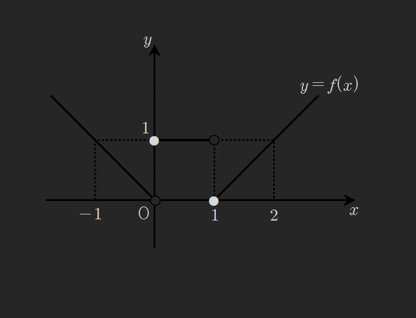

# 함수의 극한(2)

## Thm (1): 함수의 극한의 기본성질

$\lim_{x \to a} f(x) = \alpha$, $\lim_{x \to a} g(x) = \beta$이면 다음 성질이 정립한다.

### (1) 상수배

$$\lim_{x \to a} k f(x) = k\alpha \quad (k\text{는 상수})$$

### (2) 덧셈과 뺄셈 (복호동순)

$$\lim_{x \to a} \{f(x) \pm g(x)\} = \alpha \pm \beta$$

### (3) 곱셈

$$\lim_{x \to a} f(x)g(x) = \alpha\beta$$

### (4) 나눗셈

$$\lim_{x \to a} \frac{f(x)}{g(x)} = \frac{\alpha}{\beta} \quad (\text{단, } \beta \neq 0)$$

### (5) 부등식 보존

$$f(x) < g(x) \text{이면 } \lim_{x \to a} f(x) \leq \lim_{x \to a} g(x) \text{ 즉, } \alpha \leq \beta\text{이다.}$$

> **⇒ 얻말한 중병은 대학미적분학에서 합니다.**

---

## 예제 6

다항함수 $f(x)$에 대하여 $\lim_{x \to 0} \frac{f(x)}{x} = 3$일 때, $\lim_{x \to 2} \frac{f(x-2)}{x^3 - 8}$의 값을 구하여라.

> [!summary]- 풀이
> 주어진 조건 $\lim_{x \to 0} \frac{f(x)}{x} = 3$에서 $f(x)$가 다항함수이므로, $f(0) = 0$이어야 한다.
>
> 따라서 $f(x) = x \cdot h(x)$ 형태로 쓸 수 있고, $\lim_{x \to 0} h(x) = 3$이다.
>
> 구하려는 극한값을 계산하면:
>
> $$\lim_{x \to 2} \frac{f(x-2)}{x^3 - 8}$$
>
> 분모를 인수분해하면: $x^3 - 8 = (x-2)(x^2 + 2x + 4)$
>
> 분자에서 $f(x-2) = (x-2) \cdot h(x-2)$이므로:
>
> $$\lim_{x \to 2} \frac{(x-2) \cdot h(x-2)}{(x-2)(x^2 + 2x + 4)} = \lim_{x \to 2} \frac{h(x-2)}{x^2 + 2x + 4}$$
>
> $x \to 2$일 때, $x-2 \to 0$이므로:
>
> $$= \frac{\lim_{x \to 2} h(x-2)}{\lim_{x \to 2} (x^2 + 2x + 4)} = \frac{3}{4 + 4 + 4} = \frac{3}{12} = \frac{1}{4}$$
>
> **답:** $\boxed{\frac{1}{4}}$

---

## 예제 7

두 함수 $f(x)$, $g(x)$에 대하여 $\lim_{x \to \infty} \frac{g(x)}{f(x)} = 1$일 때, $\lim_{x \to \infty} \frac{f(x) + 2g(x)}{4f(x) - 3g(x)}$의 값을 구하여라.

> [!summary]- 풀이
> 주어진 조건: $\lim_{x \to \infty} \frac{g(x)}{f(x)} = 1$
>
> 구하려는 극한값의 분자와 분모를 $f(x)$로 나누면:
>
> $$\lim_{x \to \infty} \frac{f(x) + 2g(x)}{4f(x) - 3g(x)} = \lim_{x \to \infty} \frac{\frac{f(x)}{f(x)} + 2\frac{g(x)}{f(x)}}{4\frac{f(x)}{f(x)} - 3\frac{g(x)}{f(x)}}$$
>
> $$= \lim_{x \to \infty} \frac{1 + 2\frac{g(x)}{f(x)}}{4 - 3\frac{g(x)}{f(x)}}$$
>
> $\lim_{x \to \infty} \frac{g(x)}{f(x)} = 1$을 대입하면:
>
> $$= \frac{1 + 2 \cdot 1}{4 - 3 \cdot 1} = \frac{1 + 2}{4 - 3} = \frac{3}{1} = 3$$
>
> **답:** $\boxed{3}$

---

## 예제 8

두 함수 $f(x)$, $g(x)$가 $\lim_{x \to \infty} f(x) = \infty$, $\lim_{x \to \infty} \{f(x) - g(x)\} = 2$를 만족시킬 때, $\lim_{x \to \infty} \frac{f(x) + g(x)}{2f(x) - 3g(x)}$의 값을 구하여라.

> [!summary]- 풀이
> 주어진 조건:
>
> - $\lim_{x \to \infty} f(x) = \infty$
> - $\lim_{x \to \infty} \{f(x) - g(x)\} = 2$
>
> 두 번째 조건에서: $g(x) = f(x) - 2 + \epsilon(x)$ (여기서 $\lim_{x \to \infty} \epsilon(x) = 0$)
>
> 따라서 $\lim_{x \to \infty} g(x) = \infty$이다.
>
> 분자와 분모를 $f(x)$로 나누면:
>
> $$\lim_{x \to \infty} \frac{f(x) + g(x)}{2f(x) - 3g(x)} = \lim_{x \to \infty} \frac{1 + \frac{g(x)}{f(x)}}{2 - 3\frac{g(x)}{f(x)}}$$
>
> $\frac{g(x)}{f(x)} = \frac{f(x) - 2}{f(x)} = 1 - \frac{2}{f(x)}$이고, $x \to \infty$일 때:
>
> $$\lim_{x \to \infty} \frac{g(x)}{f(x)} = \lim_{x \to \infty} \left(1 - \frac{2}{f(x)}\right) = 1 - 0 = 1$$
>
> 따라서:
>
> $$= \frac{1 + 1}{2 - 3 \cdot 1} = \frac{2}{2 - 3} = \frac{2}{-1} = -2$$
>
> **답:** $\boxed{-2}$

---

## Thm (2): 합성함수의 극한값

$\lim_{x \to a} g(f(x))$에서 $f(x) = t$라 치환하여 쓴다.

즉, **함수의 치환 가능** 조건이 성립한다.

---

## 예제 9

함수 $f(x)$의 그래프가 오른쪽과 같을 때 다음 극한 값을 계산하시오.

### (1) $\lim_{x \to -1} f(x)$

> [!summary]- 풀이
> 그래프를 보면, $x \to -1$일 때 $f(x) \to 1$이다.
>
> **답:** $\boxed{1}$

### (2) $\lim_{x \to 1^-} f(f(x))$

> [!summary]- 풀이
> $x \to 1^-$일 때, $f(x) \to 0^+$ (그래프에서 $x=1$에서 왼쪽 극한값은 0)
>
> 다음 단계: $t = f(x) \to 0^+$일 때, $f(t) \to 1$ (그래프에서 $t \to 0^+$일 때 $f(t) \to 1$)
>
> **답:** $\boxed{1}$

### (3) $\lim_{x \to 1} f(f(x))$

> [!summary]- 풀이
> 좌극한: $x \to 1^-$일 때 $f(x) \to 0^+$이고, $f(0^+) \to 1$
>
> 우극한: $x \to 1^+$일 때 $f(x) \to 2^-$이고, $f(2^-) \to f(2) = 1$
>
> 좌극한 = 우극한 = 1이므로:
>
> **답:** $\boxed{1}$

---

## Thm (3): 극한값의 계산

### (1) $\frac{0}{0}$ 꼴

분수식 ~ 인수분해 약분 또는 로피탈 정리  
무리식 ~ 유리화 약분 또는 로피탈 정리

### (2) $\frac{\infty}{\infty}$ 꼴

최고차 항으로 분모, 분자를 나눈다. 또는 최고차 항의 계수비교

### (3) $\infty - \infty$ 꼴, $0 \times \infty$ 꼴

$\frac{0}{0}$ 꼴 또는 $\frac{\infty}{\infty}$ 꼴로 고친다.

---

## 예제 10

다음 극한 값을 구하여라.

### (1) $\lim_{x \to a} \frac{x^3 - ax^2 + a^2x - a^3}{x - a}$

> [!summary]- 풀이
> 분자를 인수분해하면:
>
> $$x^3 - ax^2 + a^2x - a^3 = x^2(x-a) + a^2(x-a) = (x-a)(x^2 + a^2)$$
>
> 따라서:
>
> $$\lim_{x \to a} \frac{(x-a)(x^2 + a^2)}{x - a} = \lim_{x \to a} (x^2 + a^2) = a^2 + a^2 = 2a^2$$
>
> **답:** $\boxed{2a^2}$

### (2) $\lim_{x \to 1} \frac{x-1}{\sqrt{x+3} - 2}$

> [!summary]- 풀이
> 분모를 유리화하면:
>
> $$\lim_{x \to 1} \frac{x-1}{\sqrt{x+3} - 2} \cdot \frac{\sqrt{x+3} + 2}{\sqrt{x+3} + 2}$$
>
> $$= \lim_{x \to 1} \frac{(x-1)(\sqrt{x+3} + 2)}{(x+3) - 4}$$
>
> $$= \lim_{x \to 1} \frac{(x-1)(\sqrt{x+3} + 2)}{x - 1}$$
>
> $$= \lim_{x \to 1} (\sqrt{x+3} + 2) = \sqrt{4} + 2 = 2 + 2 = 4$$
>
> **답:** $\boxed{4}$

---

## 예제 11

$\lim_{x \to 3} \frac{f(x) - 1}{x - 3} = 9$일 때, $\lim_{x \to 3} \frac{\{f(x)\}^2 - f(x)}{x^2f(x) - 9f(x)}$의 값을 구하여라.

(단, $f(x) \neq 0$, $f(x)$는 다항함수)

> [!summary]- 풀이
> 주어진 조건에서 $\lim_{x \to 3} \frac{f(x) - 1}{x - 3} = 9$이고, 분모가 0으로 가므로 분자도 0으로 가야 한다.
>
> 따라서 $f(3) = 1$이다.
>
> 구하려는 극한값을 정리하면:
>
> $$\lim_{x \to 3} \frac{f(x)\{f(x) - 1\}}{f(x)(x^2 - 9)} = \lim_{x \to 3} \frac{f(x) - 1}{x^2 - 9}$$
>
> $$= \lim_{x \to 3} \frac{f(x) - 1}{(x-3)(x+3)}$$
>
> $$= \lim_{x \to 3} \frac{f(x) - 1}{x - 3} \cdot \frac{1}{x + 3}$$
>
> $$= 9 \cdot \frac{1}{6} = \frac{9}{6} = \frac{3}{2}$$
>
> **답:** $\boxed{\frac{3}{2}}$

---

## 예제 12

다음 극한 값을 구하여라.

### (1) $\lim_{x \to \infty} \frac{x^2 + 1}{2x^2 + x + 1}$

> [!summary]- 풀이
> 분자와 분모를 $x^2$로 나누면:
>
> $$\lim_{x \to \infty} \frac{1 + \frac{1}{x^2}}{2 + \frac{1}{x} + \frac{1}{x^2}} = \frac{1 + 0}{2 + 0 + 0} = \frac{1}{2}$$
>
> **답:** $\boxed{\frac{1}{2}}$

### (2) $\lim_{x \to \infty} \frac{4x}{\sqrt{9x^2 - x} + \sqrt{16x^2 - 1}}$

> [!summary]- 풀이
> 분자와 분모를 $x$로 나누면 (단, $x > 0$이므로 $\sqrt{x^2} = x$):
>
> $$\lim_{x \to \infty} \frac{4}{\sqrt{9 - \frac{1}{x}} + \sqrt{16 - \frac{1}{x^2}}}$$
>
> $$= \frac{4}{\sqrt{9} + \sqrt{16}} = \frac{4}{3 + 4} = \frac{4}{7}$$
>
> **답:** $\boxed{\frac{4}{7}}$

### (3) $\lim_{x \to \infty} \frac{2x^2 + x - 3}{x^3 + x^2 + 1}$

> [!summary]- 풀이
> 분자의 최고차항은 $x^2$, 분모의 최고차항은 $x^3$이므로:
>
> 분자와 분모를 $x^3$으로 나누면:
>
> $$\lim_{x \to \infty} \frac{\frac{2}{x} + \frac{1}{x^2} - \frac{3}{x^3}}{1 + \frac{1}{x} + \frac{1}{x^3}} = \frac{0}{1} = 0$$
>
> **답:** $\boxed{0}$

### (4) $\lim_{x \to \infty} \frac{x^2 + x - 1}{x + 4}$

> [!summary]- 풀이
> 분자의 차수가 분모보다 크므로 극한값은 $\infty$이다.
>
> 분자와 분모를 $x$로 나누면:
>
> $$\lim_{x \to \infty} \frac{x + 1 - \frac{1}{x}}{1 + \frac{4}{x}} = \frac{\infty}{1} = \infty$$
>
> **답:** $\boxed{\infty}$

---

## 예제 13

$\lim_{x \to \infty} \frac{f(x)}{x} = 16$이고 $\lim_{x \to \infty} \frac{2f(x)}{\sqrt{f(x) + x^2} + 4f(x)} = \frac{p}{q}$일 때, $p + q$를 구하여라.

(단, $p$, $q$는 서로소)

> [!summary]- 풀이
> 주어진 조건: $\lim_{x \to \infty} \frac{f(x)}{x} = 16$
>
> 이는 $f(x) \sim 16x$ (as $x \to \infty$)를 의미한다.
>
> 구하려는 극한값:
>
> $\lim_{x \to \infty} \frac{2f(x)}{\sqrt{f(x) + x^2} + 4f(x)}$
>
> 분자와 분모를 $x$로 나누면:
>
> $\lim_{x \to \infty} \frac{2\frac{f(x)}{x}}{\sqrt{\frac{f(x)}{x^2} + 1} + 4\frac{f(x)}{x}}$
>
> $\frac{f(x)}{x} \to 16$이므로:
>
> $= \frac{2 \cdot 16}{\sqrt{\frac{16}{x} + 1} + 4 \cdot 16}$
>
> $x \to \infty$일 때 $\frac{16}{x} \to 0$이므로:
>
> $= \frac{32}{\sqrt{0 + 1} + 64} = \frac{32}{1 + 64} = \frac{32}{65}$
>
> 따라서 $p = 32$, $q = 65$이고:
>
> $p + q = 32 + 65 = 97$
>
> **답:** $\boxed{97}$

---

## 예제 14

다음 극한값을 구하여라.

### (1) $\lim_{x \to \infty} \left(\sqrt{x^3 + x^2} - \sqrt{x^3 - x^2}\right)$

> [!summary]- 풀이
> 유리화를 사용하면:
>
> $$\lim_{x \to \infty} \frac{(\sqrt{x^3 + x^2} - \sqrt{x^3 - x^2})(\sqrt{x^3 + x^2} + \sqrt{x^3 - x^2})}{\sqrt{x^3 + x^2} + \sqrt{x^3 - x^2}}$$
>
> $$= \lim_{x \to \infty} \frac{(x^3 + x^2) - (x^3 - x^2)}{\sqrt{x^3 + x^2} + \sqrt{x^3 - x^2}}$$
>
> $$= \lim_{x \to \infty} \frac{2x^2}{\sqrt{x^3 + x^2} + \sqrt{x^3 - x^2}}$$
>
> 분자와 분모를 $x^{3/2}$로 나누면 ($x > 0$이므로):
>
> $$= \lim_{x \to \infty} \frac{2x^{1/2}}{\sqrt{1 + \frac{1}{x}} + \sqrt{1 - \frac{1}{x}}}$$
>
> $$= \frac{\infty}{\sqrt{1} + \sqrt{1}} = \frac{\infty}{2} = \infty$$
>
> **답:** $\boxed{\infty}$

### (2) $\lim_{x \to -\infty} \left(\sqrt{x^2 - 3x} + x\right)$

> [!summary]- 풀이
> $x \to -\infty$인 경우, $x < 0$이므로 $|x| = -x$이고, $\sqrt{x^2} = |x| = -x$
>
> $$\sqrt{x^2 - 3x} = |x|\sqrt{1 - \frac{3}{x}} = -x\sqrt{1 - \frac{3}{x}}$$
>
> 따라서:
>
> $$\lim_{x \to -\infty} \left(\sqrt{x^2 - 3x} + x\right) = \lim_{x \to -\infty} \left(-x\sqrt{1 - \frac{3}{x}} + x\right)$$
>
> $$= \lim_{x \to -\infty} x\left(-\sqrt{1 - \frac{3}{x}} + 1\right)$$
>
> $$= \lim_{x \to -\infty} x\left(1 - \sqrt{1 - \frac{3}{x}}\right)$$
>
> 분자와 분모에 $\left(1 + \sqrt{1 - \frac{3}{x}}\right)$를 곱하면:
>
> $$= \lim_{x \to -\infty} x \cdot \frac{1 - \left(1 - \frac{3}{x}\right)}{1 + \sqrt{1 - \frac{3}{x}}}$$
>
> $$= \lim_{x \to -\infty} x \cdot \frac{\frac{3}{x}}{1 + \sqrt{1 - \frac{3}{x}}}$$
>
> $$= \lim_{x \to -\infty} \frac{3}{1 + \sqrt{1 - \frac{3}{x}}}$$
>
> $$= \frac{3}{1 + 1} = \frac{3}{2}$$
>
> **답:** $\boxed{\frac{3}{2}}$

---

## 예제 15

$f(x) = x^2 + x + 2$일 때, $\lim_{\alpha \to \infty} \left\{f\left(\frac{5}{\alpha} + 2\right) - f(2)\right\}^2$을 구하여라.

> [!summary]- 풀이
> 먼저 $f(2)$를 계산하면:
>
> $$f(2) = 2^2 + 2 + 2 = 4 + 2 + 2 = 8$$
>
> 다음으로 $f\left(\frac{5}{\alpha} + 2\right)$를 계산하면:
>
> $$f\left(\frac{5}{\alpha} + 2\right) = \left(\frac{5}{\alpha} + 2\right)^2 + \left(\frac{5}{\alpha} + 2\right) + 2$$
>
> $$= \frac{25}{\alpha^2} + \frac{20}{\alpha} + 4 + \frac{5}{\alpha} + 2 + 2$$
>
> $$= \frac{25}{\alpha^2} + \frac{25}{\alpha} + 8$$
>
> 따라서:
>
> $$f\left(\frac{5}{\alpha} + 2\right) - f(2) = \frac{25}{\alpha^2} + \frac{25}{\alpha} + 8 - 8 = \frac{25}{\alpha^2} + \frac{25}{\alpha}$$
>
> $$= \frac{25 + 25\alpha}{\alpha^2} = \frac{25(1 + \alpha)}{\alpha^2}$$
>
> 이제 극한값을 계산하면:
>
> $$\lim_{\alpha \to \infty} \left\{\frac{25(1 + \alpha)}{\alpha^2}\right\}^2 = \lim_{\alpha \to \infty} \frac{625(1 + \alpha)^2}{\alpha^4}$$
>
> $$= \lim_{\alpha \to \infty} \frac{625(1 + 2\alpha + \alpha^2)}{\alpha^4}$$
>
> $$= \lim_{\alpha \to \infty} \frac{625}{\alpha^4} + \frac{1250}{\alpha^3} + \frac{625}{\alpha^2}$$
>
> $$= 0 + 0 + 0 = 0$$
>
> **답:** $\boxed{0}$

---

## 연습문제

추가 연습문제는 교재의 해당 섹션을 참조하십시오.

---

## 관련 주제

- [[01-function-limit-1|함수의 극한 (1)]] - 함수의 극한의 정의
- [[03-function-limit-3|함수의 극한 (3)]] - 샌드위치 정리와 특수 극한

---

## 참고사항

- 극한값 계산에서 부정형($\frac{0}{0}$, $\frac{\infty}{\infty}$, $\infty - \infty$, $0 \times \infty$)을 만나면 반드시 변형이 필요합니다.
- 합성함수의 극한값은 치환을 통해 단순화할 수 있습니다.
- 무리식의 극한값은 유리화 기법이 효과적입니다.
- 다항식의 극한값은 최고차항으로 나누는 방법이 유용합니다.
