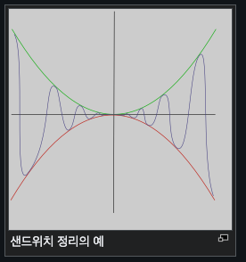

# 함수의 극한(3)

## Thm (4): 샌드위치 극한

$f(x) \leq h(x) \leq g(x)$이고 $\lim_{x \to a} f(x) = \lim_{x \to a} g(x) = L$이면 $\lim_{x \to a} h(x) = L$이다.

> **해석:** 함수 $h(x)$가 두 함수 $f(x)$와 $g(x)$ 사이에 끼여 있고, 두 바깥쪽 함수가 같은 극한값 $L$로 수렴하면, 가운데 함수 $h(x)$도 반드시 같은 값 $L$로 수렴한다.

---

## 예제 16

다음 극한값을 구하여라.

### (1) $\lim_{x \to +0} \sin x \cos \frac{1}{x}$

> [!summary]- 풀이
> $\cos \frac{1}{x}$의 범위를 생각하면: $-1 \leq \cos \frac{1}{x} \leq 1$
>
> 양변에 $\sin x$를 곱하면 ($x \to +0$이므로 $\sin x > 0$):
>
> $$-\sin x \leq \sin x \cos \frac{1}{x} \leq \sin x$$
>
> 이제 극한을 취하면:
>
> $$\lim_{x \to +0} (-\sin x) = 0, \quad \lim_{x \to +0} \sin x = 0$$
>
> 샌드위치 정리에 의해:
>
> $$\lim_{x \to +0} \sin x \cos \frac{1}{x} = 0$$
>
> **답:** $\boxed{0}$

### (2) $\lim_{x \to \infty} \frac{\left[\sqrt{x^2 + 2x}\right] - \sqrt{x}}{x}$

> [!summary]- 풀이
> 가우스 기호의 성질: $[t] \leq t < [t] + 1$을 이용한다.
>
> $$[\sqrt{x^2 + 2x}] \leq \sqrt{x^2 + 2x} < [\sqrt{x^2 + 2x}] + 1$$
>
> 각 항에서 $\sqrt{x}$를 빼면:
>
> $$[\sqrt{x^2 + 2x}] - \sqrt{x} \leq \sqrt{x^2 + 2x} - \sqrt{x} < [\sqrt{x^2 + 2x}] + 1 - \sqrt{x}$$
>
> 전체를 $x$로 나누면:
>
> $$\frac{[\sqrt{x^2 + 2x}] - \sqrt{x}}{x} \leq \frac{\sqrt{x^2 + 2x} - \sqrt{x}}{x} < \frac{[\sqrt{x^2 + 2x}] + 1 - \sqrt{x}}{x}$$
>
> 먼저 중간 항의 극한을 계산:
>
> $$\lim_{x \to \infty} \frac{\sqrt{x^2 + 2x} - \sqrt{x}}{x}$$
>
> 유리화:
>
> $$= \lim_{x \to \infty} \frac{(\sqrt{x^2 + 2x} - \sqrt{x})(\sqrt{x^2 + 2x} + \sqrt{x})}{x(\sqrt{x^2 + 2x} + \sqrt{x})}$$
>
> $$= \lim_{x \to \infty} \frac{x^2 + 2x - x}{x(\sqrt{x^2 + 2x} + \sqrt{x})}$$
>
> $$= \lim_{x \to \infty} \frac{x^2 + x}{x(\sqrt{x^2 + 2x} + \sqrt{x})}$$
>
> $$= \lim_{x \to \infty} \frac{x + 1}{\sqrt{x^2 + 2x} + \sqrt{x}}$$
>
> 분자와 분모를 $x$로 나누면:
>
> $$= \lim_{x \to \infty} \frac{1 + \frac{1}{x}}{\sqrt{1 + \frac{2}{x}} + \frac{1}{\sqrt{x}}}$$
>
> $$= \frac{1 + 0}{\sqrt{1 + 0} + 0} = \frac{1}{1} = 1$$
>
> 우변의 극한:
>
> $$\lim_{x \to \infty} \frac{[\sqrt{x^2 + 2x}] + 1 - \sqrt{x}}{x} = \lim_{x \to \infty} \frac{[\sqrt{x^2 + 2x}] - \sqrt{x}}{x} + \frac{1}{x}$$
>
> 샌드위치 정리에 의해 좌변도 1로 수렴하므로:
>
> $$\lim_{x \to \infty} \frac{[\sqrt{x^2 + 2x}] - \sqrt{x}}{x} = 1$$
>
> **답:** $\boxed{1}$

---

## Thm (5): 미정계수의 결정

### (1) $\frac{0}{0}$ 꼴에서 극한값이 0이 아닌 일정한 값일 때

**분모 → 0이면 분자 → 0이고  
분자 → 0이면 분모 → 0이다.**

### (2) $\frac{\infty}{\infty}$ 꼴에서 극한값이 0이 아닌 일정한 값일 때

**분모, 분자는 동차식이어야 한다.**

> **동차식:** 다항식에서 모든 항의 차수가 같은 식

---

## 예제 17

다음 식을 성립하게 하는 상수 $a$, $b$의 값을 구하여라.

### (1) $\lim_{x \to 1} \frac{x - 1}{x^2 + ax + b} = \frac{1}{3}$

> [!summary]- 풀이
> $\frac{0}{0}$ 꼴이므로, $x \to 1$일 때 분모도 0이어야 한다.
>
> 즉, $1 + a + b = 0$ ... ①
>
> 분모를 인수분해하면: $x^2 + ax + b = (x - 1)(x - c)$ 형태여야 한다.
>
> 전개하면: $x^2 + ax + b = x^2 - (1 + c)x + c$
>
> 계수 비교:
>
> - $a = -(1 + c)$
> - $b = c$
>
> 따라서:
>
> $$\lim_{x \to 1} \frac{x - 1}{(x - 1)(x - c)} = \lim_{x \to 1} \frac{1}{x - c} = \frac{1}{1 - c} = \frac{1}{3}$$
>
> $$1 - c = 3 \implies c = -2$$
>
> 따라서:
>
> - $b = c = -2$
> - $1 + a + b = 0$에서 $1 + a - 2 = 0 \implies a = 1$
>
> **답:** $\boxed{a = 1, \, b = -2}$

### (2) $\lim_{x \to 2} \frac{x^2 - (a + 2)x + 2a}{x^2 - b} = 3$

> [!summary]- 풀이
> $\frac{0}{0}$ 꼴이므로, $x \to 2$일 때 분자와 분모가 모두 0이어야 한다.
>
> **분모:** $4 - b = 0 \implies b = 4$
>
> **분자:** $4 - 2(a + 2) + 2a = 0$
>
> $$4 - 2a - 4 + 2a = 0 \implies 0 = 0$$
>
> 이것은 항상 참이므로, 분자를 인수분해해야 한다.
>
> 분자: $x^2 - (a + 2)x + 2a$
>
> $x = 2$가 근이므로: $(x - 2)$를 인수로 가진다.
>
> $$x^2 - (a + 2)x + 2a = (x - 2)(x - a)$$
>
> 분모: $x^2 - 4 = (x - 2)(x + 2)$
>
> 따라서:
>
> $$\lim_{x \to 2} \frac{(x - 2)(x - a)}{(x - 2)(x + 2)} = \lim_{x \to 2} \frac{x - a}{x + 2} = \frac{2 - a}{4} = 3$$
>
> $$2 - a = 12 \implies a = -10$$
>
> **답:** $\boxed{a = -10, \, b = 4}$

---

## 예제 18

다음 두 조건을 만족하는 다항함수 $f(x)$에 대하여 $f(5)$의 값을 구하여라.

**조건:**

- Ⅰ. $\lim_{x \to 1} \frac{f(x)}{x - 1} = 1$
- Ⅱ. $\lim_{x \to \infty} \frac{f(x)}{x^2 + 2x + 3} = \frac{1}{2}$

> [!summary]- 풀이
> **조건 Ⅰ 분석:**
>
> $\lim_{x \to 1} \frac{f(x)}{x - 1} = 1$이고 $\frac{0}{0}$ 꼴이므로:
>
> $f(1) = 0$, 즉 $(x - 1)$이 $f(x)$의 인수이다.
>
> 따라서 $f(x) = (x - 1) \cdot g(x)$로 쓸 수 있고:
>
> $$\lim_{x \to 1} \frac{(x - 1) g(x)}{x - 1} = \lim_{x \to 1} g(x) = g(1) = 1$$
>
> **조건 Ⅱ 분석:**
>
> $\lim_{x \to \infty} \frac{f(x)}{x^2 + 2x + 3} = \frac{1}{2}$이고 $\frac{\infty}{\infty}$ 꼴이므로:
>
> $f(x)$는 2차 다항식이어야 한다.
>
> $f(x) = ax^2 + bx + c$로 놓으면:
>
> $$\lim_{x \to \infty} \frac{ax^2 + bx + c}{x^2 + 2x + 3} = \frac{a}{1} = \frac{1}{2}$$
>
> 따라서 $a = \frac{1}{2}$
>
> **두 조건 결합:**
>
> $f(x) = \frac{1}{2}x^2 + bx + c$이고, $f(1) = 0$이므로:
>
> $$\frac{1}{2} + b + c = 0 \implies b + c = -\frac{1}{2}$$ ... ①
>
> 또한 $f(x) = (x - 1) \cdot g(x)$이고 $g(1) = 1$이므로:
>
> $$g(x) = \frac{f(x)}{x - 1} = \frac{\frac{1}{2}x^2 + bx + c}{x - 1}$$
>
> $f(x) = (x - 1)(\frac{1}{2}x + d)$ 형태로 쓸 수 있다.
>
> 전개: $f(x) = \frac{1}{2}x^2 + dx - \frac{1}{2}x - d = \frac{1}{2}x^2 + (d - \frac{1}{2})x - d$
>
> 계수 비교:
>
> - $b = d - \frac{1}{2}$
> - $c = -d$
>
> $g(1) = \frac{1}{2} + d = 1$이므로 $d = \frac{1}{2}$
>
> 따라서:
>
> - $b = \frac{1}{2} - \frac{1}{2} = 0$
> - $c = -\frac{1}{2}$
>
> $$f(x) = \frac{1}{2}x^2 - \frac{1}{2} = \frac{1}{2}(x^2 - 1)$$
>
> $$f(5) = \frac{1}{2}(25 - 1) = \frac{1}{2} \cdot 24 = 12$$
>
> **답:** $\boxed{12}$

---

## 예제 19

$f(x) = x^3 + ax^2 + bx + c$에 대하여 $f(-1) = 2$, $f(0) = 0$, $f(1) = -2$일 때 $\lim_{x \to 0} \frac{f(x)}{x}$를 구하여라.

> [!summary]- 풀이
> 주어진 조건들을 대입하면:
>
> **$f(0) = 0$:**
> $$c = 0$$
>
> **$f(-1) = 2$:**
> $$-1 + a - b + c = 2$$
> $$-1 + a - b + 0 = 2$$
> $$a - b = 3$$ ... ①
>
> **$f(1) = -2$:**
> $$1 + a + b + c = -2$$
> $$1 + a + b + 0 = -2$$
> $$a + b = -3$$ ... ②
>
> ①, ②를 연립하면:
>
> - ①+②: $2a = 0 \implies a = 0$
> - ①에 대입: $0 - b = 3 \implies b = -3$
>
> 따라서 $f(x) = x^3 - 3x$
>
> 극한값:
>
> $$\lim_{x \to 0} \frac{f(x)}{x} = \lim_{x \to 0} \frac{x^3 - 3x}{x} = \lim_{x \to 0} (x^2 - 3) = -3$$
>
> **답:** $\boxed{-3}$

---

## 예제 20

두 실수 $a$, $b$에 대하여 $\lim_{x \to 1} \frac{\sqrt{x^2 + a} - b}{x - 1} = \frac{1}{2}$일 때 $ab$의 값을 구하여라.

> [!summary]- 풀이
> $\frac{0}{0}$ 꼴이므로, $x \to 1$일 때 분자도 0이어야 한다.
>
> $$\sqrt{1 + a} - b = 0$$
> $$\sqrt{1 + a} = b$$ ... ①
>
> 극한값을 계산하기 위해 분자를 유리화:
>
> $$\lim_{x \to 1} \frac{\sqrt{x^2 + a} - b}{x - 1} \cdot \frac{\sqrt{x^2 + a} + b}{\sqrt{x^2 + a} + b}$$
>
> $$= \lim_{x \to 1} \frac{(x^2 + a) - b^2}{(x - 1)(\sqrt{x^2 + a} + b)}$$
>
> ①에서 $b^2 = 1 + a$이므로:
>
> $$= \lim_{x \to 1} \frac{x^2 + a - (1 + a)}{(x - 1)(\sqrt{x^2 + a} + b)}$$
>
> $$= \lim_{x \to 1} \frac{x^2 - 1}{(x - 1)(\sqrt{x^2 + a} + b)}$$
>
> $$= \lim_{x \to 1} \frac{(x - 1)(x + 1)}{(x - 1)(\sqrt{x^2 + a} + b)}$$
>
> $$= \lim_{x \to 1} \frac{x + 1}{\sqrt{x^2 + a} + b}$$
>
> $$= \frac{2}{\sqrt{1 + a} + b} = \frac{2}{b + b} = \frac{2}{2b} = \frac{1}{b} = \frac{1}{2}$$
>
> 따라서 $b = 2$
>
> ①에서: $\sqrt{1 + a} = 2 \implies 1 + a = 4 \implies a = 3$
>
> $$ab = 3 \cdot 2 = 6$$
>
> **답:** $\boxed{6}$

---

## 예제 21

$\lim_{x \to -\infty} \left(\sqrt{ax^2 - bx} + x\right) = 1$일 때 상수 $a$, $b$를 구하여라.

> [!summary]- 풀이
> 유리화:
>
> $\lim_{x \to -\infty} \frac{(\sqrt{ax^2 - bx} + x)(\sqrt{ax^2 - bx} - x)}{\sqrt{ax^2 - bx} - x}$
>
> $= \lim_{x \to -\infty} \frac{(ax^2 - bx) - x^2}{\sqrt{ax^2 - bx} - x}$
>
> $= \lim_{x \to -\infty} \frac{(a-1)x^2 - bx}{\sqrt{ax^2 - bx} - x}$
>
> 극한값이 0이 아닌 유한값(1)이 되려면, 분자의 $x^2$ 항의 계수가 0이어야 한다.
>
> 따라서 $a - 1 = 0$ → **$a = 1$**
>
> $a = 1$을 대입하면:
>
> $= \lim_{x \to -\infty} \frac{-bx}{\sqrt{x^2 - bx} - x}$
>
> **핵심:** $x \to -\infty$이므로 $x < 0$이고, 따라서 $\sqrt{x^2} = |x| = -x$
>
> 근호 안을 정리하면:
> $\sqrt{x^2 - bx} = |x|\sqrt{1 - \frac{b}{x}} = -x\sqrt{1 - \frac{b}{x}}$
>
> 따라서:
>
> $= \lim_{x \to -\infty} \frac{-bx}{-x\sqrt{1 - \frac{b}{x}} - x}$
>
> $= \lim_{x \to -\infty} \frac{-bx}{-x\left(\sqrt{1 - \frac{b}{x}} + 1\right)}$
>
> $= \lim_{x \to -\infty} \frac{-b}{-\left(\sqrt{1 - \frac{b}{x}} + 1\right)}$
>
> $= \lim_{x \to -\infty} \frac{b}{\sqrt{1 - \frac{b}{x}} + 1}$
>
> $= \frac{b}{\sqrt{1} + 1} = \frac{b}{2} = 1$
>
> 따라서 **$b = 2$**
>
> **답:** $\boxed{a = 1, \, b = 2}$

---

## 예제 22

$\lim_{x \to \infty} \left\{\sqrt{9x^2 + 2x + 1} - (\alpha x + \beta)\right\} = 4$일 때, $\alpha\beta$를 구하여라. (단, $\alpha$, $\beta$는 상수)

> [!summary]- 풀이
> 우선 $\alpha < x$인 경우 식의 결과값이 발산하게 되므로 $\alpha > 0$ 것을 알수있다.
>
> 극한값이 유한하려면, $\sqrt{9x^2 + 2x + 1}$과 $\alpha x + \beta$의 최고차 항이 소거되어야 한다.
>
> $\sqrt{9x^2 + 2x + 1} \approx 3x$ (as $x \to \infty$)
>
> 따라서 $\alpha = \sqrt{9} = 3$이어야 한다.
>
> $\alpha = 3$인 경우:
>
> $\lim_{x \to \infty} \left\{\sqrt{9x^2 + 2x + 1} - (3x + \beta)\right\}$
>
> 유리화:
>
> $= \lim_{x \to \infty} \frac{(\sqrt{9x^2 + 2x + 1} - 3x - \beta)(\sqrt{9x^2 + 2x + 1} + 3x + \beta)}{\sqrt{9x^2 + 2x + 1} + 3x + \beta}$
>
> $= \lim_{x \to \infty} \frac{(9x^2 + 2x + 1) - (3x + \beta)^2}{\sqrt{9x^2 + 2x + 1} + 3x + \beta}$
>
> 분자를 전개:
>
> $(3x + \beta)^2 = 9x^2 + 6\beta x + \beta^2$
>
> $\text{분자} = 9x^2 + 2x + 1 - 9x^2 - 6\beta x - \beta^2$
> $= (2 - 6\beta)x + (1 - \beta^2)$
>
> 분모를 정리 ($x \to \infty$일 때):
>
> $\sqrt{9x^2 + 2x + 1} \approx 3x$
>
> $\text{분모} = 3x + 3x + \beta = 6x + \beta$
>
> 따라서:
>
> $= \lim_{x \to \infty} \frac{(2 - 6\beta)x + (1 - \beta^2)}{6x + \beta}$
>
> 분자와 분모를 $x$로 나누면:
>
> $= \lim_{x \to \infty} \frac{2 - 6\beta + \frac{1 - \beta^2}{x}}{6 + \frac{\beta}{x}}$
>
> $= \frac{2 - 6\beta}{6} = 4$
>
> $2 - 6\beta = 24$
> $-6\beta = 22$
> $\beta = -\frac{22}{6} = -\frac{11}{3}$
>
> 따라서:
>
> $\alpha\beta = 3 \times \left(-\frac{11}{3}\right) = -11$
>
> **답:** $\boxed{-11}$

---

## 연습문제

추가 연습문제는 교재의 해당 섹션을 참조하십시오.

---

## 관련 주제

- [[01-function-limit-1|함수의 극한 (1)]] - 함수의 극한의 정의
- [[02-function-limit-2|함수의 극한 (2)]] - 극한의 기본성질과 계산
- [[04-continuity|연속함수]]

---

## 참고사항

- **샌드위치 정리**는 함수가 직접 계산하기 어려울 때 유용합니다.
- **미정계수 결정**에서는 부정형의 종류($\frac{0}{0}$ 또는 $\frac{\infty}{\infty}$)를 먼저 파악해야 합니다.
- $\frac{0}{0}$ 꼴: 분모가 0이면 분자도 0, 분자가 0이면 분모도 0
- $\frac{\infty}{\infty}$ 꼴: 분자와 분모는 동차식이어야 함
- 무리식 극한에서는 유리화 기법이 핵심입니다.
