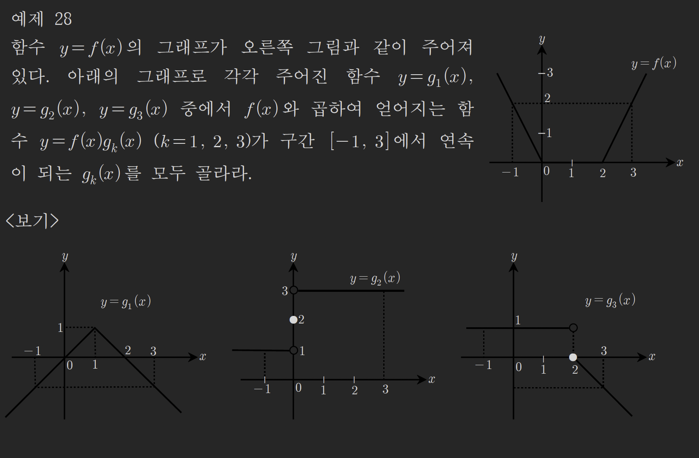

# 함수의 극한(5) - 연속함수의 성질

## Thm (7): 연속함수의 성질(1)

두 함수 $f(x)$, $g(x)$가 모두 $x = a$에서 연속이면 다음 함수도 $x = a$에서 연속이다.

### 연속함수의 사칙연산

1. **상수배:** $kf(x)$ ($k$는 상수)
2. **덧셈/뺄셈:** $f(x) \pm g(x)$
3. **곱셈:** $f(x)g(x)$
4. **나눗셈:** $\frac{f(x)}{g(x)}$ (단, $g(a) \neq 0$)

---

### 증명

$x = a$에 대하여 $\lim_{x \to a} f(x) = f(a)$, $\lim_{x \to a} g(x) = g(a)$를 할 수 있다.

#### ① $h(x) = kf(x)$라 두면

$$h(a) = kf(a)$$

이고

$$\lim_{x \to a} h(x) = k\lim_{x \to a} f(x) = kf(a)$$

이므로 $h(x)$도 $x = a$에서 연속이다.

---

#### ② $h(x) = f(x) \pm g(x)$라 두면

$$h(a) = f(a) \pm g(a)$$

이고

$$\lim_{x \to a} h(x) = \lim_{x \to a} (f(x) \pm g(x))$$

$$= \lim_{x \to a} f(x) \pm \lim_{x \to a} g(x) = f(a) \pm g(a)$$

이므로 $h(x)$도 $x = a$에서 연속이다.

---

#### ③ $h(x) = f(x)g(x)$라 두면

$$h(a) = f(a)g(a)$$

이고

$$\lim_{x \to a} h(x) = \lim_{x \to a} f(x)g(x)$$

$$= \lim_{x \to a} f(x) \lim_{x \to a} g(x) = f(a)g(a)$$

이므로 $h(x)$도 $x = a$에서 연속이다.

---

#### ④ $h(x) = \frac{f(x)}{g(x)}$라 두면

$$h(a) = \frac{f(a)}{g(a)}$$

이고

$$\lim_{x \to a} h(x) = \lim_{x \to a} \frac{f(x)}{g(x)} = \frac{\lim_{x \to a} f(x)}{\lim_{x \to a} g(x)} = \frac{f(a)}{g(a)}$$

이므로 $h(x)$도 $x = a$에서 연속이다.

---

## Thm (8): 연속함수의 성질(2)

함수 $f(x)$가 $x = a$에서 연속이고 함수 $g(x)$가 $x = f(a)$에서 연속이면 합성함수 $g(f(x))$는 $x = a$에서 연속이다.

### 증명

$f(x)$가 $x = a$에서 연속이므로:
$$\lim_{x \to a} f(x) = f(a)$$

$g(x)$가 $x = f(a)$에서 연속이므로:
$$\lim_{t \to f(a)} g(t) = g(f(a))$$

$t = f(x)$로 치환하면, $x \to a$일 때 $t \to f(a)$이므로:
$$\lim_{x \to a} g(f(x)) = g(f(a))$$

따라서 합성함수 $g(f(x))$는 $x = a$에서 연속이다. ∎

---

## 예제 28

함수 $y = f(x)$의 그래프와 오른쪽 그림과 같이 주어져 있다. 아래의 그래프로 각각 주어진 함수 $y = g_1(x)$, $y = g_2(x)$, $y = g_3(x)$ 중에서 $f(x)$와 곱하여 얻어지는 함수 $y = f(x)g_k(x)$ ($k = 1, 2, 3$)가 구간 $[-1, 3]$에서 연속이 되는 $g_k(x)$를 모두 골라라.

> [!summary]- 풀이
> $f(x)g_k(x)$가 구간 $[-1, 3]$에서 연속이려면, 각 점에서 $f(x)$와 $g_k(x)$ 모두 연속이거나, 둘 중 하나가 0이어야 한다.
>
> **$f(x)$의 불연속점 분석:**
>
> - 그래프를 보면 $x = 1$에서 불연속 (함수값은 정의되어 있으나 극한값과 다름)
>
> **$g_1(x)$ 검토:**
>
> - $x = 1$에서: $g_1(1) = 0$이므로 $f(1) \cdot g_1(1) = f(1) \cdot 0 = 0$
> - $\lim_{x \to 1} f(x)g_1(x) = \lim_{x \to 1} f(x) \cdot \lim_{x \to 1} g_1(x) = (\text{어떤 값}) \cdot 0 = 0$
> - 따라서 $x = 1$에서 $f(x)g_1(x)$가 연속이다.
> - 다른 점에서도 $f(x)$와 $g_1(x)$ 모두 연속이므로 곱도 연속이다.
> - **$g_1(x)$ ✓**
>
> **$g_2(x)$ 검토:**
>
> - $x = 0, 1, 2$에서 불연속 (좌극한 ≠ 우극한)
> - $x = 1$에서 $f(x)$도 불연속이고 $g_2(x)$도 불연속
> - $g_2(1) = 0$이 아니므로 곱함수가 연속이 되지 않음
> - **$g_2(x)$ ✗**
>
> **$g_3(x)$ 검토:**
>
> - $x = 1$에서: $g_3(x)$가 불연속 (함수값 없음)
> - $f(1)$은 정의되어 있으나 $g_3(1)$이 정의되지 않으므로 $f(1)g_3(1)$도 정의 불가
> - **$g_3(x)$ ✗**
>
> **답:** $\boxed{g_1(x) \text{만 가능}}$

---

## 예제 29

함수 $f(x) = \begin{cases} \frac{1}{x} - 1 & (0 < x \leq 1) \\ \frac{1}{x-1} - 1 & (1 < x < 2) \end{cases}$이고 $g(x) = (x-1)^3 + 1$ $(0 < x < 2)$일 때

함수 $y = f(x)g(x)$는 $x = 1$에서 연속인지 불연속인지 판단하여라.

> [!summary]- 풀이
> $x = 1$에서 연속성을 판단하려면 다음을 확인해야 한다:
>
> 1. $f(1)g(1)$이 존재하는가?
> 2. $\lim_{x \to 1} f(x)g(x)$가 존재하는가?
> 3. 극한값 = 함수값인가?
>
> **함수값:**
> $$f(1) = \frac{1}{1} - 1 = 0$$
> $$g(1) = (1-1)^3 + 1 = 1$$
> $$f(1)g(1) = 0 \cdot 1 = 0$$
>
> **좌극한:**
> $$\lim_{x \to 1^-} f(x) = \lim_{x \to 1^-} \left(\frac{1}{x} - 1\right) = 1 - 1 = 0$$
> $$\lim_{x \to 1^-} g(x) = (1-1)^3 + 1 = 1$$
> $$\lim_{x \to 1^-} f(x)g(x) = 0 \cdot 1 = 0$$
>
> **우극한:**
> $$\lim_{x \to 1^+} f(x) = \lim_{x \to 1^+} \left(\frac{1}{x-1} - 1\right)$$
>
> $x \to 1^+$일 때 $\frac{1}{x-1} \to +\infty$이므로:
> $$\lim_{x \to 1^+} f(x) = +\infty$$
>
> $$\lim_{x \to 1^+} g(x) = 1$$
>
> $$\lim_{x \to 1^+} f(x)g(x) = (+\infty) \cdot 1 = +\infty$$
>
> 좌극한 = 0이지만 우극한 = $+\infty$이므로 극한이 존재하지 않는다.
>
> **답:** $\boxed{\text{불연속}}$

---

## 예제 30

삼차함수 $y = f(x) = x^3 + 4$와 함수 $g(x) = \begin{cases} \frac{1}{2}x - 1 & (x > 0) \\ -x - 2 & (x \leq 0) \end{cases}$에 대하여

합성함수 $g(f(x))$의 $x = 0$에서의 연속성을 판단하여라.

> [!summary]- 풀이
> 합성함수 $g(f(x))$가 $x = 0$에서 연속인지 판단한다.
>
> **함수값:**
> $$f(0) = 0^3 + 4 = 4$$
>
> $f(0) = 4 > 0$이므로:
> $$g(f(0)) = g(4) = \frac{1}{2} \cdot 4 - 1 = 2 - 1 = 1$$
>
> **좌극한:**
> $$\lim_{x \to 0^-} f(x) = \lim_{x \to 0^-} (x^3 + 4) = 4$$
>
> $f(x) \to 4 > 0$이므로:
> $$\lim_{x \to 0^-} g(f(x)) = g(4) = \frac{1}{2} \cdot 4 - 1 = 1$$
>
> **우극한:**
> $$\lim_{x \to 0^+} f(x) = \lim_{x \to 0^+} (x^3 + 4) = 4$$
>
> $f(x) \to 4 > 0$이므로:
> $$\lim_{x \to 0^+} g(f(x)) = g(4) = \frac{1}{2} \cdot 4 - 1 = 1$$
>
> 좌극한 = 우극한 = 함수값 = 1이므로:
>
> **답:** $\boxed{\text{연속}}$

---

## 예제 31

두 함수 $f(x) = \begin{cases} 1 & (x \geq 0) \\ -1 & (x < 0) \end{cases}$, $g(x) = |x|$일 때 $(g \circ f)(x)$는 $x = 0$에서 연속인가, 불연속인가?

> [!summary]- 풀이
> 합성함수 $(g \circ f)(x) = g(f(x))$의 $x = 0$에서의 연속성을 판단한다.
>
> **함수값:**
> $$f(0) = 1$$
> $$g(f(0)) = g(1) = |1| = 1$$
>
> **좌극한:**
> $$\lim_{x \to 0^-} f(x) = -1$$
> $$\lim_{x \to 0^-} g(f(x)) = g(-1) = |-1| = 1$$
>
> **우극한:**
> $$\lim_{x \to 0^+} f(x) = 1$$
> $$\lim_{x \to 0^+} g(f(x)) = g(1) = |1| = 1$$
>
> 좌극한 = 우극한 = 함수값 = 1이므로:
>
> **답:** $\boxed{\text{연속}}$

---

## 예제 32

함수 $f(x)$가 $x = a$에서 연속일 때 다음 중 $x = a$에서 반드시 연속이라고 말할 수 없는 것은? (단, $f(a) \neq 0$)

① $y = \{f(x)\}^3$  
② $y = \frac{1}{f(x)}$  
③ $y = 4 - 2f(x)$  
④ $y = 3^{f(x)}$  
⑤ $y = f(f(x))$

> [!summary]- 풀이
> $f(x)$가 $x = a$에서 연속이고 $f(a) \neq 0$이라는 조건에서 각 선택지를 검토한다.
>
> **① $y = \{f(x)\}^3$:**
>
> - $f(x)$가 연속이고, 거듭제곱 함수는 연속이므로 합성함수도 연속
> - **연속 ✓**
>
> **② $y = \frac{1}{f(x)}$:**
>
> - $f(x)$가 연속이고 $f(a) \neq 0$이므로 역수함수도 연속
> - **연속 ✓**
>
> **③ $y = 4 - 2f(x)$:**
>
> - 연속함수의 상수배와 덧셈이므로 연속
> - **연속 ✓**
>
> **④ $y = 3^{f(x)}$:**
>
> - $f(x)$가 연속이고, 지수함수 $3^t$는 모든 실수에서 연속이므로 합성함수도 연속
> - **연속 ✓**
>
> **⑤ $y = f(f(x))$:**
>
> - $f(x)$가 $x = a$에서 연속이어도, $f(f(x))$가 $x = a$에서 연속이려면 $f(x)$가 $x = f(a)$에서도 연속이어야 함
> - 문제에서 $f(x)$가 $x = f(a)$에서 연속이라는 보장이 없음
> - 예: $f(x) = \begin{cases} x & (x \neq 1) \\ 2 & (x = 1) \end{cases}$이고 $a = 0$이면
>   - $f(0) = 0$, $f(x)$는 $x = 0$에서 연속
>   - 하지만 $f(1) = 2 \neq 1$이므로 $f(x)$는 $x = 1$에서 불연속
>   - 만약 $f(0) = 1$이면 $f(f(0))$에서 문제 발생 가능
> - **반드시 연속이라 할 수 없음 ✗**
>
> **답:** $\boxed{⑤}$

---

## 연습문제

추가 연습문제는 교재의 해당 섹션을 참조하십시오.

---

## 관련 주제

- [[01-function-limit-1|함수의 극한 (1)]] - 함수의 극한의 정의
- [[02-function-limit-2|함수의 극한 (2)]] - 극한의 기본성질과 계산
- [[03-function-limit-3|함수의 극한 (3)]] - 샌드위치 정리와 미정계수
- [[04-function-limit-4|함수의 극한 (4)]] - 함수의 연속
- [[06-function-limit-6|함수의 극한 (6)]] - 함수의 불연속점

---

## 참고사항

- **연속함수의 사칙연산:** 연속함수끼리의 사칙연산 결과도 연속
- **합성함수의 연속:** 바깥 함수와 안쪽 함수 모두 연속이면 합성함수도 연속
- **불연속점 처리:** 한 함수가 불연속이어도, 다른 함수가 그 점에서 0이면 곱이 연속일 수 있음
- **합성함수 주의:** $f(x)$가 $x = a$에서만 연속이라고 해서 $f(f(x))$가 자동으로 연속인 것은 아님
