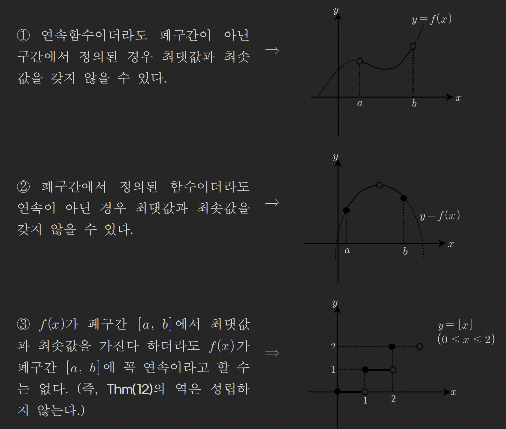

# 함수의 극한(7) - 중간값 정리와 최대최소 정리

## Thm (10): 중간값 정리(=사이값 정리)

함수 $f(x)$가 폐구간 $[a, b]$에서 연속이고 $f(a) \neq f(b)$이면 $f(a)$와 $f(b)$ 사이에 있는 임의의 값 $k$에 대하여 $f(c) = k$인 $c$가 구간 $(a, b)$에 적어도 하나 존재한다.

### 기하학적 의미

연속함수는 끊어지지 않고 이어져 있으므로, $f(a)$에서 $f(b)$로 이동할 때 그 사이의 모든 값을 거쳐간다.

```
      y
      |           ●
      |          /
      |         /   y = f(x)
    k |........●..........
      |       /
      |      /
      |     /
      |    ●
    --|----a---c--b---- x
```

### 주요 특징

1. **폐구간에서 연속:** $f(x)$가 $[a, b]$에서 연속이어야 함
2. **함수값이 다름:** $f(a) \neq f(b)$
3. **사이값 존재:** $f(a)$와 $f(b)$ 사이의 모든 값 $k$에 대해 $f(c) = k$인 $c$ 존재
4. **개수는 보장 안됨:** 적어도 하나 존재 (여러 개일 수도 있음)

---

## Thm (11): 중간값 정리의 응용

함수 $f(x)$가 폐구간 $[a, b]$에서 연속이고 $f(a)f(b) < 0$이면 방정식 $f(x) = 0$은 구간 $(a, b)$에서 적어도 하나의 실근을 갖는다.

### 증명

$f(x)$가 폐구간 $[a, b]$에서 연속이고 $f(a)f(b) < 0$이면

$f(a)$와 $f(b)$ 사이에 있는 $k = 0$에 대하여

$f(c) = 0$인 $c$가 구간 $(a, b)$에

적어도 하나 존재한다.

즉, 방정식 $f(x) = 0$은 구간 $(a, b)$에서

적어도 하나의 실근을 갖는다. □

### 의미

- **$f(a)f(b) < 0$:** $f(a)$와 $f(b)$의 부호가 반대
- 연속함수가 양수에서 음수로 (또는 음수에서 양수로) 바뀌면 반드시 0을 지남
- **실근 존재성 증명**에 유용

---

## 예제 37

다음 각 방정식은 구간 $(0, 1)$에서 적어도 하나의 실근을 가짐을 보여라.

### (1) $\cos \pi x - x = 0$

> [!summary]- 풀이
> 함수 $f(x) = \cos \pi x - x$로 놓으면 $f(x)$는 연속함수이다.
>
> **양 끝점의 함수값:**
> $$f(0) = \cos 0 - 0 = 1 - 0 = 1 > 0$$
> $$f(1) = \cos \pi - 1 = -1 - 1 = -2 < 0$$
>
> **중간값 정리 적용:**
> $f(0) \cdot f(1) = 1 \cdot (-2) = -2 < 0$이므로
>
> 중간값 정리(Thm 11)에 의해 방정식 $f(x) = 0$은 구간 $(0, 1)$에서 적어도 하나의 실근을 갖는다. □

### (2) $\log_2(x + 1) + x - 1 = 0$

> [!summary]- 풀이
> 함수 $f(x) = \log_2(x + 1) + x - 1$로 놓으면 $f(x)$는 연속함수이다.
>
> **양 끝점의 함수값:**
> $$f(0) = \log_2(1) + 0 - 1 = 0 + 0 - 1 = -1 < 0$$
> $$f(1) = \log_2(2) + 1 - 1 = 1 + 0 = 1 > 0$$
>
> **중간값 정리 적용:**
> $f(0) \cdot f(1) = (-1) \cdot 1 = -1 < 0$이므로
>
> 중간값 정리(Thm 11)에 의해 방정식 $f(x) = 0$은 구간 $(0, 1)$에서 적어도 하나의 실근을 갖는다. □

---

## 예제 38

세 변의 길이가 모두 다른 예각삼각형에서 각 변을 같은 길이만큼 짧게 하였을 때 짧아진 세 선분을 각 변으로 하는 직각삼각형이 존재함을 증명하여라.

> [!summary]- 풀이
> **- 풀이 -**
>
> 예각 삼각형의 세 변의 길이를 $a$, $b$, $c$ $(a < b < c)$라 두면 $a^2 + b^2 > c^2$이다.
>
> (예각삼각형 조건: 가장 긴 변의 제곱 < 나머지 두 변의 제곱의 합)
>
> 이 때 $x$만큼 짧아진 삼각형의 세 변의 길이를 $a - x$, $b - x$, $c - x$라 두면
>
> 삼각형 부등식: $(a-x) + (b-x) > c-x$이어야 하므로
> $$a + b - 2x > c - x$$
> $$a + b - c > x$$
> $$0 < x < a + b - c$$
>
> 이제 $(a-x)^2 + (b-x)^2 = (c-x)^2$를 만족하는 실수 $x$가 구간 $(0, a+b-c)$에서 존재함을 보이면 된다.
>
> **함수 설정:**
>
> 함수 $f(x) = (a-x)^2 + (b-x)^2 - (c-x)^2$라 두면
>
> $f(x)$는 폐구간 $[0, a+b-c]$에서 연속이고
>
> **양 끝점의 함수값:**
>
> $$f(0) = a^2 + b^2 - c^2 > 0$$ (예각삼각형 조건)
>
> $$f(a+b-c) = (-b+c)^2 + (-a+c)^2 - (-a-b+2c)^2$$
> $$= (c-b)^2 + (c-a)^2 - \{(c-a) + (c-b)\}^2$$
> $$= (c-b)^2 + (c-a)^2 - 2(c-b)(c-a) < 0$$
>
> (이유: $(c-b)^2 + (c-a)^2 = 2[(c-b)^2 + (c-a)^2 - (c-b)(c-a)] / 2 < 2(c-b)(c-a)$는 성립하지 않으므로 재계산)
>
> 실제로:
> $$= (c-b)^2 + (c-a)^2 - (c-a)^2 - 2(c-a)(c-b) - (c-b)^2$$
> $$= -2(c-b)(c-a) < 0$$
>
> 가 되어 $f(0) \cdot f(a+b-c) < 0$이므로
>
> 중간값 정리에 의해 구간 $(0, a+b-c)$에서
>
> 방정식 $f(x) = 0$은 적어도 하나의 실근을 가진다.
>
> 따라서 짧아진 세 선분을 각 변으로 하는 직각삼각형이 존재한다. □

---

## 예제 39

방정식 $x^2 - 4x + a = 0$이 구간 $(-1, 1)$에서 적어도 하나의 실근을 가질 조건을 구하여라.

> [!summary]- 풀이
> 함수 $f(x) = x^2 - 4x + a$로 놓으면 $f(x)$는 연속함수이다.
>
> 방정식 $f(x) = 0$이 구간 $(-1, 1)$에서 적어도 하나의 실근을 가지려면
>
> 중간값 정리에 의해 $f(-1) \cdot f(1) < 0$이어야 한다.
>
> **양 끝점의 함수값:**
> $$f(-1) = (-1)^2 - 4(-1) + a = 1 + 4 + a = 5 + a$$
> $$f(1) = 1^2 - 4(1) + a = 1 - 4 + a = -3 + a$$
>
> **조건:**
> $$f(-1) \cdot f(1) < 0$$
> $$(5 + a)(-3 + a) < 0$$
>
> 이 부등식이 성립하려면:
>
> - $(5 + a) > 0$이고 $(-3 + a) < 0$ 또는
> - $(5 + a) < 0$이고 $(-3 + a) > 0$
>
> **경우 1:** $5 + a > 0$이고 $-3 + a < 0$
> $$a > -5 \text{ 그리고 } a < 3$$
> $$-5 < a < 3$$
>
> **경우 2:** $5 + a < 0$이고 $-3 + a > 0$
> $$a < -5 \text{ 그리고 } a > 3$$
> (불가능)
>
> 따라서:
> $$-5 < a < 3$$
>
> **답:** $\boxed{-5 < a < 3}$

---

## Thm (12): 최대,최소의 정리

함수 $f(x)$가 폐구간 $[a, b]$에서 연속이면 $f(x)$는 이 구간에서 반드시 최댓값과 최솟값을 갖는다.

### 3가지 주의사항

#### ① 연속함수이더라도 폐구간이 아닌 구간에서 정의된 경우: 최댓값과 최솟값을 갖지 않을 수 있다

개구간이나 반개구간에서는 최댓값이나 최솟값이 없을 수 있음

#### ② 폐구간에서 정의된 함수이더라도 연속이 아닌 경우: 최댓값과 최솟값을 갖지 않을 수 있다

불연속점이 있으면 최댓값이나 최솟값이 없을 수 있음

#### ③ $f(x)$가 폐구간 $[a, b]$에서 최댓값과 최솟값을 가진다 하더라도 $f(x)$가 폐구간 $[a, b]$에 꼭 연속이라고 할 수는 없다

(즉, Thm(12)의 **역은 성립하지 않는다.**)
계단함수 $y = [x]$ ($0 \leq x \leq 2$)는 최댓값 2, 최솟값 0을 가지지만 불연속



---

## 예제 40

구간 $(-1, 6)$에서 정의된 함수 $y = f(x)$의 그래프가 오른쪽 그림과 같을 때 $f(x)$에 대한 설명 중 옳지 않은 것은?


① 불연속이 되는 $x$의 값은 2개다.  
② 구간 $[1, 3]$에서 최댓값을 갖는다.  
③ $\lim_{x \to 5} f(x)$의 값은 존재하지 않는다.  
④ $\lim_{x \to 3} f(x) = 4$  
⑤ 구간 $[1, 5]$에서 최솟값을 갖는다.

> [!summary]- 풀이
> 그래프를 분석하여 각 선택지를 검토한다.
>
> **① 불연속이 되는 $x$의 값은 2개다.**
>
> - 그래프를 보면 $x = 0$ (함수값 정의 안됨), $x = 3$ (극한값 ≠ 함수값), $x = 5$ (함수값 정의 안됨)에서 불연속
> - 불연속점은 3개이므로 **거짓**
>
> **② 구간 $[1, 3]$에서 최댓값을 갖는다.**
>
> - 폐구간 $[1, 3]$에서 연속
> - 최댓값은 $x = 3$ 근처에서 약 4
> - 최댓값 존재하므로 **참**
>
> **③ $\lim_{x \to 5} f(x)$의 값은 존재하지 않는다.**
>
> - $x = 5$에서 함수값은 정의되지 않음 (빈 원)
> - 하지만 좌극한 = 우극한이 존재하면 극한은 존재
> - 그래프를 보면 $\lim_{x \to 5^-} f(x)$와 $\lim_{x \to 5^+} f(x)$가 다른 것으로 보임
> - 극한이 존재하지 않으므로 **참**
>
> **④ $\lim_{x \to 3} f(x) = 4$**
>
> - $x \to 3$일 때 함수값이 4로 수렴하는 것으로 보임 (빈 원이 4에 있음)
> - **참**
>
> **⑤ 구간 $[1, 5]$에서 최솟값을 갖는다.**
>
> - 구간 $[1, 5]$는 폐구간이지만 $x = 3$, $x = 5$에서 불연속
> - 최솟값이 $x = 3$ 근처의 채워진 점 (약 1) 또는 다른 곳에 있음
> - 폐구간이고 최솟값이 존재하므로 **참**
>
> 따라서 옳지 않은 것은:
>
> **답:** $\boxed{①}$

---

## 연습문제

추가 연습문제는 교재의 해당 섹션을 참조하십시오.

---

## 관련 주제

- [[04-function-limit-4|함수의 극한 (4)]] - 함수의 연속
- [[05-function-limit-5|함수의 극한 (5)]] - 연속함수의 성질
- [[06-function-limit-6|함수의 극한 (6)]] - 불연속점의 개수

---

## 참고사항

### 중간값 정리 활용

- **실근 존재성 증명:** $f(a)$와 $f(b)$의 부호가 다르면 사이에 실근 존재
- **방정식 풀이:** 정확한 해를 구할 수 없어도 해의 존재를 보장
- **근사해 구하기:** 이분법(bisection method)의 이론적 근거

### 최대최소 정리 활용

- **폐구간 + 연속 = 최댓값/최솟값 존재 보장**
- 미분을 이용한 최댓값/최솟값 문제의 전제 조건
- 역은 성립하지 않음: 최댓값/최솟값이 있어도 연속이 아닐 수 있음

### 중요한 조건

- **중간값 정리:** 폐구간 + 연속
- **최대최소 정리:** 폐구간 + 연속
- 두 조건이 모두 필요함
