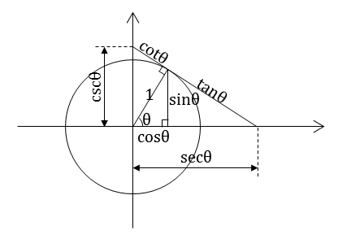
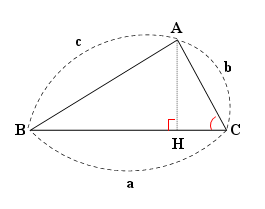

# 삼각법 공식 정리 (Cheat Sheet)

## 특수각의 삼각함수 값

### sin 0°,30°,45°,60°,90°= ?

> [!check]- 답
> $$0 ,\; \frac{1}{2} ,\; \frac{\sqrt{2}}{2} ,\; \frac{\sqrt{3}}{2} ,\; 1$$

### cos 0°,30°,45°,60°,90°= ?

> [!check]- 답
> $$1 ,\; \frac{\sqrt{3}}{2} ,\; \frac{\sqrt{2}}{2} ,\; \frac{1}{2} ,\; 0$$

### tan 0°,30°,45°,60°,90°= ?

> [!check]- 답
> $$0 ,\; \frac{\sqrt{3}}{3} ,\; 1 ,\; \sqrt{3} ,\; \infty$$

---

## 삼각 항등식

### 삼각 항등식 3개 ㄱ

> [!check]- 답
> $$\sin^2\theta + \cos^2\theta = 1$$
> $$1 + \tan^2\theta = \sec^2\theta$$
> $$1 + \cot^2\theta = \csc^2\theta$$
> 

---

## 사인 법칙

### 사인 법칙 (변과 각의 관계)

> [!check]- 답
> $$\frac{a}{\sin A} = \frac{b}{\sin B} = \frac{c}{\sin C}$$

### 사인 법칙 (외접원의 반지름)

> [!check]- 답
> $$\frac{a}{\sin A} = \frac{b}{\sin B} = \frac{c}{\sin C} = 2R$$
> (R: 외접원의 반지름)

### 외접원을 이용한 사인 법칙 유도과정

> [!check]- 답
> [answer](https://m.blog.naver.com/mathfreedom/223102838002)

---

## 코사인 법칙

### 위 그림 예각삼각형의 각 변을 두 코사인의 합으로 나타내봐 : a = ?, b = ? , c = ?

> [!check]- 답
> $$a^2 = b^2 + c^2 - 2bc\cos A$$

### 위 식으로 부터 코사인 법칙 공식을 유도해 보시오

> [!check]- 답
> [코사인법칙유도과정](https://mathbang.net/538)

### 코사인 법칙: a² = ?

> [!check]- 답
> $$a^2 = b^2 + c^2 - 2bc\cos A$$

### 코사인 법칙: b² = ?

> [!check]- 답
> $$b^2 = a^2 + c^2 - 2ac\cos B$$

### 코사인 법칙: cos A = ?

> [!check]- 답
> $$\cos A = \frac{b^2 + c^2 - a^2}{2bc}$$

---

## 덧셈정리

### sin(α + β) = ?

> [!check]- 답
> $$\sin(\alpha + \beta) = \sin\alpha\cos\beta + \cos\alpha\sin\beta$$

### sin(α - β) = ?

> [!check]- 답
> $$\sin(\alpha - \beta) = \sin\alpha\cos\beta - \cos\alpha\sin\beta$$

### cos(α + β) = ?

> [!check]- 답
> $$\cos(\alpha + \beta) = \cos\alpha\cos\beta - \sin\alpha\sin\beta$$

### cos(α - β) = ?

> [!check]- 답
> $$\cos(\alpha - \beta) = \cos\alpha\cos\beta + \sin\alpha\sin\beta$$

### tan(α + β) = ?

> [!check]- 답
> $$\tan(\alpha + \beta) = \frac{\tan\alpha + \tan\beta}{1 - \tan\alpha\tan\beta}$$

### tan(α - β) = ?

> [!check]- 답
> $$\tan(\alpha - \beta) = \frac{\tan\alpha - \tan\beta}{1 + \tan\alpha\tan\beta}$$

### sin cos tan 덧셈정리 유도과정

> [!check]- 답
> [[./08-advanced-trigonometry-1.md|덧셈정리 유도과정]]

---

## 덧셈정리 응용

### α + β = π/2 일 때, sin²α + sin²β = ?

> [!check]- 답
> $$\sin^2\alpha + \sin^2\beta = 1$$

### 두 각이 여각일 때, tan α · tan β = ?

> [!check]- 답
> $$\tan\alpha \cdot \tan\beta = 1$$

### α + β = π/4 일 때, (1 + tan α)(1 + tan β) = ?

> [!check]- 답
> $$(1 + \tan\alpha)(1 + \tan\beta) = 2$$

### α + β = 3π/4 일 때, (1 - tan α)(1 - tan β) = ?

> [!check]- 답
> $$(1 - \tan\alpha)(1 - \tan\beta) = 2$$

### 기울기가 m₁, m₂인 두 직선이 이루는 예각 θ의 tan θ = ?

> [!check]- 답
> $$\tan\theta = \left|\frac{m_1 - m_2}{1 + m_1 \cdot m_2}\right|$$

---

## 배각 공식

### sin 2α = ? (2가지 형식)

> [!check]- 답
> $$= 2\sin\alpha\cos\alpha$$
> $$= \frac{2\tan\alpha}{1+\tan^2\alpha}$$

### cos 2α = ? (4가지 형식)

> [!check]- 답
>
> $$= \cos^2\alpha - \sin^2\alpha$$
> $$= 2\cos^2\alpha - 1$$
> $$= 1 - 2\sin^2\alpha$$
> $$= \frac{1-\tan^2\alpha}{1+\tan^2\alpha}$$

### tan 2α = ?

> [!check]- 답
> $$\tan 2\alpha = \frac{2\tan\alpha}{1 - \tan^2\alpha}$$

---

## 3배각 공식

### sin 3α = ? (sin α로 표현)

> [!check]- 답
> $$\sin 3\alpha = 3\sin\alpha - 4\sin^3\alpha$$

### cos 3α = ? (cos α로 표현)

> [!check]- 답
> $$\cos 3\alpha = 4\cos^3\alpha - 3\cos\alpha$$

---

## 반각 공식

### sin²α = ? (cos 2α를 이용)

> [!check]- 답
> $$\sin^2\alpha = \frac{1 - \cos 2\alpha}{2}$$

### cos²α = ? (cos 2α를 이용)

> [!check]- 답
> $$\cos^2\alpha = \frac{1 + \cos 2\alpha}{2}$$

### tan²α = ? (cos 2α를 이용)

> [!check]- 답
> $$\tan^2\alpha = \frac{1 - \cos 2\alpha}{1 + \cos 2\alpha}$$

---

## 기타공식 (Thm 16)

### 합차를 곱으로 (1): sin A + sin B = ?

> [!check]- 답
> $$\sin A + \sin B = 2\sin\frac{A+B}{2}\cos\frac{A-B}{2}$$

### 합차를 곱으로 (2): sin A - sin B = ?

> [!check]- 답
> $$\sin A - \sin B = 2\cos\frac{A+B}{2}\sin\frac{A-B}{2}$$

### 합차를 곱으로 (3): cos A + cos B = ?

> [!check]- 답
> $$\cos A + \cos B = 2\cos\frac{A+B}{2}\cos\frac{A-B}{2}$$

### 합차를 곱으로 (4): cos A - cos B = ?

> [!check]- 답
> $$\cos A - \cos B = -2\sin\frac{A+B}{2}\sin\frac{A-B}{2}$$

### 곱을 합차로 (1): sin α cos β = ?

> [!check]- 답
> $$\sin\alpha\cos\beta = \frac{1}{2}\{\sin(\alpha+\beta)+\sin(\alpha-\beta)\}$$

### 곱을 합차로 (2): cos α sin β = ?

> [!check]- 답
> $$\cos\alpha\sin\beta = \frac{1}{2}\{\sin(\alpha+\beta)-\sin(\alpha-\beta)\}$$

### 곱을 합차로 (3): cos α cos β = ?

> [!check]- 답
> $$\cos\alpha\cos\beta = \frac{1}{2}\{\cos(\alpha+\beta)+\cos(\alpha-\beta)\}$$

### 곱을 합차로 (4): sin α sin β = ?

> [!check]- 답
> $$\sin\alpha\sin\beta = -\frac{1}{2}\{\cos(\alpha+\beta)-\cos(\alpha-\beta)\}$$

---

## 삼각함수의 합성 (Thm 17)

### 합성 공식 (1): a sin θ + b cos θ = ? (sin으로 합성)

> [!check]- 답
> $$a\sin\theta + b\cos\theta = \sqrt{a^2 + b^2} \sin(\theta + \alpha)$$
> 단, $\tan\alpha = \frac{b}{a}$

### 합성 공식 (2): a sin θ + b cos θ = ? (cos으로 합성)

> [!check]- 답
> $$a\sin\theta + b\cos\theta = \sqrt{a^2 + b^2} \cos(\theta - \beta)$$
> 단, $\tan\beta = \frac{a}{b}$

### 합성의 기하학적 의미 (벡터 내적)

> [!check]- 답
> $$a\sin\theta + b\cos\theta = (\cos\theta, \sin\theta) \cdot (b, a) = \vec{a} \cdot \vec{b} = |\vec{a}||\vec{b}|\cos\gamma$$
> $\gamma = 0°$일 때 내적이 최댓값을 가진다.

---
