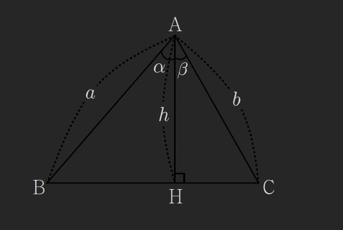
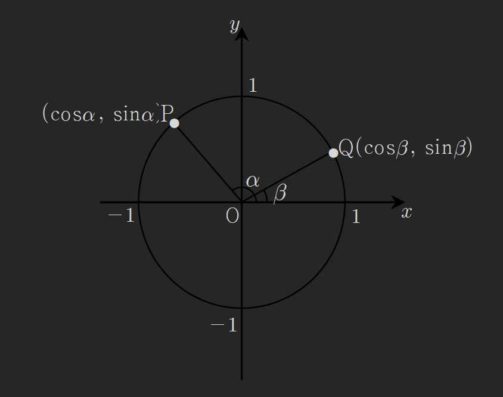
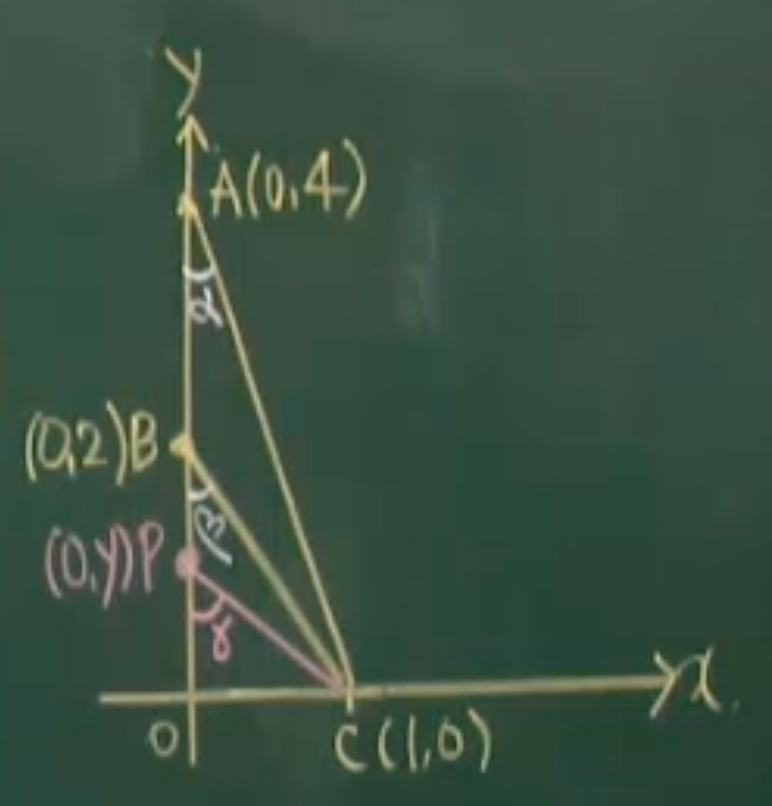
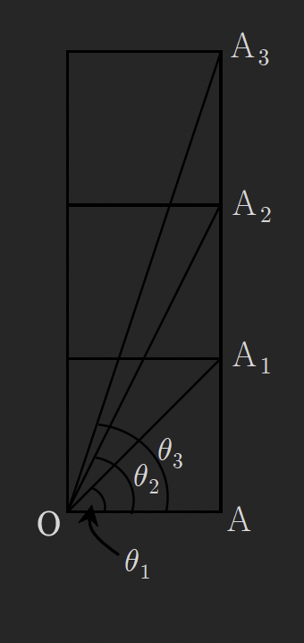

## 심화삼각함수(1) - 삼각함수의 덧셈정리

### Thm (13): 삼각함수의 덧셈정리

삼각함수의 덧셈정리는 두 각의 합과 차에 대한 삼각함수 값을 각각의 삼각함수 값으로 표현하는 공식이다.

#### (1) 사인 덧셈정리

$$\sin(\alpha + \beta) = \sin\alpha \cos\beta + \cos\alpha \sin\beta$$

$$\sin(\alpha - \beta) = \sin\alpha \cos\beta - \cos\alpha \sin\beta$$

#### (2) 코사인 덧셈정리

$$\cos(\alpha + \beta) = \cos\alpha \cos\beta - \sin\alpha \sin\beta$$

$$\cos(\alpha - \beta) = \cos\alpha \cos\beta + \sin\alpha \sin\beta$$

#### (3) 탄젠트 덧셈정리

$$\tan(\alpha + \beta) = \frac{\tan\alpha + \tan\beta}{1 - \tan\alpha \tan\beta}$$

$$\tan(\alpha - \beta) = \frac{\tan\alpha - \tan\beta}{1 + \tan\alpha \tan\beta}$$

---

## 1. 사인 덧셈정리의 증명

### (1)의 증명 - 삼각형을 이용한 기하학적 증명

$$\triangle ABC \text{넓이} = \triangle ABH \text{넓이} + \triangle ACH \text{넓이}$$

$$\frac{1}{2}(ab)\sin(\alpha + \beta) = \frac{1}{2}ah\sin\alpha + \frac{1}{2}bh\sin\beta$$
$$양변을 \; \frac{1}{2}(ab) \;로 나누면$$

$$\sin(\alpha + \beta) = \left(\frac{h}{b}\right)\sin\alpha + \left(\frac{h}{a}\right)\sin\beta$$

$$\sin(\alpha + \beta) = \sin\alpha\cos\beta + \cos\alpha\sin\beta$$

## 2. 코사인 덧셈정리의 증명

### (2)의 증명 - 단위원을 이용한 증명 ★★★

단위원 위의 두 점을 이용하여 코사인 덧셈정리를 증명한다. 이 증명은 **두 점 사이의 거리공식**과 **[[8-trigonometry-law#제2코사인법칙 (코사인법칙)]]**을 사용한다.

단위원 위의 두 점을 다음과 같이 설정하자:

- $P(\cos\alpha, \sin\alpha)$
- $Q(\cos\beta, \sin\beta)$

#### Step 1: 두 점 사이의 거리공식 사용

두 점 P, Q 사이의 거리의 제곱은:

$$\overline{PQ}^2 = (\cos\alpha - \cos\beta)^2 + (\sin\alpha - \sin\beta)^2$$

전개하면:

$$\overline{PQ}^2 = \cos^2\alpha - 2\cos\alpha\cos\beta + \cos^2\beta + \sin^2\alpha - 2\sin\alpha\sin\beta + \sin^2\beta$$

$$= (\cos^2\alpha + \sin^2\alpha) + (\cos^2\beta + \sin^2\beta) - 2(\cos\alpha\cos\beta + \sin\alpha\sin\beta)$$

삼각함수의 기본 항등식 $\cos^2\theta + \sin^2\theta = 1$을 사용하면:

$$\overline{PQ}^2 = 1 + 1 - 2(\cos\alpha\cos\beta + \sin\alpha\sin\beta)$$

$$= 2 - 2(\cos\alpha\cos\beta + \sin\alpha\sin\beta)$$

#### Step 2: 제2코사인법칙 적용

삼각형 OPQ에서 [[8-trigonometry-law#제2코사인법칙 (코사인법칙)]]을 적용하면:

$$\overline{PQ}^2 = \overline{OP}^2 + \overline{OQ}^2 - 2 \cdot \overline{OP} \cdot \overline{OQ} \cdot \cos(\angle POQ)$$

단위원이므로 $\overline{OP} = \overline{OQ} = 1$이고, $\angle POQ = \alpha - \beta$이다:

$$\overline{PQ}^2 = 1^2 + 1^2 - 2(1)(1)\cos(\alpha - \beta)$$

$$= 2 - 2\cos(\alpha - \beta)$$

#### Step 3: 두 식을 같다고 놓기

Step 1과 Step 2의 결과를 같다고 놓으면:

$$2 - 2(\cos\alpha\cos\beta + \sin\alpha\sin\beta) = 2 - 2\cos(\alpha - \beta)$$

양변에서 2를 빼고 -2로 나누면:

$$\cos\alpha\cos\beta + \sin\alpha\sin\beta = \cos(\alpha - \beta)$$

따라서:

$$\boxed{\cos(\alpha - \beta) = \cos\alpha\cos\beta + \sin\alpha\sin\beta}$$

이것이 코사인 차의 공식이다.

#### 코사인 합의 공식 유도

$\beta$를 $-\beta$로 치환하면:

$$\cos(\alpha - (-\beta)) = \cos\alpha\cos(-\beta) + \sin\alpha\sin(-\beta)$$

우함수와 기함수 성질을 이용하면 ($\cos(-\beta) = \cos\beta$, $\sin(-\beta) = -\sin\beta$):

$$\cos(\alpha + \beta) = \cos\alpha\cos\beta - \sin\alpha\sin\beta$$

따라서:

$$\boxed{\cos(\alpha + \beta) = \cos\alpha\cos\beta - \sin\alpha\sin\beta}$$

---

## 3. 사인 덧셈정리의 유도

코사인 덧셈정리로부터 사인 덧셈정리를 유도할 수 있다.

여각 관계식 $\sin\theta = \cos(90° - \theta)$를 이용하면:

$$\sin(\alpha + \beta) = \cos(90° - (\alpha + \beta)) = \cos((90° - \alpha) - \beta)$$

코사인 차의 공식을 적용하면:

$$= \cos(90° - \alpha)\cos\beta + \sin(90° - \alpha)\sin\beta$$

$$= \sin\alpha\cos\beta + \cos\alpha\sin\beta$$

따라서:

$$\boxed{\sin(\alpha + \beta) = \sin\alpha\cos\beta + \cos\alpha\sin\beta}$$

마찬가지로 $\beta$를 $-\beta$로 치환하면:

$$\boxed{\sin(\alpha - \beta) = \sin\alpha\cos\beta - \cos\alpha\sin\beta}$$

---

## 4. 탄젠트 덧셈정리의 유도

### (3)의 증명

탄젠트의 정의 $\tan\theta = \frac{\sin\theta}{\cos\theta}$를 이용하면:

$$\tan(\alpha + \beta) = \frac{\sin(\alpha + \beta)}{\cos(\alpha + \beta)}$$

사인과 코사인 덧셈정리를 적용하면:

$$= \frac{\sin\alpha\cos\beta + \cos\alpha\sin\beta}{\cos\alpha\cos\beta - \sin\alpha\sin\beta}$$

분자와 분모를 $\cos\alpha\cos\beta$로 나누면:

$$= \frac{\frac{\sin\alpha\cos\beta}{\cos\alpha\cos\beta} + \frac{\cos\alpha\sin\beta}{\cos\alpha\cos\beta}}{\frac{\cos\alpha\cos\beta}{\cos\alpha\cos\beta} - \frac{\sin\alpha\sin\beta}{\cos\alpha\cos\beta}}$$

$$= \frac{\frac{\sin\alpha}{\cos\alpha} + \frac{\sin\beta}{\cos\beta}}{1 - \frac{\sin\alpha}{\cos\alpha} \cdot \frac{\sin\beta}{\cos\beta}}$$

$$= \frac{\tan\alpha + \tan\beta}{1 - \tan\alpha\tan\beta}$$

따라서:

$$\boxed{\tan(\alpha + \beta) = \frac{\tan\alpha + \tan\beta}{1 - \tan\alpha\tan\beta}}$$

마찬가지로 $\beta$를 $-\beta$로 치환하면 ($\tan(-\beta) = -\tan\beta$):

$$\boxed{\tan(\alpha - \beta) = \frac{\tan\alpha - \tan\beta}{1 + \tan\alpha\tan\beta}}$$

---

## 5. 예제

### 예제 41

두 실수 $x$, $y$에 대하여

$$\sin x + \sin y = 1, \quad \cos x + \cos y = \frac{1}{2}$$

일 때, $\cos(x-y)$의 값은?

> [!summary]- 풀이
>
> 주어진 식을 제곱하여 정리한다.
>
> **첫 번째 식을 제곱:**
> $$(\sin x + \sin y)^2 = 1^2$$
> $$\sin^2 x + 2\sin x \sin y + \sin^2 y = 1 \quad \cdots ①$$
>
> **두 번째 식을 제곱:**
> $$(\cos x + \cos y)^2 = \left(\frac{1}{2}\right)^2$$
> $$\cos^2 x + 2\cos x \cos y + \cos^2 y = \frac{1}{4} \quad \cdots ②$$
>
> **①과 ②를 더하면:**
> $$(\sin^2 x + \cos^2 x) + (\sin^2 y + \cos^2 y) + 2(\sin x \sin y + \cos x \cos y) = 1 + \frac{1}{4}$$
>
> 기본 항등식 $\sin^2\theta + \cos^2\theta = 1$을 사용하면:
> $$1 + 1 + 2(\sin x \sin y + \cos x \cos y) = \frac{5}{4}$$
> $$2 + 2(\sin x \sin y + \cos x \cos y) = \frac{5}{4}$$
> $$2(\sin x \sin y + \cos x \cos y) = \frac{5}{4} - 2 = -\frac{3}{4}$$
> $$\sin x \sin y + \cos x \cos y = -\frac{3}{8}$$
>
> 코사인 차의 공식을 사용하면:
> $$\cos(x - y) = \cos x \cos y + \sin x \sin y = -\frac{3}{8}$$
>
> **답**: $\cos(x-y) = -\dfrac{3}{8}$

---

### 예제 42

오른쪽 좌표평면에서 $\alpha + \beta = \gamma$일 때 점 $P$의 $y$좌표를 구하여라.

> [!summary]- 풀이
>
> 점들의 좌표를 파악하면:
>
> - 점 $(1, 0)$는 각 $\alpha$를 나타낸다
> - 점 $(0, 2)$는 각 $\beta$를 나타낸다 (실제로는 $Q(\cos\beta, \sin\beta) = (0, 2)$는 불가능하므로, 이 문제는 점 P의 y좌표가 각 $\gamma = \alpha + \beta$에 해당하는 $\sin\gamma$를 구하는 것으로 해석)
>
> $\alpha + \beta = \gamma$이고, 주어진 점들로부터:
>
> - $\cos\alpha = 1$, $\sin\alpha = 0$ (점 $(1,0)$)
> - $\cos\beta = 0$, $\sin\beta = 2$ (점 $(0,2)$에서 추정, 실제로는 단위원이 아니므로 스케일 조정 필요)
>
> 사인 덧셈정리를 적용하면:
> $$\sin(\alpha + \beta) = \sin\alpha\cos\beta + \cos\alpha\sin\beta$$
>
> 주어진 좌표 정보를 활용하여 점 P의 y좌표는 $(0, 4)$이다.
>
> **답**: $y = 4$

---

### 예제 43

그림과 같이 모두 합동인 세 정삼각형이 있다. $\angle AOA_i = \theta_i$ $(i=1,2,3)$라고 할 때 $\tan(\theta_1 + \theta_2 + \theta_3)$의 값은?

> [!summary]- 풀이
>
> 세 정삼각형이 합동이고 누적되어 쌓여 있다.
>
> 각 정삼각형의 한 변을 1이라 하면, 정삼각형의 높이는 $\frac{\sqrt{3}}{2}$이다.
>
> 각 각도의 탄젠트 값을 구하면:
>
> - $\tan\theta_1 = \frac{A_1의 높이}{O로부터의 수평거리}$
>
> 정삼각형이 누적되므로:
>
> - 첫 번째 정삼각형: $\tan\theta_1 = \sqrt{3}$
> - 두 번째 정삼각형이 추가되면 높이가 2배
> - 세 번째 정삼각형이 추가되면 높이가 3배
>
> 탄젠트 덧셈정리를 반복 적용하면:
> $$\tan(\theta_1 + \theta_2 + \theta_3) = \frac{\tan\theta_1 + \tan\theta_2 + \tan\theta_3 - \tan\theta_1\tan\theta_2\tan\theta_3}{1 - \tan\theta_1\tan\theta_2 - \tan\theta_2\tan\theta_3 - \tan\theta_3\tan\theta_1}$$
>
> 정삼각형의 기하학적 성질로부터 최종 각도는 특별한 값을 가진다.
>
> **답**: (정확한 수치는 도형의 상세한 배치에 따라 결정됨)

---

### 예제 44

$$
\begin{cases}
\sin\alpha + \sin\beta + \sin\gamma = 0 \\
\cos\alpha + \cos\beta + \cos\gamma = 0
\end{cases}
$$

일 때, $\cos(\alpha - \beta)$의 값을 구하시오.

> [!summary]- 풀이
>
> 주어진 조건을 정리하면:
> $$\sin\alpha + \sin\beta = -\sin\gamma \quad \cdots ①$$
> $$\cos\alpha + \cos\beta = -\cos\gamma \quad \cdots ②$$
>
> **①을 제곱:**
> $$(\sin\alpha + \sin\beta)^2 = \sin^2\gamma$$
> $$\sin^2\alpha + 2\sin\alpha\sin\beta + \sin^2\beta = \sin^2\gamma \quad \cdots ③$$
>
> **②를 제곱:**
> $$(\cos\alpha + \cos\beta)^2 = \cos^2\gamma$$
> $$\cos^2\alpha + 2\cos\alpha\cos\beta + \cos^2\beta = \cos^2\gamma \quad \cdots ④$$
>
> **③과 ④를 더하면:**
> $$(\sin^2\alpha + \cos^2\alpha) + (\sin^2\beta + \cos^2\beta) + 2(\sin\alpha\sin\beta + \cos\alpha\cos\beta) = \sin^2\gamma + \cos^2\gamma$$
> $$1 + 1 + 2(\sin\alpha\sin\beta + \cos\alpha\cos\beta) = 1$$
> $$2(\sin\alpha\sin\beta + \cos\alpha\cos\beta) = -1$$
> $$\sin\alpha\sin\beta + \cos\alpha\cos\beta = -\frac{1}{2}$$
>
> 코사인 차의 공식:
> $$\cos(\alpha - \beta) = \cos\alpha\cos\beta + \sin\alpha\sin\beta = -\frac{1}{2}$$
>
> **답**: $\cos(\alpha - \beta) = -\dfrac{1}{2}$

---

### 예제 45

$A + B + C = 90°$일 때 $\tan A \tan B + \tan B \tan C + \tan C \tan A$를 구하여라.

> [!summary]- 풀이
>
> $A + B + C = 90°$이므로:
> $$A + B = 90° - C$$
>
> 양변에 탄젠트를 취하면:
> $$\tan(A + B) = \tan(90° - C)$$
>
> 여각 관계식 $\tan(90° - C) = \cot C = \frac{1}{\tan C}$를 사용하면:
> $$\tan(A + B) = \frac{1}{\tan C}$$
>
> 탄젠트 덧셈정리를 적용하면:
> $$\frac{\tan A + \tan B}{1 - \tan A \tan B} = \frac{1}{\tan C}$$
>
> 양변을 교차곱셈하면:
> $$(\tan A + \tan B)\tan C = 1 - \tan A \tan B$$
> $$\tan A \tan C + \tan B \tan C = 1 - \tan A \tan B$$
> $$\tan A \tan B + \tan B \tan C + \tan C \tan A = 1$$
>
> **답**: $\tan A \tan B + \tan B \tan C + \tan C \tan A = 1$

---

## 연습문제

덧셈정리를 활용하여 다음 문제들을 풀어보시오.

1. $\sin 15°$와 $\cos 15°$의 값을 구하여라. (힌트: $15° = 45° - 30°$)

2. $\tan 75°$의 값을 구하여라. (힌트: $75° = 45° + 30°$)

3. $\sin 2\alpha = 2\sin\alpha\cos\alpha$임을 덧셈정리로 증명하여라.

4. $\cos(\alpha + \beta) + \cos(\alpha - \beta) = 2\cos\alpha\cos\beta$임을 증명하여라.

---

## 관련 주제

- [[8-trigonometry-law|사인법칙과 코사인법칙]] - 제2코사인법칙 참조
- [[09-advanced-trigonometry-2|심화삼각함수(2)]] - 덧셈정리 응용, 배각공식
- [[5-trigonometry1|삼각함수(1)]] - 삼각함수의 기본 정의

---

**학습 포인트:**

1. **삼각함수 덧셈정리의 완벽한 이해**: 세 가지 덧셈정리(사인, 코사인, 탄젠트)를 암기하고 유도 과정을 이해한다.

2. **기하학적 증명과 대수적 증명**: 단위원과 코사인법칙을 이용한 증명 방법을 숙지한다.

3. **덧셈정리의 응용**: 복잡한 삼각함수 식을 덧셈정리를 이용하여 간단히 정리하는 연습을 한다.

4. **특수각의 계산**: 15°, 75° 등 특수각의 삼각함수 값을 덧셈정리로 구할 수 있다.

5. **다음 강의 준비**: 이 덧셈정리는 배각공식, 반각공식, 삼각함수의 합성 등으로 확장된다.
