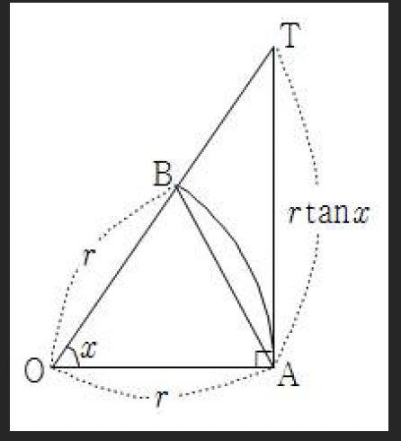

# 초월함수의 극한(1) - 기본극한값

## 1. Thm 18: 초월함수의 기본극한값

### (1) 삼각함수의 극한값

$$\lim_{x \to 0} \frac{\sin x}{x} = 1, \quad \lim_{x \to 0} \frac{\tan x}{x} = 1$$

**중요**: 이 공식은 **$x \to 0$일 때만** 성립합니다.

**핵심 1**: $\lim_{x \to 0}\sin{f(x)}=\lim_{x \to 0}f(x)\times \frac{\sin{f(x)}}{f(x)}$를 이용. (단 $\lim_{x \to 0}f(x)=0$)

> [!note] 참고
> $\sin(-x) = -\sin x$를 이용하면:
> $$\lim_{x \to 0} \frac{\sin(-x)}{x} = \lim_{x \to 0} \frac{-\sin x}{x} = -\lim_{x \to 0} \frac{\sin x}{x} = -1$$

**핵심 2**: $\cos kx = 1 - 2\sin^2 \frac{kx}{2}$임을 이용.

#### Thm 18-1의 증명: $\lim_{x \to 0} \frac{\sin x}{x} = 1$

##### (1) $x > 0$일 때의 증명

**기하학적 접근**

점 $O$를 중심으로 하는 단위원에서:

- 점 $A$의 좌표: $(x, 0)$
- 점 $B$: 단위원 위의 점
- $\angle AOB = x$ (라디안)

**삼각형 넓이 비교**

$$\triangle OAB < \text{부채꼴} OAB < \triangle OAT$$

여기서 $T$는 접선 위의 점입니다.

$$\frac{1}{2} \cdot 1 \cdot \sin x < \frac{1}{2} \cdot x \cdot 1 < \frac{1}{2} \cdot 1 \cdot \tan x$$

모든 항에 $\frac{2}{1 \cdot \sin x}$를 곱하면:

$$1 < \frac{x}{\sin x} < \frac{1}{\cos x}$$

역수를 취하면 (부등호 방향 바뀜):

$$\cos x < \frac{\sin x}{x} < 1$$

$x \to 0$일 때, $\cos x \to 1$이므로 샌드위치 정리에 의해:

$$\lim_{x \to 0} \frac{\sin x}{x} = 1$$

##### (2) $x < 0$일 때의 증명

$x < 0$이면 $-x > 0$이고:

$$\lim_{x \to 0} \frac{\sin x}{x} = \lim_{x \to 0} \frac{\sin(-\theta)}{-\theta} = \lim_{\theta \to 0} \frac{\sin \theta}{\theta} = 1$$

여기서 $\theta = -x > 0$로 치환하였습니다.

##### 결론

$$\therefore \lim_{x \to 0} \frac{\sin x}{x} = 1$$

---

### (2) 지수 · 로그 함수의 극한값

$$ \begin{align} ① \quad \lim_{x \to +\infty} a^x = \begin{cases} \infty & (a > 1) \\ 1 & (a = 1) \\ 0 & (0 < a < 1) \end{cases} \end{align} $$ $$ \begin{align} ② \quad \lim_{x \to -\infty} a^x = \begin{cases} 0 & (a > 1) \\ 1 & (a = 1) \\ \infty & (0 < a < 1) \end{cases} \end{align} $$ 
---

### (3) 극한값 e의 정리

$$\boxed{\lim_{x \to \infty} \left(1 + \frac{1}{x}\right)^x = e, \quad \lim_{x \to 0} (1 + x)^{\frac{1}{x}} = e} \quad (단, e = 2.7182\cdots)$$

**핵심**: $(1 + 0)^{\infty}$ 꼴 일때 위의 괄호안 극한값과 괄호 밖 지수값의 곱은 1이여야함

#### 관련 공식들

**2) 기본 변형**

$$
\lim_{x \to 0} \frac{a^x - 1}{x} = \ln a,
\quad \lim_{x \to 0} \frac{e^x - 1}{x} = 1
$$

특히, $a = e$일 때:
$$\lim_{x \to 0} \frac{e^x - 1}{x} = 1$$

**3) 로그 함수 극한**
$$\lim_{x \to 0} \frac{\log_a(x+1)}{x} = \frac{1}{\ln a}, \quad \lim_{x \to 0} \frac{\ln(x+1)}{x} = 1$$

---

### Thm 18-3-2)의 유도과정: $\lim_{x \to 0} \frac{a^x - 1}{x} = \ln a$

$$\lim_{x \to 0} \frac{a^x - 1}{x}$$

$a^x - 1 = t$로 치환하면 $a^x = 1 + t$이고, 양변에 로그를 취하면:

$$x = \log_a(1+t)$$

$x \to 0$일 때 $t \to 0$이므로:

$$
\lim_{x \to 0} \frac{a^x - 1}{x} 
= \lim_{t \to 0} \frac{t}{\log_a(1+t)} 
= \lim_{t \to 0} \frac{1}{\frac{\log_a(1+t)}{t}}
=\lim_{t\to0}\frac{1}{log_a(1+t)^\frac{1}{t}}
$$

$$
=\lim_{t\to0}\frac{1}{log_a(1+t)^\frac{1}{t}}
=\frac{1}{log_a e}=\ln a
$$

**결론**: $\lim_{x \to 0} \frac{a^x - 1}{x} = \ln a$ ✓

---
### Thm 18-3-3)의 유도: $\lim_{x \to 0} \frac{\log_a(x+1)}{x} = \frac{1}{\ln a}$

$$\lim_{x\to0}\frac{log_a(x+1)}{x}=\lim_{x\to0}log_a(x+1)^\frac{1}{x}=\log_ae=\frac{1}{\ln a}$$
---

## 7. 예제 문제

### 예제 1: $\lim_{x \to 0} \frac{\tan x}{x}$

> [!summary]- 풀이
> Thm 18-(1)에서 직접:
> $$\lim_{x \to 0} \frac{\tan x}{x} = 1$$

### 예제 2: $\lim_{x \to 0} \frac{\sin f(x)}{f(x)}$ (단, $\lim_{x \to 0} f(x) = 0$)

> [!summary]- 풀이
> $t = f(x)$로 치환하면, $x \to 0$일 때 $t \to 0$이므로:
> $$\lim_{x \to 0} \frac{\sin f(x)}{f(x)} = \lim_{t \to 0} \frac{\sin t}{t} = 1$$

### 예제 3: $\lim_{x \to 0} \sin f(x)$ (단, $\lim_{x \to 0} f(x) = 0$)

> [!summary]- 풀이
> $$\lim_{x \to 0} \sin f(x) = \lim_{x \to 0}f(x)\cdot\frac{\sin f(x)}{f(x)}=\lim_{x \to 0}f(x)=0$$

---

### 예제 4: $\lim_{x \to 0} \frac{\sin 5x}{\sin 3x}$

> [!summary]- 풀이
> 분자와 분모를 각각 $x$로 나누어 정리:
> $$\lim_{x \to 0} \frac{\sin 5x}{\sin 3x} = \lim_{x \to 0} \frac{\frac{\sin 5x}{5x} \cdot 5x}{\frac{\sin 3x}{3x} \cdot 3x}$$
>
> $$= \lim_{x \to 0} \frac{\frac{\sin 5x}{5x}}{\frac{\sin 3x}{3x}} \cdot \frac{5x}{3x} = \frac{1}{1} \cdot \frac{5}{3} = \boxed{\frac{5}{3}}$$

### 예제 5: $\lim_{x \to 0} \frac{\sin(\sin(\sin x))}{x}$

> [!summary]- 풀이
> $$\lim_{x\to0}\frac{sin(sin(sinx))}{x}\;에서 \sin x는\,x\,임으로$$
> $$\lim_{x\to0}\frac{x}{x}=1$$

### 예제 6: $\lim_{x \to 0} \frac{1 - \cos 3x}{x^2}$

> [!summary]- 풀이
> 반각공식 $\cos \theta = 1 - 2\sin^2 \frac{\theta}{2}$를 이용:
> $$1 - \cos 3x = 2\sin^2 \frac{3x}{2}$$
>
> $$\lim_{x \to 0} \frac{1 - \cos 3x}{x^2} = \lim_{x \to 0} \frac{2\sin^2 \frac{3x}{2}}{x^2}$$
>
> $$= 2 \lim_{x \to 0} \left(\frac{\sin \frac{3x}{2}}{\frac{3x}{2}}\right)^2 \cdot \frac{\left(\frac{3x}{2}\right)^2}{x^2}$$
>
> $$= 2 \cdot 1^2 \cdot \frac{9}{4} = \boxed{\frac{9}{2}}$$

### 예제 7: $\lim_{x \to 0} \frac{\sin(1 - \cos x)}{x^2}$

> [!summary]- 풀이
> $1 - \cos x = 2\sin^2 \frac{x}{2}$를 이용:
> $$\lim_{x \to 0} \frac{\sin(1 - \cos x)}{x^2} = \lim_{x \to 0} \frac{\sin\left(2\sin^2 \frac{x}{2}\right)}{x^2}$$
>
> $t = 2\sin^2 \frac{x}{2}$로 치환하면, $x \to 0$일 때 $t \to 0$:
> $$= \lim_{x \to 0} \frac{\sin t}{t} \cdot \frac{2\sin^2 \frac{x}{2}}{x^2}$$
>
> $$= 1 \cdot 2 \lim_{x \to 0} \left(\frac{\sin \frac{x}{2}}{\frac{x}{2}}\right)^2 \cdot \frac{\left(\frac{x}{2}\right)^2}{x^2}$$
>
> $$= 2 \cdot 1^2 \cdot \frac{1}{4} = \boxed{\frac{1}{2}}$$

---

### 예제 8: $\lim_{x \to 0} \frac{\sin(n+2)x - \sin(n-2)x}{\sin nx}$

> [!summary]- 풀이
> 삼각함수 합차공식을 이용:
> $$\sin A - \sin B = 2\cos\frac{A+B}{2}\sin\frac{A-B}{2}$$
>
> $$\sin(n+2)x - \sin(n-2)x = 2\cos\frac{(n+2)x + (n-2)x}{2}\sin\frac{(n+2)x - (n-2)x}{2}$$
> $$= 2\cos nx \cdot \sin 2x$$
>
> $$\lim_{x \to 0} \frac{2\cos nx \cdot \sin 2x}{\sin nx} = \lim_{x \to 0} 2\cos nx \cdot \frac{\sin 2x}{\sin nx}$$
>
> $$= 2 \cdot 1 \cdot \lim_{x \to 0} \frac{\frac{\sin 2x}{2x} \cdot 2x}{\frac{\sin nx}{nx} \cdot nx} = 2 \cdot \frac{1}{1} \cdot \frac{2}{n} = \boxed{\frac{4}{n}}$$

---

### 예제 9: $\lim_{x \to \infty} x\tan\frac{1}{x}$

> [!summary]- 풀이
> $t = \frac{1}{x}$로 치환하면, $x \to \infty$일 때 $t \to 0$:
> $$\lim_{x \to \infty} x\tan\frac{1}{x} = \lim_{t \to 0} \frac{1}{t} \cdot \tan t = \lim_{t \to 0} \frac{\tan t}{t} = \boxed{1}$$

### 예제 10 (추가): $\lim_{x \to \frac{\pi}{2}} \frac{\sin x - 1}{x - \frac{\pi}{2}}$

> [!warning] 주의
> 이 문제는 $x \to \frac{\pi}{2}$이므로 Thm 18을 직접 적용할 수 없습니다!

> [!summary]- 풀이
> 미분의 정의를 이용:
> $$\lim_{x \to \frac{\pi}{2}} \frac{\sin x - 1}{x - \frac{\pi}{2}} = \lim_{x \to \frac{\pi}{2}} \frac{f(x) - f\left(\frac{\pi}{2}\right)}{x - \frac{\pi}{2}}$$
>
> 여기서 $f(x) = \sin x$이므로:
> $$= f'\left(\frac{\pi}{2}\right) = \cos\frac{\pi}{2} = \boxed{0}$$

---

## 8. 극한값 e의 정리 관련 예제

### 예제 11: $\lim_{x \to 0} \frac{\ln(1+x)}{2x}$

> [!summary]- 풀이
> Thm 18-3-③를 이용:
> $$\lim_{x \to 0} \frac{\ln(1+x)}{2x} = \frac{1}{2} \lim_{x \to 0} \frac{\ln(1+x)}{x} = \frac{1}{2} \cdot 1 = \boxed{\frac{1}{2}}$$

### 예제 12: $\lim_{x \to 0} \frac{\ln(1+3x)}{x}$

> [!summary]- 풀이
> $t = 3x$로 치환하면, $x \to 0$일 때 $t \to 0$:
> $$\lim_{x \to 0} \frac{\ln(1+3x)}{x} = \lim_{t \to 0} \frac{\ln(1+t)}{\frac{t}{3}} = 3\lim_{t \to 0} \frac{\ln(1+t)}{t} = 3 \cdot 1 = \boxed{3}$$

### 예제 13: $\lim_{x \to \infty} \left(\frac{x+2}{x-2}\right)^x$

> [!summary]- 풀이
> 식을 변형하여 $(1+0)^\infty$ 꼴로 만들기:
> $$\left(\frac{x+2}{x-2}\right)^x = \left(\frac{x-2+4}{x-2}\right)^x = \left(1 + \frac{4}{x-2}\right)^x$$
>$$\lim_{x\to\infty}\left(1+\frac{4}{x-2}\right)^x=\lim_{x\to\infty}\left(1+\frac{4}{x-2}\right)^\left(\frac{x-2}{4}\cdot\frac{4x}{x-2}\right)$$
>$$\because \lim_{x \to \infty}\left(1+\frac{4}{x-2}\right)^\frac{x-2}{4}=e\;,\; \lim_{x\to\infty}\frac{4x}{x-2}=4$$
 >$$ \therefore\lim_{x\to\infty}\left(1+\frac{4}{x-2}\right)^\left(\frac{x-2}{4}\cdot\frac{4x}{x-2}\right)=e^4$$

### 예제 14: $\lim_{x \to 0} \frac{e^{2x} - 1}{x}$

> [!summary]- 풀이
> $t = 2x$로 치환하면, $x \to 0$일 때 $t \to 0$:
> $$\lim_{x \to 0} \frac{e^{2x} - 1}{x} = \lim_{t \to 0} \frac{e^t - 1}{\frac{t}{2}} = 2\lim_{t \to 0} \frac{e^t - 1}{t} = 2 \cdot 1 = \boxed{2}$$

### 예제 15: $\lim_{x \to 0} \frac{2^{3x} - 1}{x}$

> [!summary]- 풀이
> $$\lim_{x \to 0} \frac{2^{3x} - 1}{x}$$
> $$3 \cdot \lim_{x \to 0} \frac{2^{3x} - 1}{3x} = 3 \ln 2$$

### 예제 16: $\lim_{x \to 0} \frac{e^{4x} - 1}{\sin 2x}$

> [!summary]- 풀이
> $$\lim_{x \to 0} \frac{e^{4x} - 1}{\sin 2x} = \lim_{x \to 0}\frac{e^4x-1}{2x \cdot \frac{\sin2x}{2x}} = 2 \cdot \lim_{x\to0}\frac{e^{4x}-1}{2 \cdot 2x \cdot 1}$$
> $$=2 \cdot \lim_{x\to0}\frac{e^{4x}-1}{4x}=2\ln e = 2$$
>

---

## 연습문제

(각 예제를 통해 Thm 18의 조건을 명확히 이해하고, $x \to 0$ 또는 $x \to \infty$가 아닌 경우에는 미분을 사용해야 함을 숙지하시오.)

## 관련 주제

- [[12-advanced-trigonometry-5|심화삼각함수(5) - 삼각함수의 합성]]
- [[14-transcendental-limit-2|초월함수의 극한(2)]]
- [[함수의-극한|함수의 극한 복습]]

---

**학습 포인트:**

1. **삼각함수 극한**: $\lim_{x \to 0} \frac{\sin x}{x} = 1$, $\lim_{x \to 0} \frac{\tan x}{x} = 1$ (단, $x \to 0$)
2. **지수·로그 극한**: $\lim_{x \to 0} \frac{a^x - 1}{x} = \ln a$, $\lim_{x \to 0} \frac{\ln(x+1)}{x} = 1$
3. **극한값 e**: $\lim_{x \to \infty} \left(1 + \frac{1}{x}\right)^x = e$, $\lim_{x \to 0} (1 + x)^{\frac{1}{x}} = e$
4. **중요 제약**: Thm 18은 $x \to 0$ 또는 $x \to \infty$일 때만 적용 가능하며, 다른 수렴값에서는 **미분**을 사용해야 함
5. **기하학적 증명**: 단위원과 넓이 비교를 통한 $\lim_{x \to 0} \frac{\sin x}{x} = 1$ 증명
