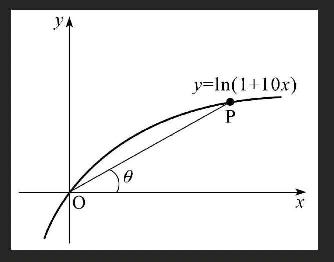
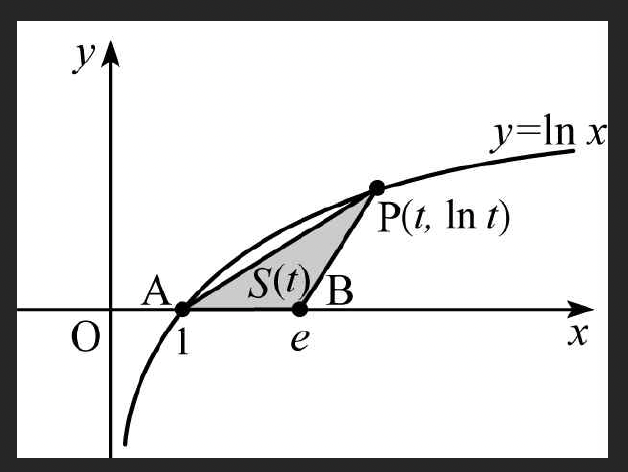

# 초월함수의 극한(2) - 응용 문제

## 예제 문제

### 예제 69: $\lim_{\theta \to 0} \frac{\sec 2\theta - 1}{\sec \theta - 1}$

$\lim_{\theta \to 0} \frac{\sec 2\theta - 1}{\sec \theta - 1}$의 값을 구하여라.

> [!summary]- 풀이
> **핵심**: $\sec \theta = \frac{1}{\cos \theta}$를 이용하고, $1 - \cos \theta = 2\sin^2 \frac{\theta}{2}$를 활용
>
> 따라서:
> $$\lim_{\theta \to 0} \frac{\sec 2\theta - 1}{\sec \theta - 1} = \lim_{\theta \to 0} \frac{\frac{1}{\cos 2\theta} - 1}{\frac{1}{\cos \theta} - 1}$$
>
> 분모 분자에 각각 $\cos2\theta$, $\cos\theta$를 곱해주면:
> $$= \lim_{\theta \to 0} \frac{(1 - \cos 2\theta)}{(1 - \cos \theta)} \cdot \frac{\cos\theta}{\cos2\theta}=\lim_{\theta \to 0} \frac{(1 - \cos 2\theta)}{(1 - \cos \theta)} \cdot 1$$
>
> 반각공식 $1 - \cos\theta = 2\sin^2\frac{\theta}{2}$ 적용:
> $$= \lim_{\theta \to 0} \frac{2\sin^2\theta}{2\sin^2\frac{\theta}{2}} = \lim_{\theta \to 0} \frac{\sin^2\theta}{\sin^2\frac{\theta}{2}} = \lim_{x \to 0}\frac{\theta^2}{(\frac{\theta}{2})^2}$$
> $$= \frac{1}{\frac{1}{4}} = 4$$

---

### 예제 70: $\lim_{x \to 0} \frac{\sin(3x^3 + 5x^2 + 4x)}{2x^3 + 2x^2 + x}$

$\lim_{x \to 0} \frac{\sin(3x^3 + 5x^2 + 4x)}{2x^3 + 2x^2 + x}$의 값을 구하여라.

> [!summary]- 풀이
> **핵심**: 분자와 분모에서 공통인자 추출 후 $\lim_{x \to 0} \frac{\sin x}{x} = 1$ 적용
>
> 분자: $\sin(3x^3 + 5x^2 + 4x) = \sin(x(3x^2 + 5x + 4))$
>
> 분모: $2x^3 + 2x^2 + x = x(2x^2 + 2x + 1)$
>
> $$\lim_{x \to 0} \frac{\sin(3x^3 + 5x^2 + 4x)}{2x^3 + 2x^2 + x} = \lim_{x \to 0} \frac{\sin(x(3x^2 + 5x + 4))}{x(2x^2 + 2x + 1)}$$
>
> $$= \lim_{x \to 0} \frac{\sin(x(3x^2 + 5x + 4))}{x(3x^2 + 5x + 4)} \cdot \frac{3x^2 + 5x + 4}{2x^2 + 2x + 1}$$
>
> $x \to 0$일 때:
>
> - 첫 번째 항: $\frac{\sin(x(3x^2 + 5x + 4))}{x(3x^2 + 5x + 4)} \to 1$
> - 두 번째 항: $\frac{3x^2 + 5x + 4}{2x^2 + 2x + 1} \to \frac{4}{1} = 4$
>
> $$\therefore \lim_{x \to 0} \frac{\sin(3x^3 + 5x^2 + 4x)}{2x^3 + 2x^2 + x} = 1 \cdot 4 = \boxed{4}$$

---

### 예제 71: 함수의 연속 조건

실수 $x$에 대하여 함수 $f(x)$를
$$f(x) = \begin{cases} \frac{\sin 2(x-1)}{x-1} & (x \neq 1) \\ a & (x = 1) \end{cases}$$
로 정의한다. $x=1$에서 $f(x)$가 연속일 때 $a$의 값을 구하여라.

> [!summary]- 풀이
> **핵심**: 연속 조건 $f(1) = \lim_{x \to 1} f(x)$를 만족해야 함
>
> $x = 1$에서 연속이려면:
> $$f(1) = \lim_{x \to 1} \frac{\sin 2(x-1)}{x-1} = a$$
>
> 극한을 계산:
> $$\lim_{x \to 1} f(x) = \lim_{x \to 1} \frac{\sin 2(x-1)}{x-1}= 2$$
>
> **참고**: $\lim_{x \to 0} \frac{\sin ax}{bx} = \frac{a}{b}$를 이용
>
> 따라서 $a = 2$
>
> $$\therefore a = \boxed{2}$$

---

### 예제 72: $\lim_{x \to 0} \frac{e^{2x} - 1}{\tan x}$

$\lim_{x \to 0} \frac{e^{2x} - 1}{\tan x}$의 값을 구하여라. (암산하셈)

> [!summary]- 풀이
> **핵심**: $\lim_{x \to 0} \frac{e^{kx} - 1}{x} = k$와 $\lim_{x \to 0} \frac{\tan x}{x} = 1$ 활용
>
> $$\lim_{x \to 0} \frac{e^{2x} - 1}{\tan x} = \lim_{x \to 0} \frac{e^{2x} - 1}{x} \cdot \frac{x}{\tan x}$$
>
> 각 항을 계산:
>
> - $\lim_{x \to 0} \frac{e^{2x} - 1}{x} = \lim_{x \to 0} \frac{e^{2x} - 1}{2x} \cdot 2 = 1 \cdot 2 = 2$
> - $\lim_{x \to 0} \frac{x}{\tan x} = \frac{1}{\lim_{x \to 0} \frac{\tan x}{x}} = \frac{1}{1} = 1$
>
> $$\therefore \lim_{x \to 0} \frac{e^{2x} - 1}{\tan x} = 2 \cdot 1 = \boxed{2}$$

---

### 예제 73: $\lim_{x \to 0} \frac{e^{5x} - 1}{\sin 3x}$

$\lim_{x \to 0} \frac{e^{5x} - 1}{\sin 3x}$의 값을 구하여라. (ㅇㅅ)

> [!summary]- 풀이
> **핵심**: $\lim_{x \to 0} \frac{e^{kx} - 1}{x} = k$와 $\lim_{x \to 0} \frac{\sin kx}{x} = k$ 활용
>
> $$\lim_{x \to 0} \frac{e^{5x} - 1}{\sin 3x} = \lim_{x \to 0} \frac{e^{5x} - 1}{5x} \cdot \frac{5x}{\sin 3x}$$
>
> $$= \lim_{x \to 0} \frac{e^{5x} - 1}{5x} \cdot \frac{5x}{3x} \cdot \frac{3x}{\sin 3x}$$
>
> 각 항을 계산:
>
> - $\lim_{x \to 0} \frac{e^{5x} - 1}{5x} = 1$
> - $\frac{5x}{3x} = \frac{5}{3}$
> - $\lim_{x \to 0} \frac{3x}{\sin 3x} = \frac{1}{\lim_{x \to 0} \frac{\sin 3x}{3x}} = \frac{1}{1} = 1$
>
> $$\therefore \lim_{x \to 0} \frac{e^{5x} - 1}{\sin 3x} = 1 \cdot \frac{5}{3} \cdot 1 = \boxed{\frac{5}{3}}$$

---

### 예제 74: 극한값 존재 조건 (보기 선택)

다음 <보기>에서 극한값 $\lim_{x \to 0} \frac{e^x - 1}{f(x)}$이 존재하는 것을 모두 골라라.

- ㄱ. $f(x) = 2x$
- ㄴ. $f(x) = e^{2x} - 1$
- ㄷ. $f(x) = 1 - \cos x$

> [!summary]- 풀이
> **핵심**: 극한값이 존재하려면 분모 $f(x) \to 0$일 때 분자 $e^x - 1 \to 0$이어야 함 (무한대가 아닌 값)
>
> **ㄱ. $f(x) = 2x$**
> $$\lim_{x \to 0} \frac{e^x - 1}{2x} = \frac{1}{2} \lim_{x \to 0} \frac{e^x - 1}{x} = \frac{1}{2} \cdot 1 = \frac{1}{2}$$
> → **존재함** ✓
>
> **ㄴ. $f(x) = e^{2x} - 1$**
> $$\lim_{x \to 0} \frac{e^x - 1}{e^{2x} - 1} = \lim_{x \to 0} \frac{\frac{e^x - 1}{x}\cdot x}{\frac{e^{2x} - 1}{2x}\cdot2x} $$
>
> $$=\lim_{x\to0}\frac{\ln e \cdot x}{\ln e \cdot 2x} = \frac{1}{2}$$
> → **존재함** ✓
>
> **ㄷ. $f(x) = 1 - \cos x$**
> $$\lim_{x \to 0} \frac{e^x - 1}{1 - \cos x} = \lim_{x \to 0} \frac{e^x - 1}{2\sin^2 \frac{x}{2}}$$
>
> $$= \lim_{x \to 0} \frac{e^x - 1}{x} \cdot \frac{x}{2\sin^2 \frac{x}{2}}$$
> $$=\lim_{x\to0}1 \cdot \frac{x}{2 \cdot \frac{x^2}{4}} = \lim_{x\to0}\frac{x}{\frac{x^2}{2}}= \lim_{x\to0}\frac{2}{x}= \infty$$
> → **발산** ✗
>
> $$\therefore \text{답: } \boxed{\text{ㄱ, ㄴ}}$$

---

### 예제 75: 연속함수와 로그 극한

연속함수 $f(x)$가 $\lim_{x \to 0} \frac{f(x)}{\ln(1-x)} = 4$를 만족할 때 $\lim_{x \to 0} \frac{f(x)}{x}$의 값을 구하시오.

> [!summary]- 풀이
> **핵심**: $\lim_{x \to 0} \frac{\ln(1+x)}{x} = 1$의 일반화
>
> **공식 유도**:
> $$\lim_{x \to 0} \frac{\ln(1+bx)}{ax} = \frac{b}{a}$$
>
> 이를 이용하면:
> $$\lim_{x \to 0} \frac{\ln(1-x)}{x} = \lim_{x \to 0} \frac{\ln(1+(-1)x)}{x} = \frac{-1}{1} = -1$$
>
> 주어진 조건:
> $$\lim_{x \to 0} \frac{f(x)}{\ln(1-x)} = 4$$
>
> 양변에 $\lim_{x \to 0} \frac{\ln(1-x)}{x}$를 곱하면:
> $$\lim_{x \to 0} \frac{f(x)}{x} = \lim_{x \to 0} \frac{f(x)}{\ln(1-x)} \cdot \frac{\ln(1-x)}{x}$$
>
> $$= 4 \cdot (-1) = -4$$
>
> $$\therefore \lim_{x \to 0} \frac{f(x)}{x} = \boxed{-4}$$

---

### 예제 76: 함수 조건과 극한 (보기 선택)

함수 $f(x)$가 $\lim_{x \to 0} \frac{f(x)}{\ln(1+x)} = 1$을 만족시킬 때 다음 <보기>에서 옳은 것을 모두 골라라.

- ㄱ. $\lim_{x \to 0} \frac{\sin x}{f(x)} = 0$
- ㄴ. $\lim_{x \to 0} \frac{f(x) + x}{\ln(1+x)} = 2$
- ㄷ. $\lim_{x \to 0} \frac{\{f(x)\}^2}{\ln(1+x)} = 0$

> [!summary]- 풀이
> **핵심**: 주어진 조건에서 $\lim_{x \to 0} \frac{f(x)}{\ln(1+x)} = 1$이므로 $\lim_{x \to 0} \frac{f(x)}{x} = 1$
>
> $$\lim_{x \to 0} \frac{f(x)}{\ln(1+x)} = \lim_{x \to 0} \frac{f(x)}{x} \cdot \frac{x}{\ln(1+x)} = \lim_{x \to 0} \frac{f(x)}{x} \cdot 1 = 1$$
>
> 따라서 $\lim_{x \to 0} \frac{f(x)}{x} = 1$
>
> **ㄱ. $\lim_{x \to 0} \frac{\sin x}{f(x)}$**
> $$\lim_{x \to 0} \frac{\sin x}{f(x)} = \lim_{x \to 0} \frac{\frac{\sin x}{x}}{\frac{f(x)}{x}} = \frac{1}{1} = 1$$
> → **거짓** ✗
>
> **ㄴ. $\lim_{x \to 0} \frac{f(x) + x}{\ln(1+x)}$**
> $$\lim_{x \to 0} \frac{f(x) + x}{\ln(1+x)} = \lim_{x \to 0} \frac{f(x)}{\ln(1+x)} + \frac{x}{\ln(1+x)}$$
>
> $$= 1 + \frac{1}{1} = 2$$
> → **참** ✓
>
> **ㄷ. $\lim_{x \to 0} \frac{\{f(x)\}^2}{\ln(1+x)}$**
> $$\lim_{x \to 0} \frac{\{f(x)\}^2}{\ln(1+x)} = \lim_{x \to 0} \frac{f(x)}{\ln(1+x)} \cdot f(x)$$
>
> $$= 1 \cdot \lim_{x \to 0} f(x) = 1 \cdot 0 = 0$$
>
> (단, $\lim_{x \to 0} \frac{f(x)}{x} = 1$이므로 $\lim_{x \to 0} f(x) = 0$)
> → **참** ✓
>
> $$\therefore \text{답: } \boxed{\text{ㄴ, ㄷ}}$$

---

### 예제 77: 삼각함수와 지수함수 극한

두 양수 $a, b$가 $\lim_{x \to 0} \frac{\sin 7x}{2^{x+1} - a} = \frac{b}{2\ln 2}$를 만족시킬 때 $ab$의 값을 구하여라.

> [!summary]- 풀이
> **핵심**: $x \to 0$일 때 분자 $\to 0$이므로 분모도 $\to 0$이어야 함
>
> **Step 1**: 분모가 $0$으로 수렴하는 조건
> $$\lim_{x \to 0} (2^{x+1} - a) = 0$$
> $$2^{0+1} - a = 0 \Rightarrow a = 2$$
>
> **Step 2**: 극한값 계산
> $$\lim_{x \to 0} \frac{\sin 7x}{2^{x+1} - 2}$$
>
> $2^{x+1} - 2 = 2 \cdot 2^x - 2 = 2(2^x - 1)$이므로:
> $$\lim_{x \to 0} \frac{\sin 7x}{2(2^x - 1)} = \lim_{x \to 0} \frac{\frac{\sin 7x}{7x} \cdot 7x}{2 \cdot \frac{2^x - 1}{x} \cdot x}$$
>
> $$= \lim_{x \to 0} \frac{1 \cdot 7x}{2 \cdot \ln 2 \cdot x} = \frac{7}{2\ln 2}$$
>
> **Step 3**: $b$ 구하기
> $$\frac{7}{2\ln 2} = \frac{b}{2\ln 2}$$
> $$\therefore b = 7$$
>
> **Step 4**: $ab$ 계산
> $$ab = 2 \times 7 = \boxed{14}$$

---

### 예제 78: 기하학적 극한 - 곡선과 각

곡선 $y = \ln(1+10x)$ 위를 움직이는 점 P와 원점 O를 이은 선분이 $x$축의 양의 방향과 이루는 각의 크기를 $\theta$라 한다. 점 P가 원점 O에 한없이 가까워질 때 $\tan\theta$의 극한값을 구하시오.

> [!summary]- 풀이
> **핵심**: 점 P의 좌표를 $(t, \ln(1+10t))$로 놓고 기울기 계산
>
> 점 P가 원점에 가까워질 때 $t \to 0$
>
> 점 P$(t, \ln(1+10t))$와 원점 O$(0, 0)$를 잇는 직선의 기울기:
> $$\tan\theta = \frac{\ln(1+10t) - 0}{t - 0} = \frac{\ln(1+10t)}{t}$$
>
> 극한값 계산:
> $$\lim_{t \to 0} \tan\theta = \lim_{t \to 0} \frac{\ln(1+10t)}{t}$$
>
> $$= \lim_{t \to 0} \frac{\ln(1+10t)}{10t} \cdot 10 = 1 \cdot 10 = 10$$
>
> $$\therefore \lim_{t \to 0} \tan\theta = \boxed{10}$$

---

### 예제 79: 기하학적 극한 - 삼각형 넓이

곡선 $y = \ln x$ 위를 움직이는 점 P$(t, \ln t)$와 두 점 A$(1, 0)$, B$(e, 0)$에 대하여 삼각형 PAB의 넓이를 $S(t)$라 할 때, $\lim_{t \to 1^+} \frac{S(t)}{t-1}$의 값을 구하여라.

> [!summary]- 풀이
> **핵심**: 삼각형 PAB의 넓이를 밑변과 높이로 표현
>
> **Step 1**: 삼각형 넓이 $S(t)$
>
> - 밑변 AB: $e - 1$
> - 높이: $|\ln t|$ (단, $t > 1$이므로 $\ln t > 0$)
>
> $$S(t) = \frac{1}{2} \cdot (e-1) \cdot \ln t$$
>
> **Step 2**: 극한값 계산 (단, $t \to 1^+$이므로 $t > 1$)
> $$\lim_{t \to 1^+} \frac{S(t)}{t-1} = \lim_{t \to 1^+} \frac{\frac{1}{2}(e-1) \cdot \ln t}{t-1}$$
>
> $$= \frac{e-1}{2} \lim_{t \to 1^+} \frac{\ln t}{t-1}$$
>
> $u = t - 1$로 치환하면, $t \to 1^+$일 때 $u \to 0^+$:
> $$\lim_{u \to 0^+} \frac{\ln(1+u)}{u} = 1$$
>
> 따라서:
> $$\lim_{t \to 1^+} \frac{S(t)}{t-1} = \frac{e-1}{2} \cdot 1 = \boxed{\frac{e-1}{2}}$$

---

## 연습문제

(각 예제를 통해 Thm 18의 조건과 응용을 숙지하고, 연속함수 조건과 기하학적 극한 문제 해결 능력을 배양하시오.)

## 관련 주제

- [[13-transcendental-limit-1|초월함수의 극한(1) - 기본극한값]]
- [[15-transcendental-limit-3|초월함수의 극한(3)]]
- [[16-derivative-intro-1|변화율과 도함수(1)]]

---

**학습 포인트:**

1. **삼각함수 극한**: $\lim_{x \to 0} \frac{\sin kx}{x} = k$, $\lim_{x \to 0} \frac{\tan kx}{x} = k$, 반각공식 활용
2. **지수함수 극한**: $\lim_{x \to 0} \frac{e^{kx} - 1}{x} = k$, $\lim_{x \to 0} \frac{a^x - 1}{x} = \ln a$
3. **로그함수 극한**: $\lim_{x \to 0} \frac{\ln(1+x)}{x} = 1$, 일반화 $\lim_{x \to 0} \frac{\ln(1+bx)}{ax} = \frac{b}{a}$
4. **연속 조건**: $f(a) = \lim_{x \to a} f(x)$, 극한값 존재를 위한 분자·분모 조건
5. **기하학적 극한**: 기울기, 각도, 넓이를 극한으로 표현하고 계산
