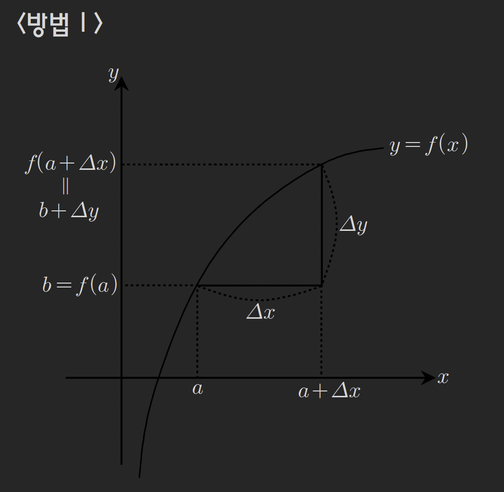

# 역함수의 미분계수, 미분가능성

## 1. 역함수의 미분계수

### Thm (22): 역함수의 미분계수

$g(x) = f^{-1}(x)$이고 $f(a) = b$일 때 $g'(b)$를 구해보자.

**방법 I**: $f(g(x)) = x$임을 이용

<!-- 그래프: 역함수의 미분계수 -->

$f(g(x)) = x$의 양변을 미분하면

$$
f'(g(x)) \cdot g'(x) = 1
$$

$x = b$를 대입하면

$$
f'(g(b)) \cdot g'(b) = f'(a) \cdot g'(b) = 1
$$

따라서

$$
g'(b) = \frac{1}{f'(a)}
$$

### 증명

그래프로부터 다음 관계를 얻는다:

$$
\begin{cases}
f(a) = b \\
g(b) = a \\
f(a + \Delta x) = b + \Delta y \\
g(b + \Delta y) = a + \Delta x
\end{cases}
$$

$\frac{1}{f'(a)}$를 계산하면

$$
\frac{1}{f'(a)} = \lim_{\Delta x \to 0} \frac{1}{\frac{f(a+\Delta x) - f(a)}{\Delta x}}
$$

분모분자에 $\Delta x$를 곱하고, 분자에 $a$를 더하고 빼면

$$
= \lim_{\Delta x \to 0} \frac{\Delta x}{f(a+\Delta x) - f(a)} = \lim_{\Delta x \to 0} \frac{(a+\Delta x) - a}{f(a+\Delta x) - f(a)}
$$

$g$, $\Delta y$, $b$에 대한 식으로 치환하면

$$
= \lim_{\Delta y \to 0} \frac{g(b+\Delta y) - g(b)}{\cancel{b} + \Delta y \cancel{- b}} = g'(b)
$$

따라서 $f'(a)$의 역수가 $g'(b)$임을 알 수 있다.

---

## 2. 예제

### 예제 115

$f(g(x)) = x$를 만족하는 일대일 대응인 두 함수 $f$, $g$에 대하여, $f$의 그래프 위의 점 $(2, 3)$에서 곡선 $f$에 그은 접선의 기울기가 $3$일 때, 점 $(3, 2)$에서 $y = g(x)$에 그은 접선의 기울기를 구하여라.

> [!summary]- 풀이
> 문제 조건으로부터 다음을 알 수 있다:
> 
> $$
> g(x) = f^{-1}(x), \quad f(2) = 3, \quad f'(2) = 3
> $$
> 
> 조건식 $f(g(x)) = x$를 미분하면
> 
> $$
> f'(g(x)) \cdot g'(x) = 1
> $$
> 
> $x = 3$을 대입하면
> 
> $$
> f'(g(3)) \cdot g'(3) = 1
> $$
> 
> $g(3) = 2$이므로
> 
> $$
> f'(2) \cdot g'(3) = 1
> $$
> 
> $$
> 3 \cdot g'(3) = 1
> $$
> 
> $$
> \therefore g'(3) = \frac{1}{3}
> $$

### 예제 116

함수 $f(x) = \tan x \left( -\frac{\pi}{2} < x < \frac{\pi}{2} \right)$이고 함수 $g(x)$는 임의의 실수 $x$에 대하여 조건식 $g(f(x)) = x$를 만족한다고 할 때 $g'\left( \frac{1}{\sqrt{3}} \right)$의 값을 구하여라.

 **참고**: $(\tan x)' = \sec^2 x = \frac{1}{\cos^2 x}$

> [!summary]- 풀이
> 
> 조건식 $g(f(x)) = x$를 $f(g(x)) = x$로 치환 후 미분하면
> 
> $$
> f'(g(x)) \cdot g'(x) = 1
> $$
> 
> $x = \frac{1}{\sqrt{3}}$을 대입하면
> 
> $$
> f'\left( g\left( \frac{1}{\sqrt{3}} \right) \right) \cdot g'\left( \frac{1}{\sqrt{3}} \right) = 1
> $$
> 
> $\tan \frac{\pi}{6} = \frac{1}{\sqrt{3}}$이므로 $g\left( \frac{1}{\sqrt{3}} \right) = \frac{\pi}{6}$
> 
> $$
> g'\left( \frac{1}{\sqrt{3}} \right) = \frac{1}{f'\left( \frac{\pi}{6} \right)}
> $$
> 
> $f'(x) = \sec^2 x$이므로
> 
> $$
> g'\left( \frac{1}{\sqrt{3}} \right) = \frac{1}{\sec^2 \frac{\pi}{6}} = \cos^2 \frac{\pi}{6} = \left( \frac{\sqrt{3}}{2} \right)^2 = \frac{3}{4}
> $$

---

## 3. 연속성과 미분가능성

### Thm (23): 연속성과 미분가능성

$f$가 $x = a$에서 미분계수 즉, $f'(a)$가 존재할 때 $f$는 $x = a$에서 **미분가능**이라고 한다.

$$
f\text{가 } x = a\text{에서 미분가능} \implies f\text{가 } x = a\text{에서 연속}
$$

(역은 성립하지 않음)

**미분가능 조건:**

(ㄱ) $x = a$에서 연속이어야 한다.

$$
\lim_{x \to a} f(x) = f(a)
$$

(ㄴ) $x = a$에서 미분계수 즉, $f'(a)$가 존재해야 한다.

$$
f'_-(a) = f'_+(a) \quad \text{(좌미분 = 우미분)}
$$

---

## 4. 예제

### 예제 117

다음 보기 중 $x = 0$에서 미분가능한 함수를 모두 골라라.

**ㄱ)** $f(x) = \begin{cases} x & (x \geq 0) \\ -x & (x < 0) \end{cases}$

**ㄴ)** $f(x) = \begin{cases} (x+1)^2 & (x \geq 0) \\ 2x+1 & (x < 0) \end{cases}$

**ㄷ)** $f(x) = \begin{cases} x^2 + x + 1 & (x \geq 0) \\ -x^2 + x - 1 & (x < 0) \end{cases}$

**ㄹ)** $f(x) = \begin{cases} x^2 & (x \geq 0) \\ -2x & (x < 0) \end{cases}$

> [!summary]- 풀이
> **ㄱ) 미분불능**
> 
> 연속성 확인:
> 
> $$
> \lim_{x \to 0^+} f(x) = 0, \quad \lim_{x \to 0^-} f(x) = 0, \quad f(0) = 0
> $$
> 
> $x = 0$에서 연속이다.
> 
> 미분계수 확인:
> 
> $$
> f'_-(0) = -1, \quad f'_+(0) = 1
> $$
> 
> 좌미분 ≠ 우미분이므로 **미분불능**
> 
> ---
> 
> **ㄴ) 미분가능** ✓
> 
> 연속성 확인:
> 
> $$
> \lim_{x \to 0^+} f(x) = 1, \quad \lim_{x \to 0^-} f(x) = 1, \quad f(0) = 1
> $$
> 
> $x = 0$에서 연속이다.
> 
> 미분계수 확인:
> 
> $$
> f'_-(0) = 2, \quad f'_+(0) = 2(x+1)\big|_{x=0} = 2
> $$
> 
> $f'_-(0) = f'_+(0)$이므로 **미분가능**
> 
> ---
> 
> **ㄷ) 미분불능**
> 
> 연속성 확인:
> 
> $$
> \lim_{x \to 0^+} f(x) = 1, \quad \lim_{x \to 0^-} f(x) = -1, \quad f(0) = 1
> $$
> 
> $x = 0$에서 **불연속**이므로 **미분불능**
> 
> ---
> 
> **ㄹ) 미분불능**
> 
> 연속성 확인:
> 
> $$
> \lim_{x \to 0^+} f(x) = 0, \quad \lim_{x \to 0^-} f(x) = 0, \quad f(0) = 0
> $$
> 
> $x = 0$에서 연속이다.
> 
> 미분계수 확인:
> 
> $$
> f'_-(0) = -2, \quad f'_+(0) = 2x\big|_{x=0} = 0
> $$
> 
> 좌미분 ≠ 우미분이므로 **미분불능**
> 
> ---
> 
> **정답: ㄴ)**

---

## 연습문제

각 예제를 통해 학습한 내용을 복습하고, 다음 사항을 숙지하시오:

1. 역함수의 미분계수 공식: $g'(b) = \frac{1}{f'(a)}$ (단, $f(a) = b$)
2. 미분가능 조건: 연속 + 좌미분 = 우미분

---

## 관련 주제

- [[19-polynomial-function|다항함수의 함수방정식]]
- [[21-differentiability|미분가능성]]

---

**학습 포인트:**

1. 역함수의 미분계수는 원함수 미분계수의 역수
2. 합성함수 미분법을 이용한 역함수 미분 유도
3. 미분가능 ⟹ 연속 (역은 성립 안 함)
4. 미분가능성 판별: 연속성 먼저 확인 후 좌미분·우미분 비교
