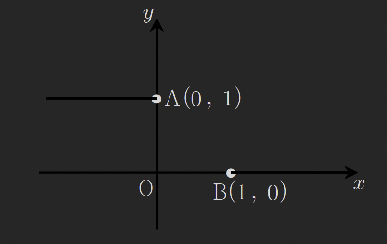

예제 118
함수 f(x)가

$$
f(x)=\begin{cases}
1-x & (x<0) \\
x^{2}-1 & (0\leq x<1) \\
\frac{2}{3}(x^{3}-1) & (x\geq 1)
\end{cases}
$$

일떄 보기에서 옳은 것을 모두 골라라
보기1 f(x)는 x=1에서 미분가능하다
보기2 |f(x)|는 x=0에서 미분가능하다
보기3 $x^{k}f(x)$가 x=0에서 미분가능하도록하는 최소의 자연수 k는 2이다

보기1 구간에서 연속성과 좌미분 우미분확인

$$
\lim_{ x \to 1^{+} } f(x)=\lim_{ x \to 1^{-} } f(x)=f(1)=0
$$

f(x)는 x=1구간에서 연속점임을 알수있다.

$$
f'(x)= \begin{cases}
2x & (0\le x <1) \\
2x^{2}  &  (x\geq 1)

\end{cases}
$$

$$
f'_{-}(1)=2\cdot 1=2 \ ,\
f'_{+}(1)=2\cdot 1=2
$$

보기1 구간에서 f(x)는 연속적이며 좌미분 우미분값이 같으므로 미분가능

보기2 구간에서의 f(x)의 연속성과 좌미분 우미분확인

$$
\lim_{ x \to 0^{-} } f(x)=1 \ , \
\lim_{ x \to 0^{+} } f(x)=-1
$$

보기2구간에서 f(x)는 연속적이지 않으므로 미분불능이다

보기3 구간에서의 k=1, k=2에서의 f(x)의 연속성과 좌미분 우미분확인
k=1 일떄

$$
f(x)=\begin{cases}
x-x^{2} & (x<0) \\
x^{3}-x & (0\leq x<1)
\end{cases}
$$

$$
\lim_{ x \to 0^{-} } f(x)=\lim_{ x \to 0^{+} } f(x)= f(0)=0
$$

$$
f'_{-}(0)=1-2x=1
$$

$$
f'_{+}(0)=3x^{2}-1=-1
$$

k=1일떄 x=1구간에서 f(x)는 연속적이지만 좌미분 우미분 값이 다르므로 미분불능하다

k=2 일떄

$$
f(x)=\begin{cases}
x^{2}-x^{3} & (x<0) \\
x^{4}-x^{2} & (0\leq x<1)
\end{cases}
$$

$$
\lim_{ x \to 0^{-} } f(x)=\lim_{ x \to 0^{+} } f(x)= f(0)=0
$$

$$
f'_{-}(0)=2x-3x^{2}=0
$$

$$
f'_{+}(0)=4x^{3}-2x=0
$$

보기3에서 k=1일떄 미분불능이고, k=2일떄 미분가능하다.

예제 119

$$
f(x)=\begin{cases}
x^{3}+ax^{2}+bx & (x\geq 1) \\
2x^{2}+1 & (x<1)
\end{cases}
$$

f(x) 가 모든 실수 x에서 미분가능하도록
상수 a,b를 정할때 ab의 값을 구하라

우선 f(x) 두 구간에서의 식이 다항함수임으로 x>1 x<1 구간에서는 미분가능함을 할수있다.

x=1구간에서 f(x)가 미분가능한지 확인

$$
\lim_{ x \to 1^{-} } f(x)=3 \ , \
\lim_{ x \to 1^{+} } f(x)= a+b
$$

임으로 1+a+b=3, a+b=2 이어야 x=1구간에서 f(x)는 연속적일 수있다.

$$
f'_{-}(1)=4x=4
$$

$$
f'_{+}(1)=3x^{2}+2ax+b=3+2a+b
$$

$$
\begin{align}
3+2a+b=4 \\
2a+b=1 \\ \\
\text{a+b=2으로 부터}\ ,\ b=2-a \\
2a+2-a=1 \\
a=-1 \\
b=3
\end{align}
$$

$$
ab=-1\cdot 3 = -3
$$

예제 120
삼차함수 $f(x)=x^{3}+3x^{2}-9x$ 에 대하여 함수 g(x)를

$$
g(x)=\begin{cases}
f(x) & (x<a) \\
m-f(x) & (a\leq x < b) \\
n + f(x) & (x\geq b)
\end{cases}
$$

로 정의한다 함수 g(x)가 모든실수 x에 대하여 미분가능하도록 상수 a,b와 m,n의 값을 정할떄
a+b+m+n 을 구하라

x=a에서의 미분가능성

$$
\lim_{ x \to a^{-} } g(x)=\lim_{ x \to a^{-} } f(x)=a^{3}+3a^{2}-9a
$$

$$
\lim_{ x \to a^{+} } g(x)=\lim_{ x \to a^{+} } f(x)=m-a^{3}-3a^{2}+9a
$$

$$
a^{3}+3a^{2}-9a=m-a^{3}-3a^{2}+9a
$$

$$
m=2a^{3}+6a^{2}-18a
$$

일때 g(x)는 x=a구간에서 연속적일수있다.

$$
\begin{align}
f'_{-}(a)=3x^{2}+6x-9=3a^{2}+6a-9 \\
f'_{+}(a)=-3a^{2}-6a+9

\end{align}
$$

좌미분우미분이 같아야 미분가능함으로

$$
\begin{align}
g'_{-}(a)=g'_{+}(a) \\
3a^{2}+6a-9=-3a^{2}-6a+9 \\
6a^{2}+12a-18=0 \\
(2a+6)(3a-3)=0 \\
a=-3 \ \text{and}\   a=1\\
\end{align}
$$

a값이 두개가 나왔당 값을 하나로 특정할 수 있는 방법은 멀까?
$a\leq x<b$ 니까
만약 $-3<b\leq1$이라면 a=-3이라고 특정할수 있을꺼같다

x=b에서의 미분가능성

$$
\lim_{ x \to b } m-f(x)=m-b^{3}-3b^{2}+9b
$$

$$
\lim_{ x \to b } n+f(x)=n+b^{3}+3b^{2}-9b
$$

위 두식이 같아야 g(x)는 x=b 에서의 미분가능성이 생긴다.

$$
m-n=2b^{3}+6b^{2}-18b
$$

$$
n=m-2b^{3}-6b^{2}+18b
$$

$$
\begin{align}
g'_{-}(b)=g_{+}(b) \\
-3b^{2}-6b+9=3b^{2}+6b-9 \\
6b^{2}+12b-18=0 \\
(2b+6)(3b-3)=0 \\
b=-3  \\
b=1
\end{align}

$$

g(x)의 식에서 범위 $a\leq x<b$ 가 있기떄문에 a=-3 b=1 이라고 봐야
미분가능한 g(x)의 함수식의 x범위가 결정될수있다.

$$
\begin{align}
m=2a^{3}+6a^{2}-18a \\
n=m-2b^{3}-6b^{2}+18b
\end{align}
$$

에 a,b를 대입하면

$$
m=2\cdot(-3)^{3}+6\cdot(-3)^{2}-18\cdot-3=-54+54+54
$$

$$
m=54
$$

$$
n=m-2\cdot 1^{3}-6 \cdot 1^{2}+18 \cdot 1 = 54-2-6+18=64
$$

$$
n=64
$$

a=-3 , b=1 , m=54, n=64 임으로

$$
a+b+m+n=-3+1+54+64=116
$$

예제 121
다음 그림은 함수 y=1 과 함수 y=0의 그래프의 일부이다. 두점 A(0,1), B(1,0) 사이를
$0\leq x\leq 1$ 에서 정의된 함수 $y=ax^{3}+bx^{2}+cx+1$ 의 그래프를 이용하여 연결하였다.
이렇게 연결된 그래프 전체를 나타내는 함수가 구간 $(-\infty,\infty)$ 에서 미분가능하도록
상수 a,b,c의 값을 정할때, $a^{2}+b^{2}+c^{2}$ 의 값을 구하시오.

연결된 세 함수를 g(x)로 표현하면

$$
g(x)= \begin{cases}
1 &  (0 > x) \\
ax^{3}+bx^{2}+cx+1 & (0\leq x\leq1) \\
0 & (x>1)
\end{cases}
$$

각 함수 자체는 미분가능함으로 x=0, x=1 두 구간에서 미분가능여부를 확인한다.

x=0 구간에서 g(x) 미분가능 조건 확인

$$
\lim_{ x \to 0^{-}} g(x) = \lim_{ x \to 0^{+} } g(x)= g(0)=1
$$

$$
g'_{-}(0)=0
$$

$$
g'_{+}(0)=2ax^{2}+2bx+c=c
$$

연결된 함수 g(x)가 미분가능하려면 x=1에서의 좌미분 우미분이 같아야한다.

$$
\therefore c=0
$$

x=1 구간에서 g(x)의 미분가능조건 확인

$$
\lim_{ x \to 1^{-} } g(x)=a+b+c+1
$$

$$
\lim_{ x \to 1^{+} } g(x)=0
$$

$a+b+c+1 = 0$ 일때 x=1구간에서 g(x)의 미분가능성이 존재

$$
g'_{-}(1)=3a+2b+c
$$

$$
g'_{+}(1)=0
$$

$3a+2b+c=0$

c=0이고 a,b에 대한 식 두개가 구해졌으니 연립하여 풀어보자

$$
a+b=-1 \ ,\ a=-b-1
$$

$$
3a+2b=0
$$

$$
-3b-3+2b=0
$$

$$
-b=3
$$

$$
b=-3
$$

$$
a=2
$$

a=2 , b=-3, c=0

$$
a^{2}+b^{2}+c^{2}=4+9=13
$$

예제 122
아래 함수 f(x)의 연속성과 미분가능성을 조사하여라 (강의풀이)

$$
f(x)= \begin{cases}
x^{2}\sin \frac{1}{x} & (x\neq0) \\
0 & (x=0)
\end{cases}
$$

1 f(x)의 연속성 조사
$f(x)$의 좌극한 우극한이 0이면 함수 f(x)는 연속적이라고 볼수있다.

$$
\lim_{ x \to 0^{-} } f(x)=x^{2}\sin \frac{1}{x}
$$

샌드위치 극한을 이용하면

$$
-1\leq \sin \frac{1}{x} \leq 1
$$

양변에 $x^{2}$를 곱하면

$$
-x^{2}\leq x^{2} \sin \frac{1}{x} \leq x^{2}
$$

$x \to 0$ 일떄 $x^{2}$의 극한값은 0이므로

$$
0\leq x^{2}\cdot \sin \frac{1}{x} \leq 0
$$

$x^{2} \cdot \sin \frac{1}{x}$ 의 극한값 또한 0임을 알수있다.

그러므로 함수 f(x)는 x=0에서 연속적이다.

2 x=0에서의 미분계수 존재여부 조사
현재 초월함수의 미분에 대한 개념이 없기떄문에
미분계수의 정의를 이용하도록 하자

$$
f'(0)=\lim_{ h \to 0 } \frac{f(0+h)-f(0)}{h}=\lim_{ h \to 0 } \frac{h^{2}\sin \frac{1}{x}}{h}
=\lim_{ h \to 0 } h\cdot \sin \frac{1}{x}
$$

$$
\lim_{ h \to 0^{-} } h\cdot \sin \frac{1}{x}
$$

$$
-1\leq \sin \frac{1}{x} \leq 1
$$

$$
-h \geq h \cdot \sin \frac{1}{x} \geq h
$$

$$
0 \geq h \cdot \sin \frac{1}{x} \geq 0
$$

$$
\lim_{ h \to 0^{-} } h \cdot \sin \frac{1}{x}=0
$$

$$
\lim_{ h \to 0^{+} } h \cdot \sin \frac{1}{x}
$$

$$
-1\leq \sin \frac{1}{x}\leq 1
$$

$$
-h \leq h \cdot \sin \frac{1}{x} \leq h
$$

$$
0\leq h \cdot \sin \frac{1}{x} \leq 0
$$

$$
\lim_{ h \to 0^{+} } h\cdot \sin \frac{1}{x}=0
$$

$$
\therefore f'(0)=0
$$

