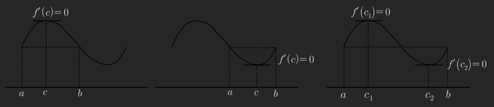

thm31 롤의 정리
함수 f(x)가 폐구간 $[a,b]$에서 연속이고 개구간 $(a,b)$에서 미분가능할 떄
$f(a)=f(b)$이면 $f'(c)=0\  (a < c < b)$ 을 만족시키는 c가 적어도 하나 존재한다

[[07-function-limit-7#Thm (12): 최대,최소의 정리]]

예제167
$f(x)=k(x-a)(x-b)$ 는 롤의정리가 성립함을 보이고 
롤의 정리를 만족하는 $c (a < c < b)$ 를 구하여라

f(x)는 이차함수임으로 $x \in R$ 범위에서 미분가능하며

$$
f(a)=0\ ,\ 
f(b)=0
$$

임으로 롤의 정리가 성립한다

$$
f'(x)=k(x-b)+k(x-a)
$$

$$
f'(c)=k(c-b)+k(c-a)=0
$$

$$
2c-b-a=0
$$

$$
2c=a+b
$$

$$
c=\frac{a+b}{2}
$$

thm32 평균값의 정리
$\frac{f(b)-f(a)}{b-a}=f'(c)$

예제168
폐구간 $[1,2]$에서 함수 $f(x)=x^{3}$에 대하여 
평균값 정리를 만족하는 $c (1 < c < 2)$ 를 구하여라

$$
\frac{f(2)-f(1)}{2-1}=f'(c)
$$

$$
f'(c)=8-1=7
$$

$$
f'(x)=3x^{2}
$$

$$
3c^{2}=7
$$

$$
c=\frac{\sqrt{ 7 }}{\sqrt{ 3 }}=\frac{\sqrt{ 21 }}{3}
$$

예제169
모든 실수 x에 대하여 미분가능한 함수 f(x) 가 $\lim_{ x \to \infty }f'(x)=4$ 를 만족할 때
$\lim_{ x \to \infty }{f(x+2)-f(x-2)}$의 값을 구하여라

$$
\lim_{ x \to \infty } \frac{f(x+2)-f(x-2)}{x+2-(x-2)}
=\lim_{ c \to \infty } f'(c)=4\ ,\ 
(x-2 < c < x+2)
$$

$$
\lim_{ x \to \infty } f(x+2)-f(x-2)=4\times 4=16
$$

예제170
$\lim_{ x \to \infty }(\cos \sqrt{ x+1 }-\cos \sqrt{ x })$의 값을 구하여라

$$
\text{put}\ f(x)=\cos \sqrt{ x }\ ,\ 
f(x+1)=\cos \sqrt{ x+1 }
$$

f(x)는 $x \in (0,\infty)$에서 미분가능

$$
\frac{f(x+1)-f(x)}{x+1-x}=f'(c)\ ,\ (x < c < x+1)
$$

$$
\lim_{ x \to \infty }(\cos \sqrt{ x+1 }-\cos \sqrt{ x })
=\lim_{ c \to \infty } f'(c)
$$

$$
\lim_{ x \to \infty } f'(x)=\lim_{ x \to \infty } -\frac{1}{2\sqrt{ x }}\sin \sqrt{ x }
$$

$$
\lim_{ c \to \infty } f'(c)
=\lim_{ c \to \infty } -\frac{1}{2\sqrt{ c }}\sin \sqrt{ c }
$$

$$
-1\leq \lim_{ c \to \infty } \sin \sqrt{ c }\leq 1
$$

$$
=\lim_{ c \to \infty } -\frac{1}{2\sqrt{ c }} \leq  -\frac{1}{2\sqrt{ c }}\sin \sqrt{ c } \leq \frac{1}{2\sqrt{ c }}
$$

$$
\because \lim_{ c \to \infty } -\frac{1}{2\sqrt{ c }}=0\ ,\ 
\lim_{ c \to \infty } \frac{1}{2\sqrt{ c }}=0
$$

$$
\therefore -\frac{1}{2\sqrt{ c }}\sin \sqrt{ c }=0
$$

예제171
$$\lim_{ x \to 0^{+} } \frac{e^{x}-e^{\sin x}}{x-\sin x}$$
의 값을 
평균값의 정리를 이용하여 구하시오 

$$
\text{put } f(x)=e^{x}\ ,\ f(\sin x) = e^{\sin x}
$$

$$
\lim_{ x \to 0^{+} } \frac{f(x)-f(\sin x)}{x-\sin x}=\lim_{ c \to 0^{+} } f'(c)\ ,\ 

(\sin x < c < x)
$$

$$
\lim_{ x \to 0^{+} } f'(x)=e^{x}
$$

$$
\lim_{ c \to 0^{+} } f'(c)=e^{c}=e^{0}=1
$$