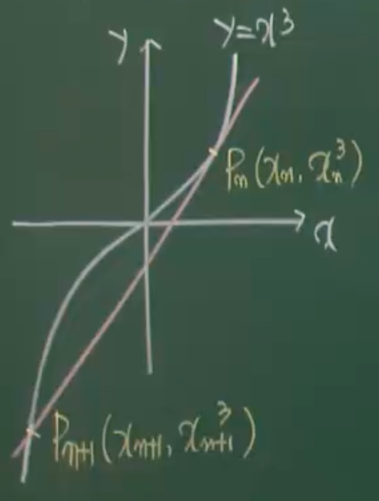
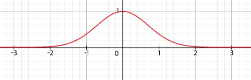

예제177
곡선 $y=x^{3}$ 위의 임의이 점 $P_{0}$ 에서 접선을 그어 이 곡선과 만나는 $P_{0}$ 이외의 점을 $P_{1}$이라 하자
점 $P_{1}$에서의 접선을 그어 이 곡선과 만나는 $p_{1}$ 이외의 점을 $P_{2}$ 라 하자
이와같이 계속하여 $P_{3},P_{4},P_{5}\dots$을 얻는다. $P_{0},P_{1},P_{2}\dots$의 x좌표를
$x_{0},x_{1},x_{2}\dots$ 라고 한다. $x_{0}=1$일때

$$
x_{0}+\frac{x_{1}}{2}+\frac{x_{2}}{2^{2}}+\dots+\frac{x_{10}}{2^{10}}
$$

의 값을 구하여라

$$
y'=3x^{2}
$$

$$
f'(x_{n})=3x_{n}^{2}
$$

$$
y_{p_{n}}=3x_{n}^{2}(x-x_{n})+x_{n}^{3}
=3x_{n}^{2}x-2x_{n}^{3}
$$

$$
x^{3}=3x_{n}^{2}x-2x_{n}^{3}
$$

$$
x^{3}-3x_{n}^{2}x+2x_{n}^{3}=0
$$

$$
(x-x_{n})^{2}(x-2x_{n})=0
$$

$$
x_{n+1}=-2x_{n}
$$

$$
\because x_{0}=1
$$

$$
x_{1}= -2x_{0}=-2
$$

$$
x_{n}=-2\cdot(-2)^{n-1}=(-2)^{n}
$$

$$
x_{0}+\frac{x_{1}}{2}+\frac{x_{2}}{2^{2}}+\dots+\frac{x_{10}}{2^{10}}
$$

$$
=1+\frac{(-2)^{1}}{2}+\frac{(-2)^{2}}{2^{2}}+\frac{(-2)^{3}}{2^{3}}\dots+\frac{(-2)^{10}}{2^{10}}
$$

$$
=1+(1\cdot 5)+(-1 \cdot 5)=1
$$

예제178
곡선 $y=x^{3}+4$ 위의 점 $A(1,5)$ 에서의 접선이 이 곡선과 다시 만나는 점을 B라 하자
점 P가 이 곡선 위의 점 일떄 $\triangle PAB$의 넓이가 최대가 되는 P의 좌표를 (a,b)라 하자
이때 a+b의 값을 구하여라

접선 $\overline {AB}$ 와 평행이되는 곡선의 접선일 떄 $\triangle PAB$ 넓이가 최대

$$
y'=3x^{2}
$$

$$
x=\pm 1
$$

$$
P(-1,3)
$$

$$
a+b=2
$$

예제179
곡선 $y=f(x)$ 위의 점 $(a,f(a))$에서의 접선이 $y=2x+1$ 일때

$$
\lim_{ h \to 0 } \frac{f(a+2h)-f(a-2h)}{h}
$$

의 값을 구하여라

$$
given: f'(a)=2
$$

$$
\lim_{ h \to 0 } \frac{f(a+2h)-f(a-2h)}{h}
=\lim_{ h \to 0 } \frac{f(a+2h)-f(a-2h)}{4h}\cdot 4
$$

$$
=4f'(a)=4\times 2 = 8
$$

예제180
함수 $f(x)=x^{3}+x+1$의 역함수를 $g(x)$ 라 할 때 함수 $g(x)$ 위의 점 (3,1)에서의
접선의 방정식을 $y=mx+n$이라 하자 이때 2(m+n)의 값을 구하여라

$$
g'(3)=\frac{1}{f'(1)}
$$

$$
=\frac{1}{3x^{2}+1}=\frac{1}{4}
$$

$$
y=\frac{1}{4}(x-3)+1
$$

$$
y=\frac{1}{4}x+\frac{1}{4}
$$

$$
2(m+n)=2\left( \frac{1}{4}+\frac{1}{4} \right)=1
$$

예제181
y가 x의 함수일때 곡선 $e^{x}\ln y=1$ 위의 점 $(0,e)$에서의 접선의 방정식을 구하여라

곡선을 x에 관해 미분하면

$$
e^{x}\ln y+e^{x} \frac{y'}{y}=0
$$

$$
y'=-\frac{e^{x}\ln y}{e^{x}} \cdot y
$$

$$
f'(0)=-\frac{1 \ln e}{1}\cdot e=-e
$$

예제182
곡선 $x^{3}-xy^{2}=10$ 위의 점 (-2,3) 에서의 접선의 기울기를 구하여라

$$
3x^{2}-(y^{2}+x\cdot 2yy')=0
$$

$$
3x^{2}-y^{2}-2xyy'=0
$$

$$
12-9-2(-2\cdot 3 \cdot y')=0
$$

$$
3+12y'=0
$$

$$
y'_{x=-2}=-\frac{1}{4}
$$

예제183
곡선 $\sqrt[3]{ x }+\sqrt[3]{ y }=3$ 위의 점 (1,8)에서의
접선의 방정식을 구하라

$$
x^{\frac{1}{3}}+y^{\frac{1}{3}}=3
$$

$$
\frac{1}{3}x^{-\frac{2}{3}}+\frac{1}{3}y^{-\frac{2}{3}}y'=0
$$

$$
x^{-\frac{2}{3}}+y^{-\frac{2}{3}}y'=0
$$

$$
1+2^{-2}y'=0
$$

$$
y'_{x=1}=-4
$$

예제184
곡선 $x=\cos\theta-1,\ y=\cos 2\theta$ 에 대하여 $\theta=\pi$에 대응하는 점에서의
접선의 방정식을 $y=ax+b$라 할때 $a^{2}+b^{2}$의 값을 구하라

$\theta=\pi$일떄 xy좌표는 (-2,1)

$$
\frac{dy}{dx}
=\frac{-2\sin 2\theta}{-\sin\theta}
=\frac{4\sin\theta \cos\theta}{\sin\theta}=4\cos\theta
$$

$$
f'(-2)=-4
$$

$$
y_{\tan}=-4(x+2)+1
=-4x-7
$$

$$
a^{2}+b^{2}=16+49=65
$$

예제185
곡선위가 아닌 점 $(-4,0)$에서 곡선 $y=xe^{x}$에 그은 접선의 기울기를 구하여라

$$
y'=e^{x}+xe^{x}=(1+x)e^{x}
$$

$$
y'_{x=t}=(1+t)e^{t}
$$

$$
y_{\tan}=(1+t)e^{t}(x-t)+te^{t}
$$

$$
0=(1+t)e^{t}(-4-t)+te^{t}
$$

$$
(t-(1+t)(4+t))e^{t}
=0
$$

$$
t-(4+5t+t^{2})=0
$$

$$
t^{2}+4t+4=0
$$

$$
(t+2)^{2}=0
$$

$$
t=-2
$$

$$
y'_{x=t}=-\frac{1}{e^{2}}
$$

예제186
곡선 $y=xe^{-x}$와 직선 $y=a(x-4)$가 접할때 a의 값을 구하여라

$$
y'_{curve}=e^{-x}-xe^{-x}=(1-x)e^{-x}
$$

$$
y_{\tan}=(1-t)e^{-t}(x-t)+te^{-t}
$$

직선 $y=a(x-4)$ 는 (4,0) 을 지난다

$$
0=((1-t)(4-t)+t)e^{-t}
$$

$$
0=4-5t+t^{2}+t
$$

$$
t^{2}-4t+4=0
$$

$$
(t-2)^{2}=0
$$

$$
t=2
$$

$$
y_{\tan}=-e^{-2}(x-2)+2e^{-2}
=-e^{-2}x+4e^{-2}
$$

$$
y_{\tan}=-e^{-2}(x-4)
$$

$$
a=-e^{-2}
$$

예제187
두 곡선 $y=ax^{3}$ 와 $y=\ln x$ 가 접할때 상수 a의 값을 구하여라

주어진 조건에서 두 곡선이 1사분면내 같은 특정 지점에서의 미분계수가 같고
해당 x좌표가 t일떄 $at^{3}=\ln t$ 임을 알수있다.

$$
\text{put}\ f(x)=ax^{3},\ g(x)=\ln x
$$

$$
at^{3}=\ln t \tag{1}
$$

$$
f'(t)=3at^{2},\ g'(t)=\frac{1}{t}
$$

$$
3at^{2}=\frac{1}{t} \tag{2}
$$

식1,2 를 연립하면

$$
at^{3}=\frac{1}{3}
$$

$$
\ln t=\frac{1}{3}
$$

$$
t=e^{\frac{1}{3}}
$$

식1에 t 대입

$$
ae^{\frac{1}{3}^{3}}=\frac{1}{3}
$$

$$
a=\frac{1}{3e}
$$

예제188
함수 $f(x)=\cos ^{2}x$위의 두점 $(a,f(a)),\ (b,f(b)$에서의 접선이
서로 수직으로 만날때 $\cos(a-b)$의 값을 구하여라 $\left( 0 < a < \frac{\pi}{2} < b < \pi \right )$

$$
f'(x)=2\cos x \cdot (-\sin x)=-\sin 2x
$$

$$
given: f'(a) \cdot f'(b)=-1
$$

$$
-\sin 2a \cdot -\sin 2b=-1
$$

$$
\sin 2a \cdot \sin 2b = -1
$$

$$
\because (0 < 2a < \pi < 2b < 2\pi)
$$

$$
2a= \frac{\pi}{2},\ 2b=\frac{3}{2}\pi
$$

$$
a=\frac{\pi}{4},\ b=\frac{3}{4}\pi
$$

$$
\cos ^{2}(a-b)
=\cos ^{2}\left( \frac{\pi}{4} - \frac{3}{4}\pi \right)
=\cos ^{2}\left( -\frac{1}{2}\pi \right)
=0
$$

예제189
두 곡선 $y=\ln x$와 $y=\ln(2-x)$의 교점에서의 두 접선이 이루는 각의 크기를 $\theta$라 할떄
$\theta$의 값을 구하라

교점 좌표는 두 곡선을 연립하여 구할수 잇다.

$$
\ln x=\ln(2-x)
$$

$$
x=2-x
$$

$$
x=1
$$

$$
\text{put}\ f(x)=\ln x,\ g(x)=\ln(2-x)
$$

$$
f'(x)=\frac{1}{x},\ g'(x)=-\frac{1}{2-x}
$$

$$
f'(1)=1,\ g'(1)=-1
$$

$$
\because f'(1) \cdot g'(1)=-1
$$

$$
\therefore \theta=\frac{\pi}{2}
$$

강의 문제 풀이
두 접선의 기울기의 곱이 -1로 $\theta$를 알아내는 것이 아니라
각 접선의 기울기를 $\tan\alpha,\ \tan\beta$ 로 나타낸이후
$\theta=\beta-\alpha$ 로 $\theta$값을 구함

두 접선의 기울기는 각각

$$
\tan\alpha=1,\ \tan\beta=-1
$$

$$
\alpha=\frac{\pi}{4},\ \beta=\frac{3}{4}\pi
$$

$$
\theta=\beta-\alpha=\frac{\pi}{2}
$$

예제190
x축 위의 점 $(k,0)$에서 곡선 $y=e^{-x^{2}}$ 에 오직 하나의 접선을 그을 수 있을때
k의 값을 구하여라 (k>0)

$$
y'=-2x\cdot e^{-x^{2}}
$$

$$
\text{put}\ \text{tangent point}=(t,e^{-t^{2}})
$$

$$
f'(t)=-2te^{-t^{2}}
$$

$$
y_{\tan}=-2te^{-t^{2}}(x-t)+e^{-t^{2}}
$$

$$
=-2te^{-t^{2}}x+2t^{2}\cdot e^{-t^{2}}+e^{-t^{2}}
$$

(k,0) 대입
$$
0=-2te^{-t^{2}}k+2t^{2}\cdot e^{-t^{2}}+e^{-t^{2}}
$$

$$
-2tk+2t^{2}+1=0
$$

$$
2t^{2}-2kt+1=0
$$

(k,0)에서 하나의 접선만 그을수 있으므로 판별식 D=0 
$$
D=4k^{2}-8=0
$$

$$
k=\pm \sqrt{ 2 }
$$

$$
\because given:\ k>0
$$
$$
k=\sqrt{ 2 }
$$