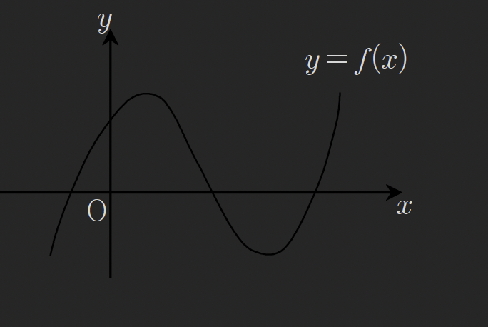
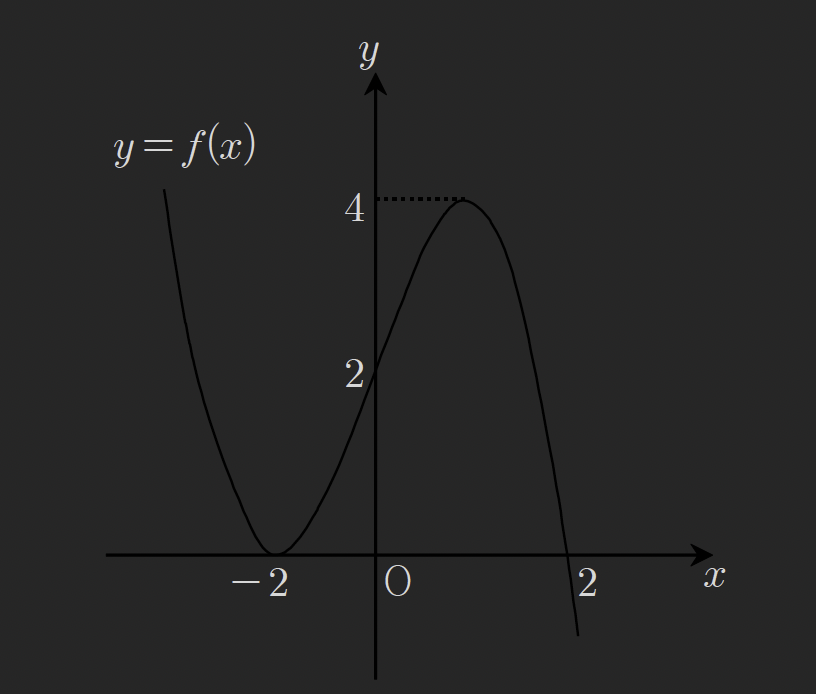

## Def(3) 테일러 급수, 매크로린급수

### 테일러급수

a를 포함하는 구간에서 f가 무한번 미분가능할때
$f(x)=f(a)+\frac{f'(a)}{1!}(x-a)+\frac{f''(a)}{2!}(x-a)^{2}+\frac{f'''(a)}{3!}(x-a)^{3}+\dots$
을 x=a에서의 테일러 급수라 한다

다차함수를 아래처럼 나타낼수 있는데 C는 각 차수의 계수 일떄

$$
(x)=C_{0}+C_{1}(x-a)+C_{2}(x-a)^{2}+C_{3}(x-a)^{3}+\dots  \tag{exp1}
$$

다차함수 계수들을 테일러 급수로 나타낼수있다.
모든 실수범위에서 미분가능한 싸인,코싸인,지수 함수와 같은 초월함수 또함
테일러 급수로 다항함수의 꼴로 나타낼수있다.

테일러급수와 exp1의 계수 부분이 같음을 확인해보자

exp1에 x=a대입

$$
f(a)=C_{0} \implies C_{0}=f(a)
$$

exp1 양변을 미분하면

$$
f'(x)=C_{1}+2C_{2}(x-a)^{1}+3C_{3}(x-a)^{2}+\dots
$$

$$
f'(a)=C_{1}=\frac{f'(a)}{1!}
$$

한번더 미분하게되면

$$
f''(x)=2C_{2}+2\cdot 3 C_{3}(x-a)^{1}+\dots
$$

$$
f''(a)=2C_{2}=\frac{f''(a)}{2!}
$$

으로 테일러 급수의 각 계수와 다차함수간의 계수가 서로 같음을 알수있다.
나아가 다차함수의 n번쨰 계수는

$$
C_{n}=\frac{f^{(n)}(a)}{n!}
$$

임을 알수있다.

### 매크로린 급수

$$
f(x)=f(0)+\frac{f'(0)}{1!}x+\frac{f''(0)}{2!}x^{2}+\frac{f'''(0)}{3!}x^{3}+\dots
$$

을 f의 매크로린 급수라고 하며 x=0에서의 테일러 급수라고 보면된다.

삼차함수 $f(x)=ax^{3}+bx^{2}+cx+d$ 에서

$$
f(0)=d
$$

$$
f'(x)=c+2bx+3ax^{2}
$$

$$
f'(0)=c=\frac{f'(0)}{1!}
$$

$$
f''(x)=2\cdot 1 b+3\cdot 2 ax
$$

$$
f''(0)=2\cdot 1 b \implies b=\frac{f''(0)}{2!}
$$

$$
f'''(x)=3\cdot 2 \cdot 1 a
$$

$$
f'''(0)=3!a \implies a=\frac{f'''(0)}{3!}
$$

으로 다차함수를 매크로린급수 나타낼수있음을 알수있고 차수가 유한한 다항함수는
유한한 급수로 나타낼수 있는 것을 알수있다.

예제191
함수 $f(x)=e^{x}$의 매크로린 급수를 구하여라

$$
f'(x)=e^{x} \implies f'(0)=1
$$

$$
f(x)=e^{x}=f(0)+\frac{f'(0)}{1!}x+\frac{f''(0)}{2!}x^{2}+\frac{f'''(0)}{3!}x^{3}+\dots
$$

$$
=1+x+\frac{x^{2}}{2!}+\frac{x^{3}}{3!}+\dots
$$

$$
=\Sigma^{\infty}_{n=0}\left( \frac{x^{n}}{n!} \right)
$$

추가문제 $f(x)=\sin x$의 매크로린급수를 구하여라

$$
f'(x)=\cos x,\ f''(x)=-\sin x,\ f'''(x)=-\cos x,\ f''''(x)=\sin x
$$

$$
f(x)=\sin x=f(0)+\frac{f'(0)}{1!}x+\frac{f''(0)}{2!}x^{2}+\dots
$$

$$
=0+\cos 0 \cdot x-\frac{\sin 0}{2!}x^{2}-\frac{\cos 0}{3!}x^{3}+\frac{\sin 0}{4!}x^{4}+\frac{\cos 0}{5!}x^{5}+\dots
$$

$$
=x-\frac{x^{3}}{3!}+\frac{x^{5}}{5!}-\frac{x^{7}}{7!}+\dots
$$

$$
=\Sigma^{\infty}_{n=0}(-1)^{n} \cdot \frac{x^{2n+1}}{(2n+1)!}
$$

예제192
함수 $f(x)=x^{3}+ax^{2}+bx+c$의 그래프가 다음과 같을 때 a,b,c의 부호를 구하여라

함수 꼬리가 위를 향하므로 a>0
f(0)>0 이므로 c>0
$f'(0)=b$ 인데 그래프에서 해당 부분의 접선의 기울기는 양이므로 b>0
$f''(0)=2a$ 인데 x=0구간은 극대권 내이므로 a<0

예제193
함수f(x)의 그래프가 다음과 같고
$f(x)=(x-4)^{3}+a(x-4)^{2}+b(x-4)+c$
에서 a,b,c의 부호를 구하여라

$$
f(x)=f(4)+f'(4)(x-4)+\frac{f''(4)}{2!}(x-4)^{2}+\frac{f'''(4)}{3!}(x-4)^{3}
$$

$$
f(4)=c>0,\ f'(4)=b>0,\ \frac{f''(4)}{2!}=a>0(극소권)
$$

예제194
함수 f(x)의 그래프가 다음과같고
$f(x)=-(x-3)^{3}+A(x-3)^{2}+B(x-3)+C$ 라고 할떄
A,B,C의 부호를 구하여라

$$
f(x)=f(3)+f'(3)(x-3)+\frac{f''(3)}{2!}(x-3)^{2}+\frac{f'''(3)}{3!}(x-3)^{3}
$$

$$
f(3)=C<0,\ f'(3)=B<0,\ \frac{f''(3)}{2!}=A<0
$$

예제195
이차함수 $f(x)=ax^{2}+bx+c$ 위의 점 $(m,f(m))$ 에서의
접선의 방정식을 g(x)라 할떄

$$
f(x)-g(x)=\frac{f''(m)}{2!}(x-m)^{2}
$$

임을 보여라 (단, $\frac{f''(m)}{2!}=a$)

x=m에서 테일러급수로 함수를 나타내면

$$
f(x)=f(m)+f'(m)(x-m)+\frac{f''(m)}{2!}(x-m)^{2}
$$

접선의 기울기는 f'(m)이고 (m,f(m))을 지나므로

$$
g(x)=f'(m)(x-m)+f(m)
$$

$$
f(x)-g(x)=\frac{f''(m)}{2!}(x-m)^{2}
=a(x-m)^{2}
$$

예제196
함수 $f(x)=3x^{2}+ax+b$ 의 그래프 위의 한 점 $p,f(p)$ 에서의 접선의 방정식을 $g(x)$라 하고
$h(x)=f(x)-g(x)$라 할때 다음 보기중 옳은 것을 모두 골라라
(1) h(x)는 극솟값을 갖는다
(2)부등식 $h(x)< \frac{1}{3}$의 해가 존재한다
(3) $h(x_{1})=h(x_{2})$ 를 만족시키는 서로다른 실수 x가 존재한다

$$
h(x)=3(x-p)^{2}
$$

아래로 볼록한 이차함수이므로 극솟값 갖는다
극솟값은 0이다
이차함수임으로 $h(x_{1})=h(x_{2})$를 만족시키는 서로다른 실수 x 존재한다
1,2,3 모두 옳다

예제197
이차함수 $y=f(x)$ 의 그래프 위의 한점 $(a,f(a))$에서의 접선의 방정식을
$y=g(x)$라 하자 $h(x)=f(x)-g(x)$라 할때 다음 보기에서 올은 것을 모두 골라라
(1) $h(x_{1})=h(x_{2})$ 를 만족시키는 서로 다른 실수 $x_{1}, x_{2}$가 존재한다
(2) h(x)는 $x=a$에서 극소이다
(3) 부등식 $|h(x)|< \frac{1}{100}$ 의 해는 항상 존재한다

f(x)를 다음과 같이 두면

$$
f(x)=Ax^{2}+Bx+C
$$

$$
h(x)=A(x-a)^{2}
$$

이차함수임으로 (1)은 참
(2)는 극소점 또는 극대점이 된다 A값을 모르므로 옳다할수없다
|h(x)|임으로 (3)은 옳다

