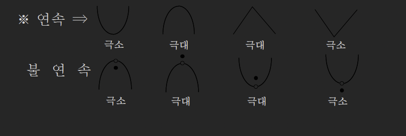

# 함수의 극대와 극소(1)

## 1. 함수의 극대와 극소

### Thm (36): 함수의 극대와 극소

함수 $f(x)$에서 $x = a$를 포함하는 어떤 열린구간에 속하는 모든 $x$에 대하여

**(1) $f(x) \leq f(a)$일 때 $f(a)$를 **극댓값**이라 한다.**

$\Rightarrow$ $x = a$의 좌우에서 $f(x)$가 증가하다가 감소하면 $x = a$에서 $f(x)$는 극대이다.

**(2) $f(x) \geq f(a)$일 때 $f(a)$를 **극솟값**이라 한다.**

$\Rightarrow$ $x = a$의 좌우에서 $f(x)$가 감소하다가 증가하면 $x = a$에서 $f(x)$는 극소이다.

### 극값의 기하학적 의미

극값은 **증감이 바뀌는 점**의 함숫값으로 연속유무, 미분계수 존재유무와 상관이 없다.

<!-- 그래프: 극값의 형태 -->



**연속 함수의 극값**: 매끄러운 곡선에서 증감이 바뀌는 점
**불연속 함수의 극값**: 점프, 구멍이 있어도 좌우에서 증감이 바뀌면 극값

## 2. 극값 판정법

### 핵심 I: 극값의 존재성

함수 $f(x)$가 $x = a$에서 미분가능하고 $x = a$에서 극값을 가지면 $f'(a) = 0$이다. 단, 역은 성립하지 않는다.

**예**: $f(x) = x^3 - 6x$

$f'(x) = 3x^2 - 6 = 0$에서 $x = \pm\sqrt{2}$

하지만 $f'(x) = 0$이라고 모두 극값은 아니다. (변곡점일 수도 있음)

### 핵심 II: 극값의 판정 (1계 도함수 검사)

① **미분가능한 함수** $f(x)$에 대하여 $f'(a) = 0$이고

$x = a$의 좌우에서 $f'(x)$의 부호가 $+ \to -$이면 극대,
$- \to +$이면 극소와 관정한다. (증감표)

② $f''(a) < 0$이면 $x = a$에서 극대

$f''(a) > 0$이면 $x = a$에서 극소와 관정한다.

③ graph의 개형을 통해서 관정할 수도 있다.

### 핵심 III: 삼차함수의 극소

① 극값이 존재하는 경우 반드시 두 개(극대 1, 극소 1)이다.

즉, $f'(a) = 0$는 서로 다른 두 실근을 갖는다.

② 극값이 없는 경우 $f'(a) = 0$은 중근 or 허근을 갖는다.

③ 극값 중 하나가 $0$인 경우 $x$축과 접한다.

### 극값 판정 알고리즘

**Step 1**: $f'(x) = 0$을 풀어 임계점 찾기

**Step 2**: 다음 중 하나를 선택하여 극값 판정

- **방법 1 (증감표)**: $f'(x)$의 부호 변화 확인
  - $f'(x)$: $+ \to 0 \to -$ $\Rightarrow$ 극대
  - $f'(x)$: $- \to 0 \to +$ $\Rightarrow$ 극소

- **방법 2 (2계 도함수)**: $f''(a)$의 부호 확인
  - $f''(a) < 0$ $\Rightarrow$ 극대
  - $f''(a) > 0$ $\Rightarrow$ 극소

- **방법 3 (그래프)**: 함수의 개형으로 판정

**Step 3**: 극값 계산: $f(a)$ 구하기

## 3. 극값과 관련된 주의사항

### 극값과 최댓값/최솟값의 차이

- **극값**: 국소적(local)인 개념 - 주변에서만 비교
- **최댓값/최솟값**: 전역적(global)인 개념 - 전체 구간에서 비교

<!-- 그래프: 극값 vs 최댓값/최솟값 -->

```
    y
    |
    |    ● 극대 (최댓값 아님)
    |   / \
    |  /   \    ● 최댓값 (극대)
    | /     \  /|\
    |/       \/  \
    |         ●   \
    |      극소    \
    +---------------- x
```

### $f'(a) = 0$이지만 극값이 아닌 경우

**변곡점의 예**: $f(x) = x^3$

$$f'(x) = 3x^2 = 0 \quad \Rightarrow \quad x = 0$$

하지만 $x = 0$에서 $f'(x)$의 부호가 바뀌지 않음 ($f'(x) \geq 0$ 항상)

따라서 $x = 0$은 극값이 아니라 변곡점

## 4. 적용 예시

### 예시 1: 삼차함수의 극값

$f(x) = x^3 - 3x^2 + 2$의 극값을 구하여라.

> [!summary]- 풀이
> **Step 1**: 임계점 찾기
>
> $$f'(x) = 3x^2 - 6x = 3x(x - 2) = 0$$
>
> $$x = 0 \quad \text{or} \quad x = 2$$
>
> **Step 2**: 극값 판정 (2계 도함수 이용)
>
> $$f''(x) = 6x - 6$$
>
> - $f''(0) = -6 < 0$ $\Rightarrow$ $x = 0$에서 극대
> - $f''(2) = 6 > 0$ $\Rightarrow$ $x = 2$에서 극소
>
> **Step 3**: 극값 계산
>
> - 극댓값: $f(0) = 2$
> - 극솟값: $f(2) = 8 - 12 + 2 = -2$

### 예시 2: 증감표를 이용한 극값 판정

$f(x) = x^4 - 4x^3$의 극값을 구하여라.

> [!summary]- 풀이
> **Step 1**: 임계점 찾기
>
> $$f'(x) = 4x^3 - 12x^2 = 4x^2(x - 3) = 0$$
>
> $$x = 0 \quad \text{or} \quad x = 3$$
>
> **Step 2**: 증감표 작성
>
> | $x$     | $\cdots$   | $0$       | $\cdots$   | $3$  | $\cdots$   |
> | ------- | ---------- | --------- | ---------- | ---- | ---------- |
> | $f'(x)$ | $-$        | $0$       | $-$        | $0$  | $+$        |
> | $f(x)$  | $\searrow$ | 극값 아님 | $\searrow$ | 극소 | $\nearrow$ |
>
> - $x = 0$: $f'(x)$의 부호가 바뀌지 않음 $\Rightarrow$ 극값 아님
> - $x = 3$: $f'(x)$의 부호가 $- \to +$ $\Rightarrow$ 극소
>
> **Step 3**: 극값 계산
>
> - 극솟값: $f(3) = 81 - 108 = -27$

## 연습문제

다음 개념을 숙지하시오:

1. 극값은 증감이 바뀌는 점의 함숫값이며, 연속성이나 미분가능성과 무관
2. $f'(a) = 0$은 극값의 필요조건이지 충분조건은 아님
3. 극값 판정은 1계 도함수의 부호 변화 또는 2계 도함수의 부호로 확인
4. 삼차함수는 극값이 0개 또는 2개(극대 1개, 극소 1개)

## 관련 주제

- [[32-function-behavior|변곡점 이론, 함수의 증가와 감소]]
- [[34-extrema-2|함수의 극대와 극소(2)]]
- [[28-mean-value-theorem|롤의 정리, 평균값 정리]]

---

**학습 포인트:**

1. 극값의 정의: 좌우에서 증감이 바뀌는 점의 함숫값
2. 극값 판정의 필요조건: 미분가능한 함수에서 $f'(a) = 0$
3. 극값 판정의 충분조건: $f'(x)$의 부호 변화 또는 $f''(a)$의 부호
4. 삼차함수의 극값은 0개 또는 2개 (극대 1개 + 극소 1개)
