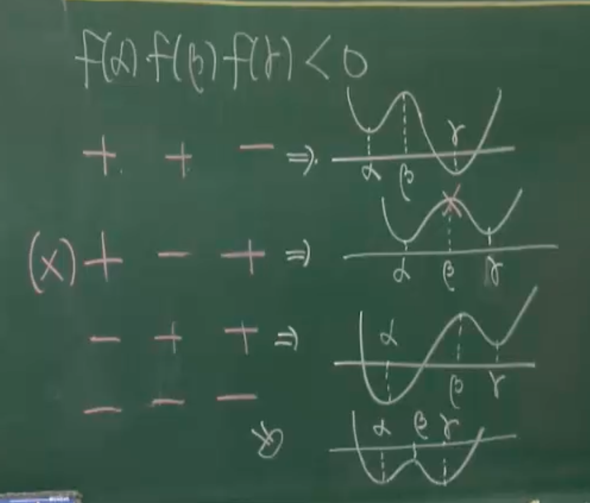

예제207
함수 $f(x)=2x^{3}-9x^{2}+12x+2$ 의 극댓값을 M, 극솟값을 m이라할떄
Mm의 값을 구하여라

극점좌표 추정

$$
f'(x)=6x^{2}-18x+12
$$

$$
6x^{2}-18x+12=0
$$

$$
(3x-3)(2x-4)=0
$$

$$
x=1,\ or\ x=2
$$

극점 확인

(1)증감표로 확인

$$
f'(0)>0,\ f'\left( \frac{3}{2} \right)<0,\ f'(3)>0
$$

$$
+ \to f'(1) \to - \to f'(2) \to +
$$

이므로 x=1에서 극대 x=2에서 극소 값을 가진다

(2) 이계도함수로 확인

$$
f''(x)=12x-18
$$

$$
f'(1)=0,\ f'(2)=0\ 이고
$$

$$
f''(1)<0,\ f''(2) >0
$$

이므로
x=1에서 극대, x=2에서 극소

$$
M=f(1),\ m=f(2)
$$

$$
M=2-9+12+2=7
$$

$$
m=16-36+24+2=6
$$

$$
Mm= f(1)\cdot f(2)= 7\times 6 = 42
$$

예제208
함수 $f(x)=x^{3}-3ax^{2}+4a$의 그래프가 x축과 접할때(극점이 x축에 접함)
a의 값을 구하여라 ($a>0$)

$$
f'(x)=3x^{2}-6ax
$$

$$
x(x-2a)=0
$$

x=0, x=2a 에서 극점

$$
f''(0)=-6a < 0,\ f''(2a)=12a-6a=6a >0
$$

x=0에서 극대, x=2a에서 극소

$$
f(0)=4a > 0
$$

으로 극대점은 x축과 접하지 않는다

$$
f(2a)
=8a^{3}-12a^{3}+4a
=-4a^{3}+4a
$$

$$
-4a^{3}+4a=0
$$

$$
a^{3}+a=0
$$

$$
a(a^{2}-1)=0
$$

$$
a=0\ or\  \pm 1
$$

$$
\because a>0,\ \therefore a=1
$$

예제209
두 상수 a,b에 대하여 함수 $f(x)=x^{3}+ax^{2}+9x+b$가 x=1에서
극댓값 0을 가질때 ab의 값을 구하여라

$$
f'(x)=3x^{2}+2ax+9
$$

$$
f'(1)=3+2a+9=0
$$

$$
2a=-12,\ a=-6
$$

$$
f(1)=1-6+9+b=0
$$

$$
b=-4
$$

$$
ab=-6 \cdot -4 = 24
$$

예제210
함수 $f(x)=x^{3}-3x$에 대한 <보기>의 설명중 옳은 것을 모두 골라라
(1) f(x)는 극댓값과 극솟값을 가진다
(2) $x\geq 2$이면 $f(x)\geq 2$이다
(3)$|x|\leq 2$이면 $|f(x)|\leq 2$이다

(1):

$$
f'(x)=3x^{2}-3=3(x^{2}-1)
$$

$x=\pm1$ 에서 극점

$$
f''(x)=6x
$$

x=1에서 극소점 x=-1에서 극대점을 가지고
각 극점좌표는 $(1, -2),\ (-1,2)$

(1)은 참이다

(2):
$x\geq 2$ 범위는 극소권 우측이므로 참이다.

(3):
$f(2)=2,\ f(-2)=-2$
그래프를 그려보면
구간 $-2\leq x \leq 2$ 에서 f(x)는 $-2 \leq f(x)\leq 2$ 범위이므로
(3)은 참이다

예제211
함수 $f(x)=x^{4}+ax^{3}+bx^{2}+cx+6$ 이 다음 조건을 만족시킬때
f(3)의 값을 구하여라
(1) 모든 실수 x에 대하여 $f(-x)=f(x)$
(2) $f(x)$ 의 극솟값이 -10을 갖는다

(1): 우함수 임으로 a,c=0이다

$$
f(x)=x^{4}+bx^{2}+6
$$

(2): 극점의 접선기울기는 0

$$
f'(x)=4x^{3}+2bx=0
$$

$$
2x(2x^{2}+b)=0
$$

$$
x=0,\ \pm \sqrt{ -\frac{b}{2} }
$$

위의 극점의 x좌표는 위 3가지가 가능
근데 $b>0$일떄 실근을 가지는 극점은 x=0 하나이게 된다

i) b>0 일떄, 극점 (x=0)

$$
f(0)=6 \neq -10
$$

ii) b<0일떄, 극점 $x=0,\ x=\pm \sqrt{ -\frac{b}{2} }$ ,
두 극소점 루트 사이에 x=0에서 극대점

$$
f\left( \pm \sqrt{ -\frac{b}{2} } \right)
=\frac{b^{2}}{4}+b \cdot -\frac{b}{2}+6
$$

$$
=-\frac{b^{2}}{4}+6=-10
$$

$$
-b^{2}+24=-40
$$

$$
b^{2}=64
$$

$$
b=\pm 8,\ \because b<0,\ b=-8
$$

예제212
최고차 항의 계수가 양인 사차함수 f(x)에 대하여 $f'(x)=0$ 는
서로 다른 세 실슨 $\alpha,\ \beta,\ \gamma\ (\alpha<\beta<\gamma)$ 를 갖고
$f(\alpha)f(\beta)f(\gamma)<0$ 일때 다음 보기중 옳은 것을 모두 골라라

(1) 함수 f(x)는 $x=\beta$에서 극댓값을 갖는다
(2) 방정식 $f(x)=0$는 서로 다른 두 실근을 갖는다
(3) $f(\alpha)>0$ 이면 방정식 $f(x)=0$는 $\beta$ 볻다 작은 실근을 가진다

사차함수에서 최고차항이 양이고 $f'(x)=0$에 대한 실근이 3개라는 것은
극소값2개 극댓값 1개를 가지는 그래프라는 것을 알 수 있다.

그리고 세함수의 곱의 결과가 0보다 작을려면 위의 그림처럼 3가지 경우만이 가능하다.

(1) 조건이 성립되는 3가지 그래프에서 $\beta$ 는 모두 극댓값이다.
1은 참이다.

(2) 조건이 성립되는 3가지 그래프에서 x축과 접하는 점이 2개씩 있다.
2는 참이다.

(3) 이미지의 첫번쨰 그래프에서 알 수있듯이 두 실근이 $\beta$보다 오른쪾에 있으므로
3은 거짓이다.

예제213
a>1 일떄 함수 $f(x)=2x^{3}-3(a+1)x^{2}+6ax-4a+2$ 에 대하여
방정식 $f(x)=0$의 한 실근을 b라 하자 다음은 두수 a,b의 크기를
비교하는 과정이다 ??을 채우세요

$f'(a)=$?? 이고 a>1 이므로 f(x)는 x=1에서 ??을 가진다
그런데 $f(1)<0$이고 $f(b)=0$ 이므로 a??b 이다

---

(1)

$$
f'(x)
=6x^{2}-6(a+1)x+6a
=6(x^{2}-(a+1)x+a)
=6(x-1)(x-a)
$$

$$
f'(x)=6(x-1)(x-a)
$$

(2)
$f'(x)=0$ 을 만족하는 두 실근은 $x=1,\ x=a$ 인데 삼차항의 계수가 양수이므로
x=1에서 극댓값을 가진다 (x=a에서는 극솟값)

(3)
극댓값f(1)이 음이라면 극솟값f(a)도 음일 것이고,
그래프의 좌측꼬리부터 극솟값 까지는 모두 음임 을 알수있는데
$f(b)=0$ 이라는 것은 b는 a보다 그래프 오른쪾의 값임을 알수있다.
그러므로 $a<b$

예제214
함수 $f(x)=x^{3}-6x^{2}+9x+1$의 극댓값과 극솟값의 차를 구하시오

$$
f'(x)
=3x^{2}-12x+9
$$

$$
3x^{2}-12x+9=0
$$

$$
(3x-3)(x-3)=0
$$

$$
x=1\ or\ 3
$$

삼차항의 계수는 양임므로 $x=1$에서 극댓값 $x=3$에서 극솟값

대입하여 차를 구하면 된다.

$$
|f(3)-f(1)|
=|27-54+27+1-(1-6+9+1)|
=|1-5|
=4
$$

예제215
함수 $f(x)=2x^{3}-3x^{2}+6ax \left( a< \frac{1}{4} \right)$ 가 충분히 작은 양수 h 에 대하여
(1)$f(\alpha-h) < f(\alpha),\ f(\alpha)>f(\alpha+h)$
(2) $f(\beta-h) > f(\beta),\ f(\beta < f(\beta+h))$
를 만족 시키는 $\alpha,\beta$에 대하여 $|f(\alpha)-f(\beta)=8$이라고 한다 이때
$a+\alpha+\beta$ 의 값을 구하여라

hint:
삼차함수 $y=f(x)$에 대하여 $f'(x)=0$의 서로 다른 두 실근을 $\alpha,\beta$ 라 하면
| 극대 - 극소| = $|f(\alpha)-f(\beta)$ 이다
f(x)의 $f'(x)=px^{2}+qx+r$ 일떄
$f(\alpha)-f(\beta)=\frac{|p|}{6}|\alpha-\beta|^{3}$ 이다 (이에 대한 증명은 적분 과정에서 배운다)

---

(1)과 (2)로 부터 $x=\alpha,\ x=\beta$에서 각각 극대, 극소 임을 알 수 있다.

$$
f'(x)=6x^{2}-6x+6a=0 \tag{ex1}
$$

에서 두근은 각각 $\alpha, \beta$ 임을 알수있다.

$$
f(\alpha)-f(\beta)
=\frac{|p|}{6}|\alpha-\beta|^{3}
=\frac{6}{6}|\alpha-\beta|^{3}
$$

$$
|\alpha-\beta|^{3}=8
$$

$$
|\alpha-\beta|=2,\
|\alpha-\beta|^{2}=4
$$

$$
|\alpha-\beta|^{2}=(\alpha+\beta)^{2}-4\alpha\beta=4
$$

ex1에서 두근의 합과 곱은 각각 1, a 임으로

$$
|\alpha-\beta|^{2}=(\alpha+\beta)^{2}-4\alpha\beta=1^{2}-4a=4
$$

$$
a=-\frac{3}{4}
$$

$$
a+\alpha+\beta=-\frac{3}{4}+1=\frac{1}{4}
$$
