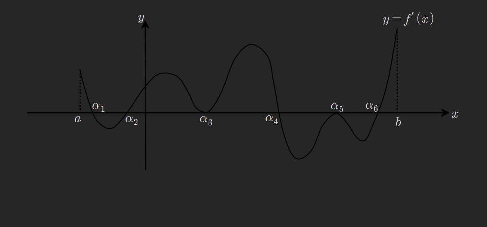
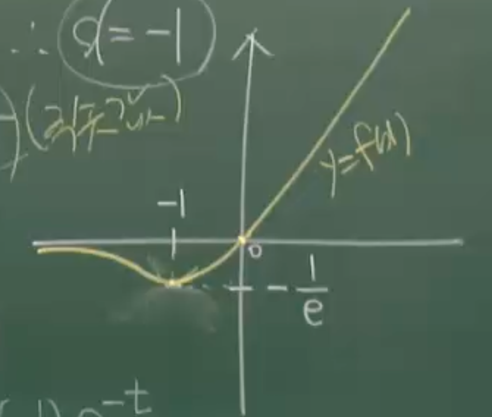
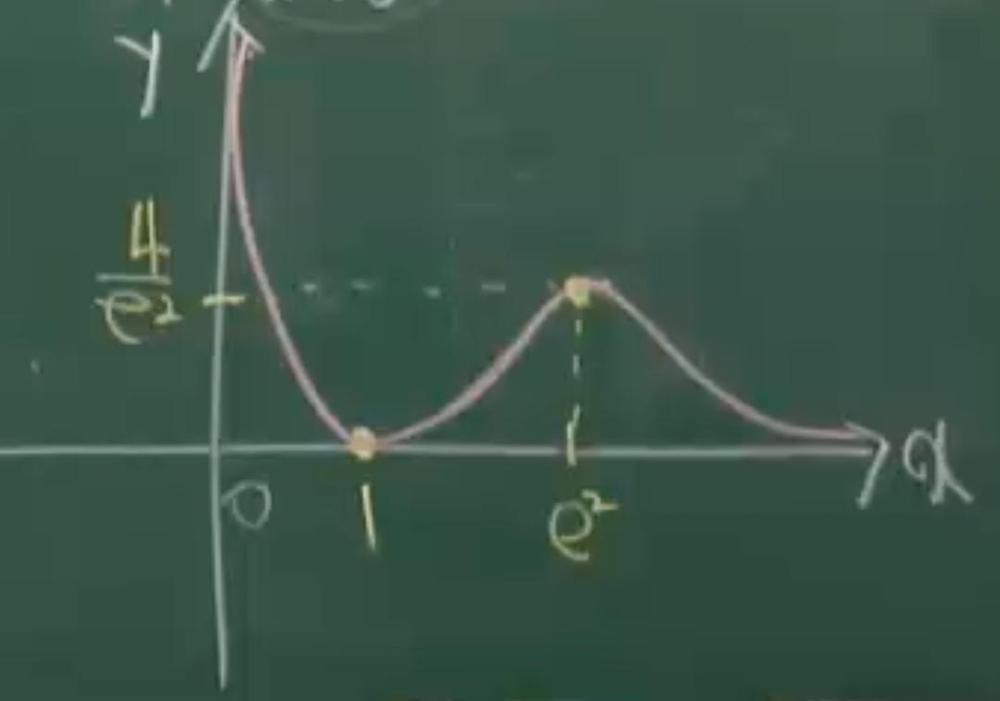
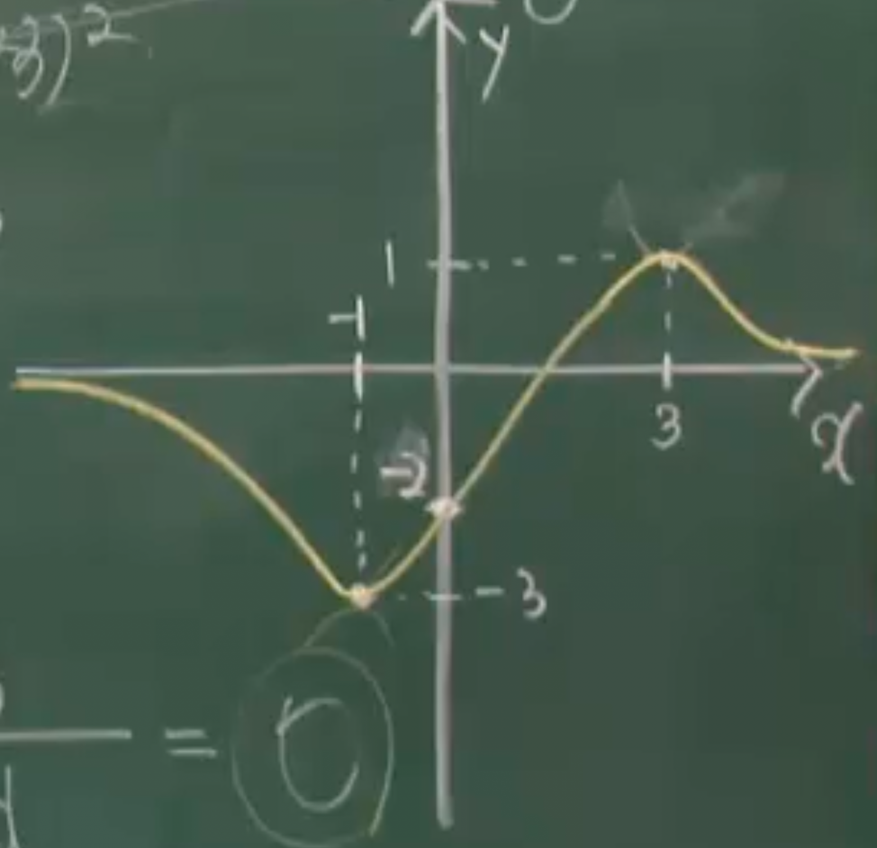
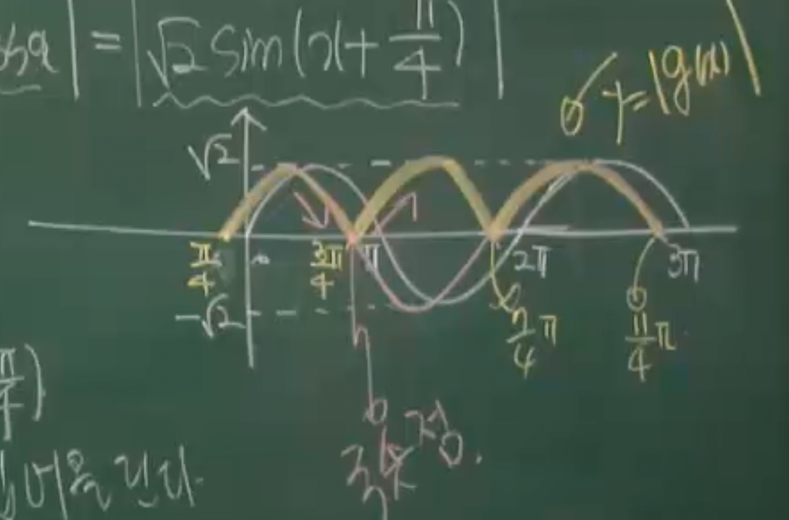

예제216
함수 $f(x)=-\frac{3}{4}x^{4}+5x^{3}-\frac{21}{2}x^{2}+9x+10$ 의
극댓값의 개수를 m, 극솟값의 개수를 n이라 할떄 $m^{2}+n^{2}$을 구하라

$$
f'(x)=-3x^{3}+15x^{2}-21x+9=0
$$

$$
x^{3}-5x^{2}+7x-3=0
$$

$$
(x-1)^{2}(x-3)=0
$$

x=1에서 변곡점 x=3에서 극대
m=1, n=0

$$
m^{2}+n^{2}=1^{2}+0=1
$$

예제217
함수 $f(x)=x^{3}+(a-1)x^{2}-3x$ 의 극댓점과 극솟점이 원점에 관해
대칭일때 상수 a의 값을 구하여라

변곡점은 (0,0)

$$
f'(x)=3x^{2}+2(a-1)x-3
$$

$$
f''(x)=6x+2(a-1)=0
$$

$$
f''(0)=2(a-1)=2a-2=0
$$

$$
a=1
$$

예제218
함수 $f(x)=-x^{3}-\frac{3}{2}kx^{2}+6k^{2}x\ (k>0)$ 에서 다음을 만족하는
$\alpha,\beta$에 대하여 $|f(\alpha)-f(\beta)|=\frac{1}{2}$일때 상수 k를 구하여라
(1) $f'(\alpha)=0$이고 $f''(\alpha)>0$이다
(2) $f'(\beta)=0$ 이고 $f''(\beta)<0$이다

$x=\alpha$에서 극소점, $x=\beta$에서 극대점

$$
f'(x)=-3x^{2}-3kx+6k^{2}=0
$$

$$
|f(\alpha)-f(\beta)|=\frac{|-3|}{6}|\alpha-\beta|^{3}=\frac{1}{2}
$$

$$
|\alpha-\beta|^{3}=1,\
|\alpha-\beta|^{2}=1,\
$$

$$
|\alpha-\beta|^{2}=|\alpha+\beta|^{2}-4\alpha\beta
$$

두근의합 두근의 곱

$$
=|-k|^{2}-4\cdot -2k^{2}
=k^{2}+8k^{2}=9k^{2}
=1
$$

$$
k=\pm \frac{1}{3},\  \because k>0,\ k=\frac{1}{3}
$$

예제219
구간 $[a,b]$ 에서 도함수 $y=f'(x)$ 의 그래프가 다음과 같을 때 함수
$y=f(x)$ 의 극댓값의 갯수 a와 극솟값의 갯수 b에 대하여 $a^{2}+b^{2}$을 구하여라

f'의 부호가 - -> +가 되는 극솟점은 $a_{2},a_{6}$ 2개
f'의 부호가 + -> -가 되는 극댓점은 $a_{1},a_{4}$ 2개

$$
a^{2}+b^{2}=2^{2}+2^{2}=8
$$

예제220
함수 $f(x)=xe^{x}$의 극솟값을 구하여라

극값조사

$$
f'(x)=e^{x} \cdot + x \cdot e^{x}=(1+x)e^{x}=0
$$

x=-1에서 극값을 가진다

$$
f(-1)=-1e^{-1}=-\frac{1}{e}
$$

극대권 극소권 조사

$$
f''(x)=e^{x}+e^{x}+x \cdot e^{x}
=(2+x)e^{x}
$$

$$
f''(-1)=(2-1)e^{-1}=\frac{1}{e} > 0
$$

임으로 x=-1에서 극점이며 극소권에 있음을 알수있으므로 극솟값은 $-\frac{1}{e}$

---

강의 문제풀이
그래프를 그리는 것에 초점을 두고 문제를 풀어 본다

극값조사

$$
f'(x)=e^{x} \cdot + x \cdot e^{x}=(1+x)e^{x}=0
$$

x=-1에서 극값을 가진다

경계값의 극한값조사
함수식과 극값조사를 통해 $x \in (-\infty, \infty)$ , $f(0)=0$, $f(-1)=-\frac{1}{e}$
임을 알수있다.

$$
\lim_{ x \to \infty } xe^{x} = \infty
$$

$$
\lim_{ x \to -\infty } xe^{x}= \lim_{ x \to \infty } -\frac{x}{e^{x}}
$$

로피탈정리

$$
\lim_{ x \to \infty } -\frac{1}{e^{x}}=0
$$

그러므로 아래 그림과 같은 그래프를 그릴수있다.

그러므로 $f(-1)=-\frac{1}{e}$가 극솟값

예제221
함수 $f(x)=\frac{(\ln x)^{2}}{x}$ 의 개형을 그려보아라

극값 조사

$$
f'(x)=\frac{2\ln x \cdot \frac{1}{x} \cdot x - (\ln x)^{2} \cdot 1}{x^{2}}
$$

$$
=\frac{2\ln x-(\ln x)^{2}}{x^{2}}
=\frac{(2-\ln x)\ln x}{x^{2}}=0
$$

$$
x=e^{2} \ or\ 1
$$

$$
f'(1)=0,\ f'(e^{2})=\frac{4}{e^{2}}
$$

경계값의 극댓값 조사
$\ln x$에서 진수의 범위는 0보다 큰 양수임으로

$$
x \in (0,\infty)
$$

$$
\lim_{ x \to \infty } \frac{(\ln x)^{2}}{x}
=\lim_{ x \to \infty } \frac{2\ln x \cdot \frac{1}{x}}{1}
=\lim_{ x \to \infty } 2\cdot \frac{1}{x} \cdot \frac{1}{1}
$$

$$
=\lim_{ x \to \infty } \frac{2}{x}=0
$$

$$
\lim_{ x \to 0+ } \frac{(\ln x)^{2}}{x}
= \frac{(-\infty)^{2}}{0}=\infty
$$

그러므로 해당 함수의 개형은

예제222
함수 $f(x)=\frac{6(x-1)}{x^{2}+3}$ 의 개형을 그려보아라

극값조사

$$
f'(x)=\frac{6(x^{2}+3)-6(x-1)(2x)}{(x^{2}+3)^{2}}=0
$$

$$
6x^{2}+18-12x^{2}+12x=0
$$

$$
-6x^{2}+12x+18=0
$$

$$
x^{2}-2x-3=0
$$

$$
(x-3)(x+1)=0
$$

$$
\therefore x=3\ or\ -1
$$

$$
f(3)=\frac{12}{12}=1
$$

$$
f(-1)= -\frac{12}{4}=-3
$$

경계의 극한값 조사
$-\infty<x<\infty$

$$
\lim_{ x \to \infty } \frac{6(x-1)}{x^{2}+3}
=\lim_{ x \to \infty } \frac{6}{2x}=0
$$

$$
\lim_{ x \to -\infty } \frac{6(x-1)}{x^{2}+3}=\lim_{ x \to -\infty } \frac{6}{2x}=0
$$

예제223
두 함수 $f(x)=e^{-x}$ 와 $g(x)=\sin x+\cos x$ 에 대하여
다음중 옳은 것을 모두 골라라
(1) $f\left( \frac{1}{x} \right)$ 는 증가 함수이다.
(2) $x=\frac{3}{4}\pi$ 일떄 함수 $y=|g(x)|$ 는 극솟값을 가진다
(3) $0<x<20$ 일때 함수 $y=f(x)\cdot g(x)$의 극댓점은 모두 3개이다

(1)

$$
\left\{ f\left( \frac{1}{x} \right) \right\}'=\left\{ e^{-\frac{1}{x}} \right\}'
=\left( -\frac{1}{x}' \right)\cdot e^{-\frac{1}{x}}
=\frac{e^{-\frac{1}{x}}}{x^{2}}>0
$$

도함수가 항상 +임으로 $f\left( \frac{1}{x} \right)$ 는 증가함수이다 (1)은 참이다

(2)
절대치가 붙어있는 함수의 극값을 구할떄는 그래프를 그려서 구해야한다.
뾰족점이 생기는 지점이 극값일떄, 해당지점은 미분불능임으로
미분으로 해당 극값을 구할수없기떄문이다.

$$
y=|g(x)|=|\sin x+\cos x|
=|\sqrt{ 2 }\sin\left( x+\frac{\pi}{4} \right)|
$$

이 함수의 그래프는
$y=\sqrt{ 2 }\sin x$ 에서 x축 $-\frac{\pi}{4}$ 만큼 평행이동 시킨다
$y=\sqrt{ 2 }\sin (x+\frac{\pi}{4})$ 에서 x축 아래를 접어올린다
$y=|\sqrt{ 2 }\sin\left( x+\frac{\pi}{4} \right)|$

(2)는 참이다

(3)

$$
y=f(x)\cdot g(x)=e^{-x}(\sin x+\cos x)
$$

$$
y'=-e^{-x}(\sin x+\cos x)+e^{-x}(\cos x-\sin x)
=-2e^{-x}\cdot \sin x=0
$$

$$
y'=-2e^{-x}\cdot \sin x=0
$$

$-2e^{-x}$는 0이 될수없으므로 y'을 0이되게 하는 x값은 $(0<x<20)$
$\pi,2\pi,3\pi,4\pi,5\pi,6\pi$

$$
y''=2e^{-x}\sin x+(-2e^{-x})\cos x
=2e^{-x}(\sin x-\cos x)
$$

$2e^{-x}$는 무조건 양수임으로 sinx-cosx값이 0과의 대소비교를 하면

$$
\sin \pi-\cos \pi=1,\
y''_{x=\pi}>0
$$

$x=\pi$에서 극솟값을 가지는 것을 알 수 있다.
$y=f(x)g(x)$는 두 연속함수 곱임으로
y자체도 연속함수임을 알수있다
연속함수에서는 극소값 다음 극댓값이 나오므로
각 x좌표$\pi,2\pi,3\pi,4\pi,5\pi,6\pi$ 는
극소,극대,극소,극대,극소,극대 점에 해당함을 알수있다.
극댓점을 3개 임으로 (3)은 참이다
