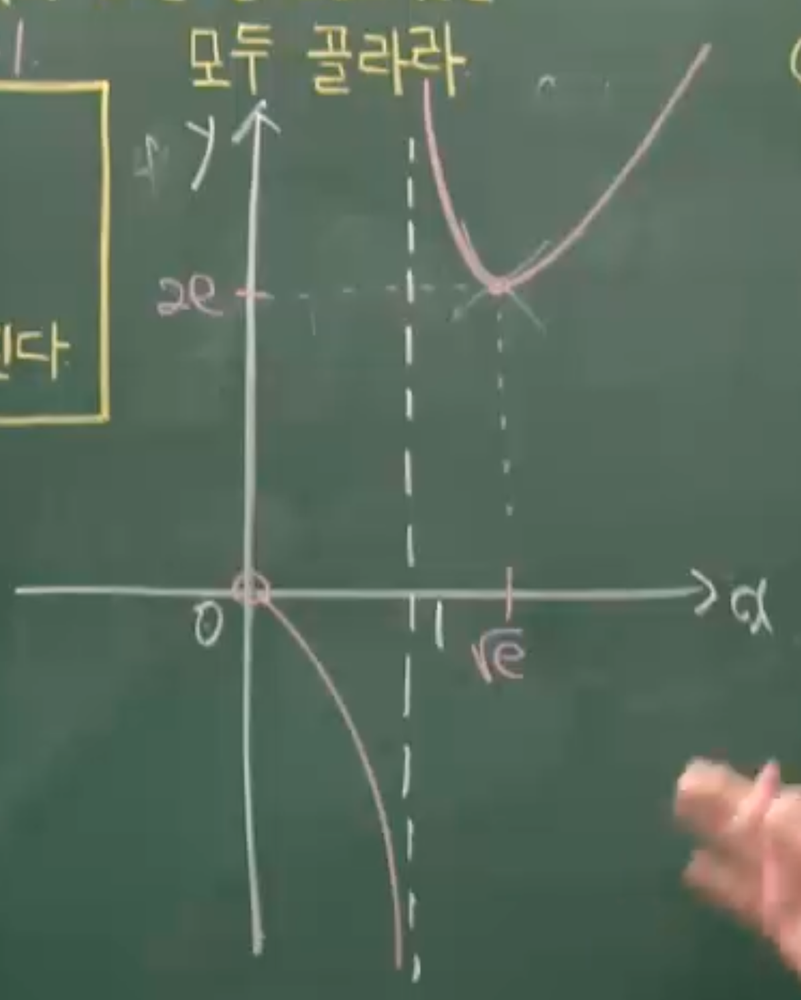
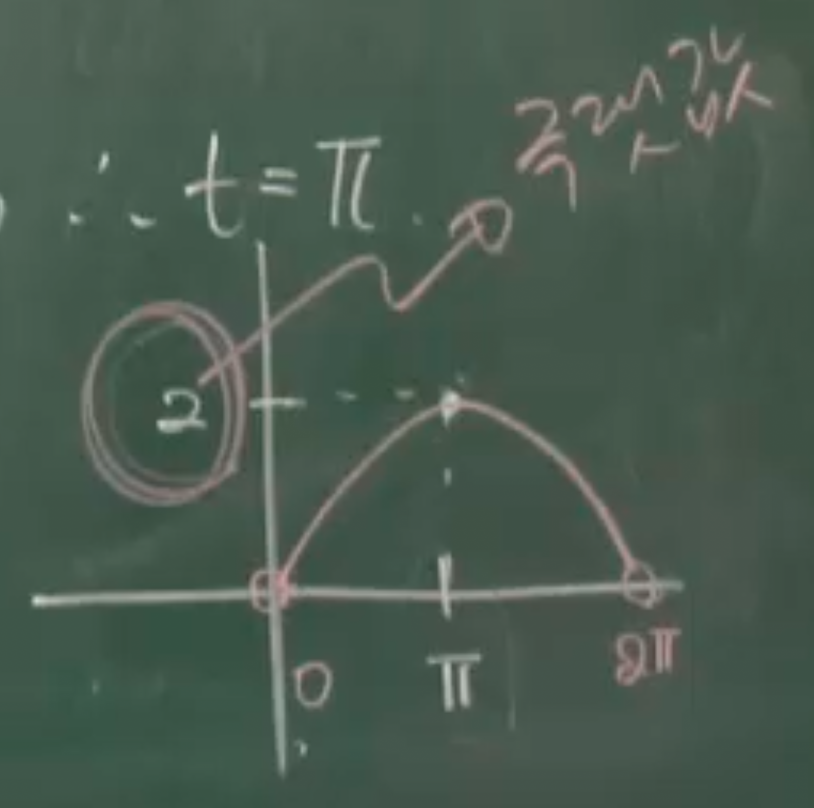

# 함수의 극대와 극소(4) - 곡선의 요철 판단

## 1. Thm 37: 곡선의 요철 판단

### 정리

함수 $f(x)$의 곡선이 구간에서 위로 볼록한지 아래로 볼록한지 판단하는 방법은 이계도함수 $f''(x)$의 부호로 결정된다.

**(1)** $a < b$일 때 $f'(a) > \frac{f(b)-f(a)}{b-a}$ $\Rightarrow$ 위로 볼록 (극대권)

**(2)** $a < b < c$일 때 $\frac{f(b)-f(a)}{b-a} > \frac{f(c)-f(a)}{c-a}$ $\Rightarrow$ 위로 볼록 (극대권)

**(3)** $f\left(\frac{a+b}{2}\right) > \frac{f(a)+f(b)}{2}$ $\Rightarrow$ 위로 볼록 (극대권)

가중평균 형태: $f\left(\frac{na+mb}{m+n}\right) > \frac{nf(a)+mf(b)}{m+n}$ $\Rightarrow$ 위로 볼록

### 기하학적 의미

위의 부등식들은 모두 함수가 **위로 볼록** ($f''(x) < 0$)일 때 성립한다.

- **위로 볼록** (concave down): $f''(x) < 0$ → 극대권
- **아래로 볼록** (concave up): $f''(x) > 0$ → 극소권

### 핵심 원리

구간에서 함수의 볼록성을 판단하려면:

1. $f''(x)$를 계산한다
2. $f''(x) < 0$ → 위로 볼록 (극대권)
3. $f''(x) > 0$ → 아래로 볼록 (극소권)
4. $f''(x) = 0$ → 변곡점 가능성

---

## 2. 예제

### 예제 224: 로그함수의 극값과 그래프 분석

함수 $f(x)=\frac{x^{2}}{\ln x}$의 그래프에 대한 다음 보기의 설명 중 옳은 것을 모두 골라라.

**(ㄱ)** $f(x)$는 오직 하나의 극값을 가진다.

**(ㄴ)** $\lim_{x \to 1}f(x)$의 값은 존재하지 않는다.

**(ㄷ)** 방정식 $\frac{x^{2}}{\ln x}=3e$는 서로 다른 두 실근을 가진다.

> [!summary]- 풀이
>
> **(ㄱ) 극값 판정**
>
> 도함수를 구하면:
>
> $$f'(x)=\frac{2x\ln x-x^{2} \cdot \frac{1}{x}}{(\ln x)^{2}}=\frac{2x\ln x-x}{(\ln x)^{2}}=\frac{x(2\ln x-1)}{(\ln x)^{2}}$$
>
> $f'(x)=0$이 되려면:
>
> $$x(2\ln x-1)=0$$
>
> $x>0$이므로:
>
> $$2\ln x-1=0 \Rightarrow \ln x=\frac{1}{2} \Rightarrow x=e^{1/2}=\sqrt{e}$$
>
> 극값:
>
> $$f(\sqrt{e})=\frac{(\sqrt{e})^{2}}{\ln\sqrt{e}}=\frac{e}{1/2}=2e$$
>
> $x=\sqrt{e}$에서 유일한 극값 $2e$를 가진다.
>
> **(ㄱ)은 참이다.**
>
> **(ㄴ) 극한값 조사**
>
> 함수의 정의역: $\ln x \neq 0$이고 $x > 0$이므로 $0 < x < 1$ 또는 $1 < x < \infty$
>
> 경계값에서의 극한:
>
> $$\lim_{x \to 0^+} \frac{x^{2}}{\ln x}=\frac{0}{-\infty}=0$$
>
> $$\lim_{x \to 1^+} \frac{x^{2}}{\ln x}=\frac{1}{0^+}=+\infty$$
>
> $$\lim_{x \to 1^-} \frac{x^{2}}{\ln x}=\frac{1}{0^-}=-\infty$$
>
> $$\lim_{x \to \infty} \frac{x^{2}}{\ln x}=\lim_{x \to \infty} \frac{2x}{1/x}=\lim_{x \to \infty} 2x^{2}=\infty$$
>
> $x \to 1$일 때 좌극한과 우극한이 다르므로 극한값이 존재하지 않는다.
>
> **(ㄴ)은 참이다.**
>
> **(ㄷ) 방정식의 실근**
>
> 그래프 개형:
>
> 
>
> - $x \to 0^+$일 때: $f(x) \to 0$
> - $x \to 1^-$일 때: $f(x) \to -\infty$
> - $x=\sqrt{e}$에서 극솟값 $2e$
> - $x \to \infty$일 때: $f(x) \to \infty$
>
> 수평선 $y=3e$는 그래프와 두 점에서 만난다.
>
> **(ㄷ)은 참이다.**
>
> **답: (ㄱ), (ㄴ), (ㄷ) 모두 참**

---

### 예제 225: 지수함수와 삼각함수의 볼록성

구간 $[0,2\pi]$에서 곡선 $f(x)=e^{x}\cos x$가 아래로 볼록인 구간은?

**(1)** $\left(0, \frac{\pi}{2}\right)$
**(2)** $(0,\pi)$
**(3)** $\left(\frac{\pi}{2}, \pi\right)$
**(4)** $(\pi, 2\pi)$
**(5)** $\left(\frac{\pi}{2}, \frac{3}{2}\pi\right)$

> [!summary]- 풀이
>
> 아래로 볼록한 구간은 $f''(x) > 0$인 구간이다.
>
> **1차 도함수:**
>
> $$f'(x)=e^{x}\cos x+e^{x}(-\sin x)=e^{x}(\cos x-\sin x)$$
>
> **2차 도함수:**
>
> $$f''(x)=e^{x}(\cos x-\sin x)+e^{x}(-\sin x-\cos x)$$
>
> $$=e^{x}[(\cos x-\sin x)+(-\sin x-\cos x)]$$
>
> $$=e^{x}(-2\sin x)=-2e^{x}\sin x$$
>
> **부호 판정:**
>
> $e^{x} > 0$이므로 $f''(x)$의 부호는 $-2\sin x$의 부호로 결정된다.
>
> 아래로 볼록 ($f''(x) > 0$)이려면:
>
> $$-2\sin x > 0 \Rightarrow \sin x < 0$$
>
> 구간 $[0, 2\pi]$에서 $\sin x < 0$인 구간은:
>
> $$\pi < x < 2\pi$$
>
> **(4)번이 정답이다.**
>
> **(5)번 검증:**
>
> - $\frac{\pi}{2} < x < \pi$: $\sin x > 0$ → $f''(x) < 0$ (위로 볼록)
> - $\pi < x < \frac{3\pi}{2}$: $\sin x < 0$ → $f''(x) > 0$ (아래로 볼록)
>
> (5)번 구간은 위로 볼록과 아래로 볼록 구간이 모두 포함되므로 제외된다.

---

### 예제 226: 매개변수 방정식의 극점

$x=t-\sin t$, $y=1-\cos t$ $(0<t<2\pi)$의 개형을 그려보아라.

> [!summary]- 풀이
>
> **극점 조사**
>
> 매개변수 방정식의 기울기:
>
> $$\frac{dy}{dx}=\frac{\frac{dy}{dt}}{\frac{dx}{dt}}=\frac{\sin t}{1-\cos t}$$
>
> 극점은 $\frac{dy}{dx}=0$인 점:
>
> $$\sin t=0 \Rightarrow t=\pi$$
>
> **경계값 조사**
>
> - $t=0$: $x=0$, $y=0$
> - $t=\pi$: $x=\pi$, $y=2$
> - $t=2\pi$: $x=2\pi$, $y=0$
>
> **그래프:**
>
> 
>
> 사이클로이드 곡선의 한 주기를 나타낸다.
>
> - $(0,0)$에서 시작
> - $(\pi, 2)$에서 극댓값
> - $(2\pi, 0)$에서 종료

---

j

### 예제 227 (스킵)

오른쪽 그림은 5차 다항함수 $f(x)$의 도함수 $f'(x)$의 그래프이다. 이 문제는 스킵한다.

---

### 예제 228: 볼록성과 부등식

임의의 세 실수 $a, b, c$ $(0<a<b<c<\pi)$에 대하여 부등식

$$\frac{f(b)-f(a)}{b-a}> \frac{f(c)-f(b)}{c-b}$$

가 성립하는 함수를 보기에서 모두 골라라.

**(ㄱ)** $f(x)=\sin x$
**(ㄴ)** $f(x)=\cos x-x$
**(ㄷ)** $f(x)=x-\ln x$

> [!summary]- 풀이
>
> 주어진 부등식은 구간 $(0, \pi)$에서 함수가 **위로 볼록** ($f''(x) < 0$)한지 확인하는 조건이다.
>
> **(ㄱ) $f(x)=\sin x$**
>
> $$f'(x)=\cos x, \quad f''(x)=-\sin x$$
>
> $0 < x < \pi$에서 $\sin x > 0$이므로:
>
> $$f''(x)=-\sin x < 0$$
>
> 전체 구간에서 위로 볼록하다.
>
> **(ㄱ)은 참이다.**
>
> **(ㄴ) $f(x)=\cos x-x$**
>
> $$f'(x)=-\sin x-1, \quad f''(x)=-\cos x$$
>
> 구간별 부호 판정:
>
> - $0 < x < \frac{\pi}{2}$: $\cos x > 0$ → $f''(x) < 0$ (위로 볼록)
> - $\frac{\pi}{2} < x < \pi$: $\cos x < 0$ → $f''(x) > 0$ (아래로 볼록)
>
> 전체 구간에서 일관되게 위로 볼록하지않다.
>
> **(ㄴ)은 거짓이다.**
>
> **(ㄷ) $f(x)=x-\ln x$**
>
> 노트의 풀이에 따르면:
>
> $$f'(x)=1+\frac{1}{x}, \quad f''(x)=-\frac{1}{x^2}$$
>
> 모든 $x > 0$에서 $f''(x) < 0$이므로 위로 볼록하다.
>
> **(ㄷ)은 참이다.**
>
> **답: (ㄱ), (ㄷ)**

---

### 예제 229: 종합 문제 - 극값, 변곡점, 볼록성

구간 $[0,2\pi]$에서 정의된 함수 $f(x)=x+2\sin x$의 그래프에 대한 보기의 설명 중 옳은 것을 모두 골라라.

**(ㄱ)** $x=\frac{4}{3}\pi$에서 극솟값을 갖는다.

**(ㄴ)** 점 $(\pi,\pi)$은 곡선 $f(x)$의 변곡점이다.

**(ㄷ)** $\frac{5}{3}\pi < x_{1}<x_{2}<2\pi$인 $x_{1},x_{2}$에 대하여 $f\left(\frac{x_{1}+x_{2}}{2}\right) > \frac{f(x_{1})+f(x_{2})}{2}$이다.

> [!summary]- 풀이
>
> **(ㄱ) 극값 판정**
>
> $$f'(x)=1+2\cos x$$
>
> $f'(x)=0$이 되려면:
>
> $$1+2\cos x=0 \Rightarrow \cos x=-\frac{1}{2}$$
>
> 구간 $[0, 2\pi]$에서:
>
> $$x=\frac{2\pi}{3}, \quad \frac{4\pi}{3}$$
>
> 이계도함수:
>
> $$f''(x)=-2\sin x$$
>
> 각 점에서의 부호:
>
> $$f''\left(\frac{2\pi}{3}\right)=-2\sin\frac{2\pi}{3}=-2 \cdot \frac{\sqrt{3}}{2}=-\sqrt{3} < 0 \quad \text{(극대)}$$
>
> $$f''\left(\frac{4\pi}{3}\right)=-2\sin\frac{4\pi}{3}=-2 \cdot \left(-\frac{\sqrt{3}}{2}\right)=\sqrt{3} > 0 \quad \text{(극소)}$$
>
> $x=\frac{4\pi}{3}$에서 $f'(x)=0$이고 $f''(x)>0$이므로 극솟값을 갖는다.
>
> **(ㄱ)은 참이다.**
>
> **(ㄴ) 변곡점 판정**
>
> 변곡점은 $f''(x)=0$인 점:
>
> $$f''(x)=-2\sin x=0 \Rightarrow x=0, \pi, 2\pi$$
>
> $x=\pi$에서 변곡점이고, 함수값은:
>
> $$f(\pi)=\pi+2\sin\pi=\pi+0=\pi$$
>
> 점 $(\pi, \pi)$는 변곡점이다.
>
> **(ㄴ)은 참이다.**
>
> **(ㄷ) 볼록성 판정**
>
> 조건 $f\left(\frac{x_{1}+x_{2}}{2}\right) > \frac{f(x_{1})+f(x_{2})}{2}$는 해당 구간에서 함수가 **위로 볼록** ($f''(x) < 0$)한지 확인하는 조건이다.
>
> 구간 $\left(\frac{5\pi}{3}, 2\pi\right)$에서:
>
> $$f''(x)=-2\sin x$$
>
> $\frac{5\pi}{3} < x < 2\pi$에서 $\sin x < 0$이므로:
>
> $$f''(x)=-2\sin x > 0$$
>
> 이 구간에서 함수는 **아래로 볼록**하다.
>
> 따라서 주어진 부등식은 성립하지 않는다.
>
> **(ㄷ)은 거짓이다.**
>
> **답: (ㄱ), (ㄴ)**

---

## 연습문제

각 예제를 통해 학습한 내용을 복습하고, 다음을 숙지하시오:

1. 이계도함수를 이용한 극값 판정법
2. 곡선의 볼록성과 $f''(x)$의 관계
3. 매개변수 방정식에서의 극점 찾기
4. 볼록성과 부등식의 관계

---

## 관련 주제

- [[35-extrema-3|함수의 극대와 극소 (3)]]
- [[37-optimization|미분과 최대, 최소]]
- [[32-function-behavior|변곡점 이론, 함수의 증가와 감소]]

---

**학습 포인트:**

1. **곡선의 요철 판단**: $f''(x) < 0$ (위로 볼록), $f''(x) > 0$ (아래로 볼록)
2. **극값과 볼록성**: 이계도함수를 이용한 극값의 종류 판정
3. **볼록성과 부등식**: 평균값 부등식과 함수의 볼록성 관계
4. **매개변수 방정식**: $\frac{dy}{dx}=\frac{dy/dt}{dx/dt}$를 이용한 극점 분석
