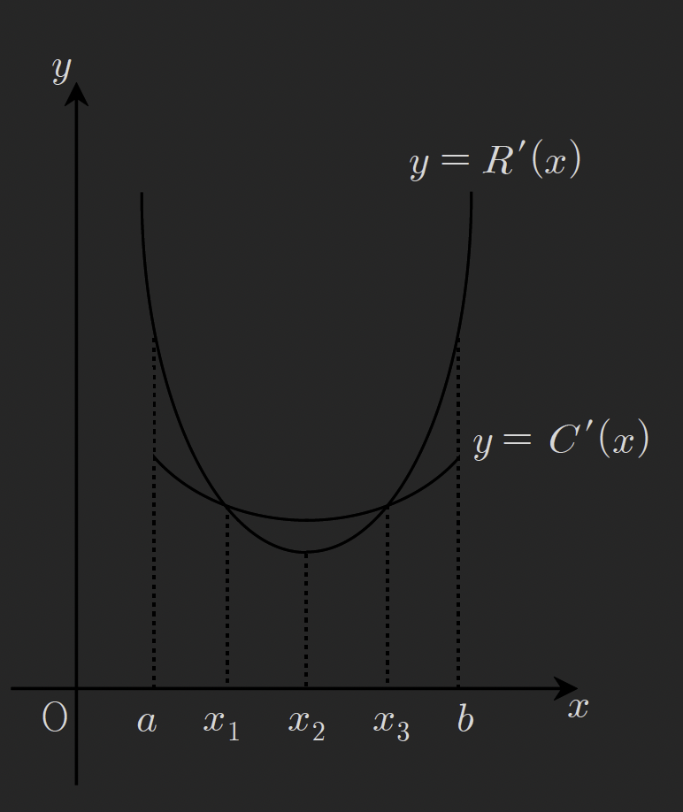
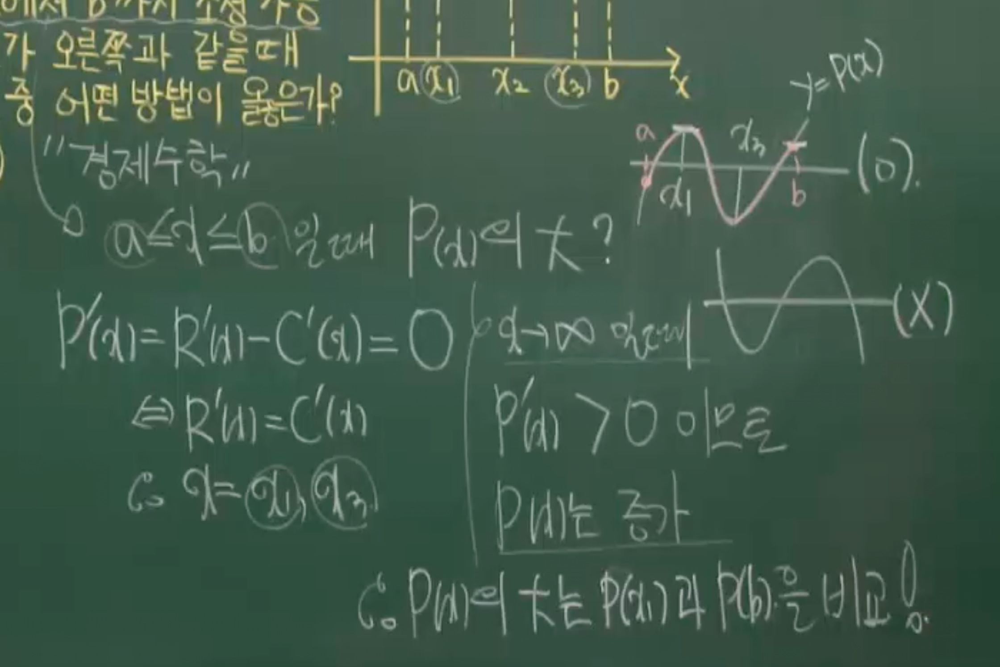
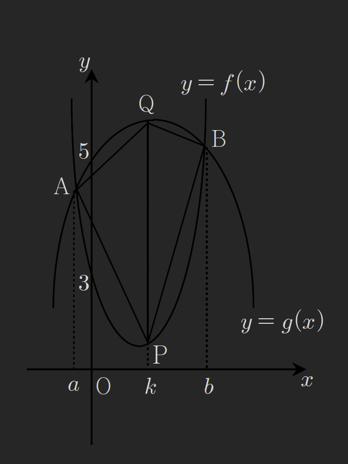

### thm38 미분과 최대 최소

### 예제230

함수 $f(x)=\log_{9}(5-x)+\log_{3}(x+4)$ 의 최댓값을 구하여라

$$
f(x)=\log_{9}(5-x)+\log_{3}(x+4)
$$

$$
f(x)=\log_{9}(5-x)+\log_{3^{2}}(x+4)^{2}
$$

$$
f(x)=\log_{9}((5-x)(x+4)^{2})
$$

진수의 최댓값을 구하면 함수의 최댓값을 알수있다.

정의역 범위구하기
진수 부분은 함수 g(x)로 놓고보면

$$
g(x)=(5-x)(x+4)^{2}
$$

정의역 범위는 진수는 0보다 커야함으로

$$
-4<x<5
$$

---

극점구하기

$$
g'(x)=(-1)(x+4)^{2}+(5-x)\cdot 2(x+4)
$$

$$
=-x^{2}-8x-16+10x+40-2x^{2}-8x
$$

$$
=-3x^{2}-6x+24
$$

$$
=(x+4)(-3x+6)=0
$$

$$
x=-4,\ 2 \ \because -4<x<5,\ x=2
$$

$$
g''(x)=-2(x+4)+(-1)\cdot 2(x+4)+(5-x)\cdot 2
$$

$$
=-2x-8-2x-8+10-2x
=-6x-6
$$

$$
g''(2)=-18<0
$$

극댓값은 (2,g(2)=108), 경계값 g(-4)=0, g(5)=0 이므로 g(x)의 최댓값은 108 이다

$$
\therefore f(x)_{max}=\log_{9}108
=\log_{3^{2}}(3^{3}\times 2^{2})
$$

$$
=\log_{3^{2}}3^{3}+\log_{3^{2}}2^{2}
=\frac{3}{2}+\log_{3}2
$$

### 예제231

함수 $f(x)=-x^{3}+3x+1,\ (-1\leq x\leq 1$ 에 대하여
함수 $y=(f\circ f)(x)$ 의 최댓값과 최솟값을 구하여라

f(x)의 최대최소 구하기(y의 정의역)

$$
f'(x)=-3x^{2}+3=0
$$

$$
x=\pm 1
$$

$$
f(-1)=1-3+1=-1
$$

$$
f(1)=-1+3+1=3
$$

f(x)의 정의역범위가 -1,1이고 삼차함수 개형에 따라 -1이 극솟값이자 최솟값이 되고
3이 최댓값이 된다.

y의 최대최소구하기

$$
\text{put}\ f(x)=t,\ y=f(f(x))=f(t)
$$

$$
-1\leq t \leq 3
$$

$$
f(t)=-t^{3}+3t+1
$$

$$
f(3)=-27+9+1=-17
$$

$$
f(-1)=1-3+1=-1
$$

$$
f(1)=-1+3+1=3
$$

y의 최댓값은 3, 최솟값은 -17 이다

### 예제232

$x\geq 0$ 인 모든 실수 x에 대하여 부등식 $2x^{3}-6x^{2}+a \geq 0$이
성립하도록 실수 a 의 값의 범위를 구하여라

$$
\text{put}\ f(x)=2x^{3}-6x^{2}+a\geq 0
$$

$$
f'(x)=6x^{2}-12x
=6x(x-2)=0
$$

$$
x_{extrema}=0,\ 2
$$

$$
f(x)_{min}=f(2)=2\cdot 2^{3}-6\cdot2^{2}+a \geq 0
$$

$$
16-24+a\geq 0
$$

$$
a\geq 8
$$

### 예제 233

기업은 생산량을 적당히 조절하여 이윤이 최대가 되도록 노력한다.
경제학자들의 이론에 의하면 생산량 x에 대하여 총수입 함수를 R(x), 총비용 함수를 C(x)라 하고,
이 함수들로부터 이윤함수 P(x)를 P(x) = R(x) - C(x)로 나타낸다고 한다.
어떤 회사의 생산량은 a에서 b까지 조정 가능하고 y = R'(x)와 y = C'(x)의 그래프가
아래와 같을 때 이 회사의 최대이윤을 구하려면 다음 중 어떤 방법이 옳은가?
(단, P(x), R(x), C(x)는 다항함수)

(1) P(a)와 P(b)를 비교한다.
(2) P($x_{1}$)과 P(b)를 비교한다.
(3) P(a)와 P($x_{3}$)를 비교한다.
(4) P($x_{1}$)과 P($x_{3}$)를 비교한다.
(5) P(a)와 P($x_{2}$)를 비교한다.

---

강의 풀이

생산량 x에 대하여 a~b까지 조정가능하므로
$a\leq x \leq b$ 범위 내에서 $P(x)_{max}$ 를 구하는 방법을 찾으라는 문제다
그래프를 보면 R'(x)와 C'(x)가 이차함수의 개형이므로
P(x)의 극값과 경계값(a,b)을 구해 최대값을 찾아보면 된다
R'(x)와 C'(x) 모두 $x \to \infty$ 일떄 0보다 크므로
P(x)는 최대차수의 계수가 양인 3차함수의 개형을 가지는 것을 알수있다.
그러므로 극댓값$P(x_{1})$과 경계값$P(b)$의 값을 비교하여
해당범위(a,b)내에서의 P(x)의 최댓값을 구할수있다

---

예제233의 강의풀이는
P(x)가 3차함수이고 3차함수의 성질을 이용해서 푸는 방식같다
R(x)와 C(x)가 3차함수이고 두 함수의 최대차항의 계수가
다른것을 가정하여 P(x)가 최대차항의 계수가 양인 3차함수임을 추론하고
문제풀이를 진행하는데

문제의 그래프를 보고 R(x), C(x)가 3차함수 이면서
두 함수의 최대차항이 다를거라는 것이라는 사실을
해당 그래프의 범위만을 보고서 판단할수없는것같다 (그냥 내가 못보는걸수도)
함수 R(x), C(x)는 최대차수가 최소3차식 이라는 사실밖에 모르겠다.
해당구간만 보고 어떻게 R'(x)와 C'(x)가 2차함수라고 알수있는걸까?

만약 R(x), C(x)가 삼차함수라는 문제조건을 추가한다면
해당 그래프상의 범위만으로 두 함수의 최대차항의 계수가 다름을 알수있을까?

### 예제234

두 함수 $f(x)=x^{4}+x^{2}-6x$ , $g(x)=-2^{2}-16x+a$에 대하여
모든 실수 $x_{1},\ x_{2}$ 에 대하여 $f(x_{1})\geq g(x_{2})$ 를 성립시키는
a의 최댓값을 구하여라

---

$$
f(x)_{min}\geq g(x)_{max}
$$

를 성립시키는 a의 최댓값을 구해보자

$$
f'(x)=4x^{3}+2x-6
=2x^{3}+x-3
$$

$$
=(x-1)(2x^{2}+2x+3)=0
$$

$2x^{2}+2x+3$의 판별식은

$$
\frac{D}{4}=1^{2}-6 <0
$$

이므로 함수 f(x)는 U모양의 개형을 가지며
$f(1)$에서 유일한 극솟값을 가진다.

$$
\therefore f(x)_{min}=f(1)=-4
$$

$$
g'(x)=-4x-16=0,\ x=-4
$$

$$
g(-4)=-32+64+a
=a+32
$$

$$

f(-1)=-4\geq g(-4)=a+32
$$

$$
-4 \geq a+32
$$

$$
-36 \geq a
$$

### 예제235

두 함수 $f(x)=2x^{2}-4x+3,\ g(x)=-x^{2}+4x+5$ 에 대하여
$y=f(x)$와 $y=g(x)$의 그래프가 아래 그림과 같고 교점의 x좌표는
각각 a,b이다.
직선 $x=k\ (a<k<b)$ 와 두 곡선 $y=f(x), y=g(x)$의 교점을
각각 P,Q라 할 떄 사각형 APBQ의 넓이가 최대가 되도록 하는
상수 k의 값을 구하여라

---

$$
S_{\square APBQ }=S_{\triangle APQ}+S_{\triangle BPQ}
$$

$$
=\frac{1}{2}\cdot \overline{PQ}\cdot h_{1}+ \frac{1}{2}\cdot \overline{PQ}\cdot h_{2}
$$

$$
=\frac{1}{2}(h_{1}+h_{2})\overline{PQ}
$$

$$
=\frac{1}{2}(b-a)(g(k)-f(k))
$$

$$
=\frac{1}{2}(b-a)(-k^{2}+4k+5)-(2k^{2}-4k+3)
$$

$$
=\frac{1}{2}(b-a)(-3k^{2}+8k+2)
$$

여기서 $-3^{2}+8k+2$는 위로볼록한 이차방정식이므로 미분하여 극댓값을 구하면

$$
S'=\frac{1}{2}(b-a)(-6k+8)=0
$$

$k=\frac{4}{3}$ 일떄 사각형의 넓이가 최대가 된다

### 예제236

함수 $y=\frac{\ln x}{x}$의 최댓값을 구하여라

---

$$
y_{extrema}\implies y'=\frac{\frac{1}{x}\cdot x-\ln x\cdot 1}{x^{2}}=0
$$

$$
=\frac{1-\ln x}{x^{2}}=0
$$

$x=e$ 일떄 y는 극값을 가진다
극값은 $\frac{1}{e}$

위 극값이 최댓값인지 확인

경계값확인
x는 진수임으로 $(0<x< \infty)$

$$
\lim_{ x \to 0^{+} } \frac{\ln x}{x}
=\frac{-\infty}{0}= -\infty
$$

$$
\lim_{ x \to \infty } \frac{\ln x}{x}
=\lim_{ x \to \infty } \frac{\frac{1}{x}}{1}=0
$$

이므로 함수 y는 아래와같은 개형을 가지게 되므로

최댓값은 $\frac{1}{e}$이다

### 예제237

차량들이 고속도로를 차선의 변경없이 모두 같은 속력 v(m/sec)를 유지하면서
달리고 있다고 하자. 제동거리를 고려한 최소 차간 거리는
$f(v)=\frac{1}{20}v^{2}+\frac{1}{2}v+5$ (m) 로 나타낼수있다
60초 동안 한 차선의 일정 지점을 통과할 수 있는
최대차량의 수를 구하여라 (단, 차량의 길이는 무시한다)

---

통과한 차랑의 수는 아래와 같다

$$
\frac{60v}{f(v)}
$$

$$
\text{put}\ g(v)=\frac{60v}{f(v)}
$$

에서 $g(v)_{max}$ 를 구하기

$$
g(v)= \frac{60v}{\frac{1}{20}v^{2}+\frac{1}{2}v+5}
=\frac{1200v}{v^{2}+10+100}
$$

정의역 범위는 $0\leq v < \infty$ (속도니까)
경계값은

$$
\lim_{ v \to 0_{+} } \frac{1200v}{v^{2}+10v+100}=0
$$

$$
\lim_{ v \to \infty } \frac{1200v}{v^{2}+10v+100}
=\lim_{ v \to \infty } \frac{1200}{v+10}
=0
$$

이므로 g(v)의 극값이 0보다 크면 최대값, 0보다 작으면 최소값이 되는 개형임을 알수있다.

$$
g(v)_{extrema} \implies g'(v)=\frac{60f(v)-60v\cdot f'(v)}{f(v)^{2}}=0
$$

f(v)^2를 약분하면

$$
60f(v)-60v \cdot f'(v)=0
$$

$$
=60\cdot\left( \frac{1}{20}v^{2}+\frac{1}{2}v+5 \right)-60v \cdot \left( \frac{1}{10}v+\frac{1}{2} \right)
$$

$$
=3v^{2}+30v+300-6v^{2}-30v
$$

$$
=-3v^{2}+300=0
$$

$$
3v^{2}=300,\ \because v\geq 0 ,\ v=10
$$

$$
g(10)=\frac{600}{f(10)}=\frac{600}{15}=40
$$

$$
\because g(v)_{extrema}=g(10)>0
$$

$$
\therefore g(v)_{max}= g(10)=40
$$

예제238
양수 $\alpha$에 대하여 폐구간 $[-\alpha,\alpha]$에서 함수 $f(x)=\frac{x-5}{(x-5)^{2}+36}$의
최댓값을 M, 최솟값을 m이라 할떄, M+m=0 이 되도록하는
최솟값 $\alpha$ 의 최솟값을 구하여라

---

함수f(x)의 경계값 구간은 $x \in (-\infty,\infty)$ 이고
두 경계값 모두 0에 수렴하는 것을 함수식을 보면 알 수 있다.
0이 아닌 극값이 있다면 그 값들중에 함수의 최대 최소 값이 있을것이다.

$$
f(x)_{extrema} \implies
f'(x)=\frac{1\cdot ((x-5)^{2}+36)-(x-5)\cdot 2(x-5)}{((x-5)^{2}+36)^{2}}
=0
$$

$$
=(x-5)^{2}+36-2(x-5)^{2}=0
$$

$$
-(x-5)^{2}+36=0
$$

$$
(x-5)^{2}=36
$$

$$
x-5=\pm 6
$$

$$
x=11,\ -1
$$

$$
f(11)=\frac{11-5}{6^{2}+36}=\frac{6}{72}=\frac{1}{12}
$$

$$
f(-1)=\frac{-6}{72}=-\frac{1}{12}
$$

구간 $[-1,11]$ 에서 최대최소값을 모두 포함하므로
최대최소값을 모두 포함하는 $\alpha$ 범위는 $\alpha\geq 11$
