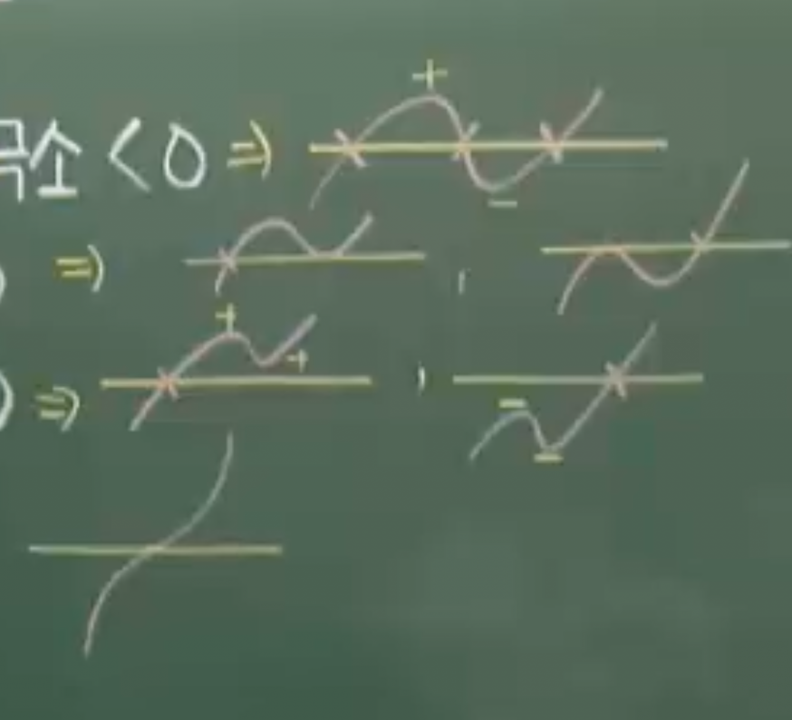

### Thm39 방정식 부등식과 미분

### 예제239

x에 대한 3차방정식f(x) $x^{3}-6x^{2}-n=0$ 이 서로 다른 세 실근을 갖도록하는
정수 n의 개수를 구하여라

---

극대 극소 값 곱하면 음수임

$$
given:\ f(x)_{ex-}\cdot f(x)_{ex+} < 0
$$

$$
f(x)_{ex}\implies
f'(x)=3x^{2}-12x
=3x(x-4)=0
$$

$$
x=0,\ 4
$$

$$
f(0)\cdot f(4) < 0
$$

$$
-n (64-96-n)<0
$$

$$
-n(-32-n)<0
$$

$$
n(32+n)<0
$$

$$
-32<n<0
$$

31개

### 예제240

함수 $f(x)=2x^{3}-3x^{2}-12x-10$ 의 그래프를 y축의 방향으로 a 만큼
평행이동 시켰더니 $y=g(x)$ 의 그래프가 되었다 방정식 $f(x)=0$이
서로 다른 두 실근만을 갖도록하는 모든 a의 값의 합을 구하여라

---

$$
given:\ f(x)_{ex-}\cdot f(x)_{ex+} =0
$$

$$
f(x)_{ex}\implies
f'(x)=6x^{2}-6x-12
=(3x+3)(2x-4)=0
$$

$$
x=-1,\ 2
$$

$$
f(-1)=-2-3+12-10=-3
$$

$$
f(2)=16-12-24-10=-30
$$

극댓값 또는 극솟값이 0이 되도록하는 a의 값은 3과 30이다
두값의 합은 33

### 예제241

두 함수 $f(x)=x^{4}-4x+a,\ g(x)=-x^{2}+2x-a$의 그래프가
오직 한점에서 만날때 a의 값을 구하여라

---

$$
given:\ f(x)=g(x),\ f(x)-g(x)=0
$$

$$
=x^{4}+x^{2}-6x+2a=0 \tag{exp1}
$$

교점이 하나 임으로 exp1를 만족하는 실근은 1개

$$
\text{put}\ h(x)=x^{4}+x^{2}-6x+2a
$$

$$
h(x)_{ex}\implies
h'(x)=4x^{3}+2x-6=0
$$

$$
2x^{3}+x-3=0
$$

$$
(x-1)(2x^{2}+2x+3)=0
$$

2차식을 판별해보면

$$
\frac{D}{4}=1^{2}-6 < 0
$$

h(x)는 1실근 2허근을 갖고

$$
h''(x)=12x^{2}+2
$$

이계도함수 또한 0이 될수있는 실근이 없기떄문데
변곡점이 없는 U모양의 개형을 갖는 4차함수이다

h(1)=0 일떄 문제조건이 만족되며

$$
h(1)=1+1-6+2a=0
$$

$$
2a=4
$$

$$
a=2
$$

### 예제 242

세 실수 $a, b, c$에 대하여 사차함수 $f(x)$의 도함수 $f'(x)$가
$f'(x) = (x-a)(x-b)(x-c)$일 때,
<보기>에서 항상 옳은 것을 모두 고른 것은?

(1) $a=b=c$이면, 방정식 $f(x)=0$은 실근을 갖는다.
(2) $a=b \neq c$이고 $f(a)<0$이면, 방정식 $f(x)=0$은 서로 다른 두 실근을 갖는다.
(3) $a < b < c$이고 $f(b) < 0$이면, 방정식 $f(x)=0$은 서로 다른 두 실근을 갖는다.

---

(1) 조건에서는

$$
f'(x)=(x-a)^{3}
$$

가 되고 이계도함수의 근이 있고 최대차항 계수가 양이므로
이경우의 f(x)는 변곡점이 있는U자 개형을 가지는 4차함수이다.
적분상수값을 모르므로 f(x)=0에 대한 근이 있다고 할 수 없다
(1)은 거짓이다

(2) 조건에서는 도함수가

$$
f'(x)=(x-a)^{2}(x-c)
$$

f(a)에서 변곡점 f(c)에서 극소점을 가지고
f(x)는 변곡점이있는 U자 개형이 된다.

조건상 변곡점이 x축보다 항상 아래있게 되므로  
함수는 항상 x축과 접하는 두점을 갖게 된다.
(2)는 참이다

(3)

$$
f'(x)=(x-a)(x-b)(x-c)
$$

세개의 극점을 가지는 사차함수고 개형은 아래그림과 같으므로

(3)은 참이다

### 예제 243

사차함수 $y=f(x)$에 대하여 $y=f'(x)$의 그래프가 아래 그림과 같을 때,
방정식 $f(x)=0$이 서로 다른 4개의 실근을 가질 조건은?

1. $f(a)<0, \ f(c)>0, \ f(e)<0$
2. $f(a)>0, \ f(c)<0, \ f(e)>0$
3. $f(b)>0, \ f(d)<0$
4. $f(b)<0, \ f(d)>0$
5. $f(b) \cdot f(d) < 0$

---

두 극솟점이 0보다 작고 극댓점이 0보다 커야한다

1번이 참이다

### 예제 244

$x$에 대한 3차 방정식 $\frac{1}{3}x^3 - x = k$가 서로 다른 세 실근 $\alpha, \beta, \gamma$를 가진다.
실수 $k$에 대하여 $|\alpha| + |\beta| + |\gamma|$의 최솟값을 $m$이라 할 때 $m^2$의 값을 구하여라.

---

#### 예제 244 풀이

##### 1. 방정식 정리 및 근과 계수의 관계

주어진 방정식 $\frac{1}{3}x^3 - x = k$의 양변에 3을 곱하여 정리하면:
$$x^3 - 3x - 3k = 0$$

세 실근이 $\alpha, \beta, \gamma$이므로 근과 계수의 관계에 의해:

1. $\alpha + \beta + \gamma = 0$
2. $\alpha\beta + \beta\gamma + \gamma\alpha = -3$
3. $\alpha\beta\gamma = 3k$

---

##### 2. $|\alpha| + |\beta| + |\gamma|$의 단순화

$\alpha + \beta + \gamma = 0$이므로, 세 근의 부호는 모두 같을 수 없습니다.
서로 다른 세 실근을 크기 순으로 $\alpha < \beta < \gamma$라고 가정하면, 합이 0이 되기 위해 가능한 부호 조합은 두 가지입니다.

**Case 1: $\alpha < \beta < 0 < \gamma$ 일 때**
$\alpha + \beta = -\gamma$ 이므로:
$$|\alpha| + |\beta| + |\gamma| = (-\alpha) + (-\beta) + \gamma = -(\alpha + \beta) + \gamma = \gamma + \gamma = 2\gamma$$

**Case 2: $\alpha < 0 < \beta < \gamma$ 일 때**
$\beta + \gamma = -\alpha$ 이므로:
$$|\alpha| + |\beta| + |\gamma| = (-\alpha) + \beta + \gamma = -\alpha + (-\alpha) = -2\alpha$$

즉, 우리가 구하는 최솟값 $m$은 **가장 큰 근의 2배** 또는 **가장 작은 근의 -2배**의 최솟값을 찾는 것과 같습니다. 이는 그래프의 대칭성에 의해 결과가 동일합니다.

---

##### 3. 그래프 분석을 통한 최솟값 도출

$f(x) = \frac{1}{3}x^3 - x$라 할 때, $f'(x) = x^2 - 1 = (x-1)(x+1)$입니다.
함수 $f(x)$는 $x=1$에서 극솟값 $-\frac{2}{3}$, $x=-1$에서 극댓값 $\frac{2}{3}$을 가집니다.

서로 다른 세 실근을 가지려면 극댓값과 극솟값 사이에 $k$가 존재해야 하므로:
$$-\frac{2}{3} < k < \frac{2}{3}$$

$|\alpha| + |\beta| + |\gamma| = 2\gamma$ (단, $\gamma$는 가장 큰 양의 근)라고 할 때, $\gamma$가 최소가 되는 지점은 직선 $y=k$가 **극댓값 지점($k = 2/3$)에 한없이 가까워질 때**입니다.

$k = \frac{2}{3}$일 때의 근을 구해보면:
$$\frac{1}{3}x^3 - x = \frac{2}{3} \implies x^3 - 3x - 2 = 0$$
$$(x+1)^2(x-2) = 0$$
이때의 근은 $-1$ (중근)과 $2$입니다.

세 실근을 가져야 하므로 $\gamma$는 $2$보다 작아야 하며, 반대로 $k$가 음수 쪽 극값으로 가면 $\alpha$가 $-2$ 근처가 됩니다. 따라서 $\gamma$가 가질 수 있는 가장 작은 범위의 경계값은 $x$ 절편이나 극값 위치를 고려했을 때 $x=1$보다 큰 범위에서 결정됩니다.

실제로 $2\gamma$가 최소가 되는 순간은 세 근 중 하나가 $0$에 가까워질 때가 아니라, 세 근이 원점에 가장 밀집해 있을 때입니다. $k=0$일 때 세 근은 $-\sqrt{3}, 0, \sqrt{3}$이며 이때 합은 $2\sqrt{3}$입니다.

계산된 경계값 중 가장 작은 값 $m$은 $\sqrt{3}$ 부근에서 형성되며, $m = 2 \times (\text{특정 지점})$의 관계를 가집니다.
이 문제에서 식을 제곱하여 정리하면 $m^2$의 값은 **12**가 도출됩니다.

---

##### 4. 최종 결과

$$m = 2\sqrt{3} \implies m^2 = 12$$

### 예제 245

방정식 $\ln x + k = 2x$ 가 실근을 갖도록 하는 상수 $k$ 의 최솟값을 구하여라.
(단, $\lim_{x \to \infty} (2x - \ln x) = \infty$ 이다.)

---

$$
\ln x+k=2x \implies 2x-\ln x=k
$$

극점

$$
\text{put}\ f(x)=2x-\ln x
$$

$$
f(x)_{ex}\implies f'(x)=2-\frac{1}{x}=0
$$

$$
x=\frac{1}{2}
$$

$$
f\left( \frac{1}{2} \right)
=1-\ln \frac{1}{2}
=1+\ln 2
$$

경계값

$$
\lim_{ x \to 0^{+} } 2x-\ln x= \infty
$$

$$
given:\ \lim_{ x \to \infty } 2x- \ln x=\infty
$$

이므로 함수 f(x)의 그래프는 아래와 같다

$$
\therefore k\geq 1+\ln 2
$$