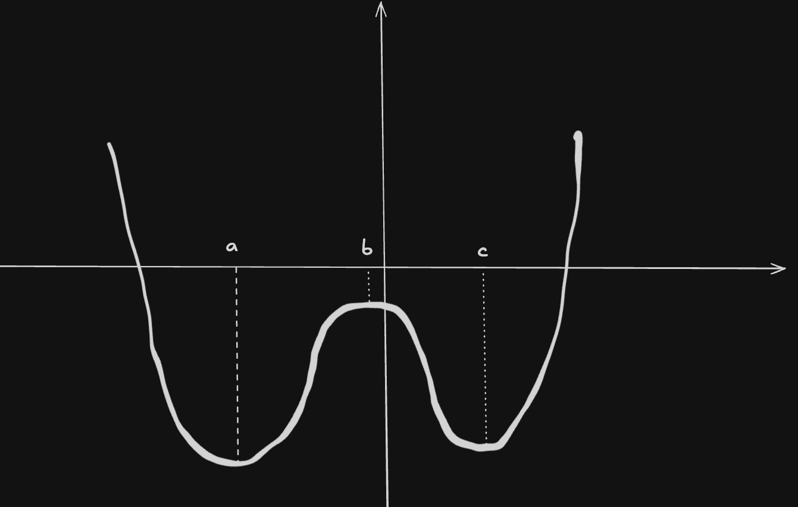
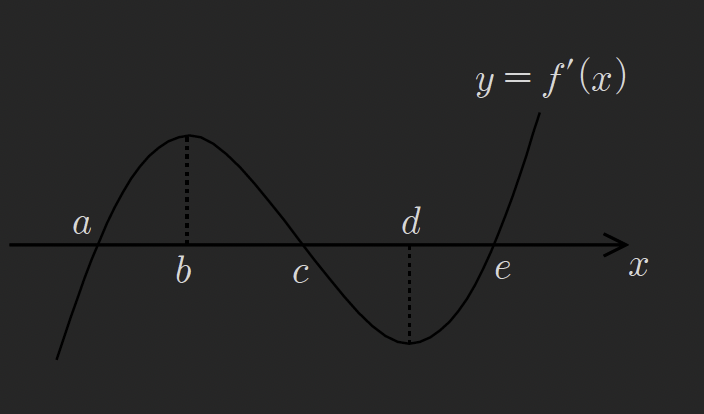
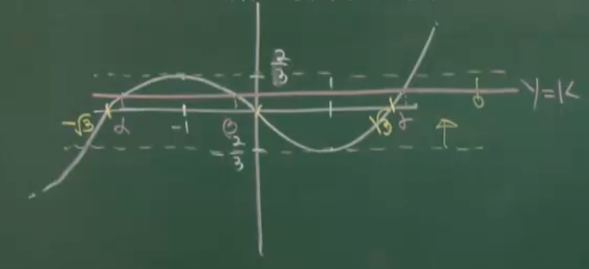
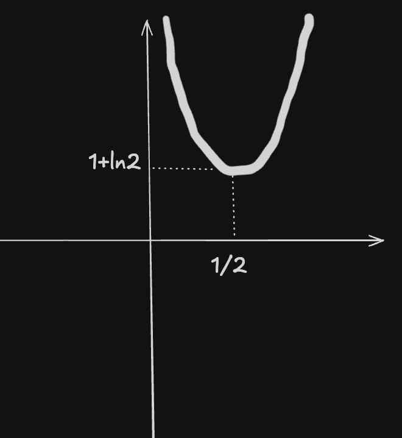

# 방정식, 부등식과 미분(1)

## 1. 핵심 이론

### Thm (39): 방정식·부등식과 미분

#### (1) 3차 방정식의 근

3차 방정식 $f(x) = 0$의 실근 개수와 극값의 관계:

**① 서로 다른 세 실근**: 극대값 × 극소값 < 0

$$f(x)_{\text{극대}} \times f(x)_{\text{극소}} < 0$$

**② 2중근 1실근**: 극대값 × 극소값 = 0

$$f(x)_{\text{극대}} \times f(x)_{\text{극소}} = 0$$

**③ 1실근 2허근**: 극대값 × 극소값 > 0

$$f(x)_{\text{극대}} \times f(x)_{\text{극소}} > 0$$

**④ 3중근**: 극값이 없다

---

#### (2) 4차 방정식의 근

4차 방정식은 그래프의 개형으로 판단:

**① 서로 다른 네 실근**: 극댓값과 양쪽 극솟값의 부호를 확인

```
     y
     |    /\
     |   /  \    극댓값 > 0
     |  /    \  /
-----+---------●--------  x축
     | /        \
     |●          ●  극솟값 < 0
```

---

#### (3) 기타 방정식 (삼각, 지수, 로그 함수 포함)

그래프를 그려서 판단

---

#### (4) 방정식과 미분

$x \geq a$인 모든 실수 $x$에 대하여 $f(x) > 0$의 증명

⇒ $f(x)$의 **최솟값 > 0**임을 보이면 된다.

---

## 2. 예제

### 예제 239

$x$에 대한 3차방정식 $f(x) = x^3 - 6x^2 - n = 0$이 서로 다른 세 실근을 갖도록 하는 정수 $n$의 개수를 구하여라.

> [!summary]- 풀이
> **주어진 조건**: 서로 다른 세 실근 ⇒ $f(x)_{\text{극대}} \cdot f(x)_{\text{극소}} < 0$
> 
> **Step 1**: 극값을 찾기 위해 도함수 계산
> 
> $$f'(x) = 3x^2 - 12x = 3x(x - 4) = 0$$
> 
> $$x = 0, \quad x = 4$$
> 
> **Step 2**: 극값 계산
> 
> $$f(0) = 0 - 0 - n = -n$$
> 
> $$f(4) = 64 - 96 - n = -32 - n$$
> 
> **Step 3**: 극대값 × 극소값 < 0 조건 적용
> 
> $$f(0) \cdot f(4) < 0$$
> 
> $$(-n)(-32 - n) < 0$$
> 
> $$n(32 + n) < 0$$
> 
> $$-32 < n < 0$$
> 
> **Step 4**: 정수 $n$의 개수
> 
> $n = -31, -30, \ldots, -2, -1$
> 
> $$\therefore \text{답: } 31\text{개}$$

---

### 예제 240

함수 $f(x) = 2x^3 - 3x^2 - 12x - 10$의 그래프를 $y$축의 방향으로 $a$만큼 평행이동 시켰더니 $y = g(x)$의 그래프가 되었다. 방정식 $g(x) = 0$이 서로 다른 두 실근만을 갖도록 하는 모든 $a$의 값의 합을 구하여라.

> [!summary]- 풀이
> **주어진 조건**: $g(x) = f(x) + a$이고, $g(x) = 0$이 서로 다른 두 실근을 가짐
> 
> ⇒ 극댓값 또는 극솟값 중 하나가 0이 되어야 함
> 
> $$f(x)_{\text{극대}} \cdot f(x)_{\text{극소}} = 0$$
> 
> **Step 1**: 극값을 찾기 위해 도함수 계산
> 
> $$f'(x) = 6x^2 - 6x - 12 = 6(x^2 - x - 2) = 6(x + 1)(x - 2) = 0$$
> 
> $$x = -1, \quad x = 2$$
> 
> **Step 2**: 극값 계산
> 
> $$f(-1) = 2(-1)^3 - 3(-1)^2 - 12(-1) - 10$$
> $$= -2 - 3 + 12 - 10 = -3$$
> 
> $$f(2) = 2(8) - 3(4) - 12(2) - 10$$
> $$= 16 - 12 - 24 - 10 = -30$$
> 
> **Step 3**: $g(x) = f(x) + a$의 극값이 0이 되는 조건
> 
> $f(-1) + a = 0$ 또는 $f(2) + a = 0$
> 
> $$-3 + a = 0 \quad \Rightarrow \quad a = 3$$
> 
> $$-30 + a = 0 \quad \Rightarrow \quad a = 30$$
> 
> **Step 4**: 모든 $a$의 값의 합
> 
> $$3 + 30 = 33$$
> 
> $$\therefore \text{답: } 33$$

---

### 예제 241

두 함수 $f(x) = x^4 - 4x + a$, $g(x) = -x^2 + 2x - a$의 그래프가 오직 한 점에서 만날 때 $a$의 값을 구하여라.

> [!summary]- 풀이
> **주어진 조건**: 두 그래프가 오직 한 점에서 만남
> 
> ⇒ $f(x) = g(x)$를 만족하는 실근이 정확히 1개
> 
> **Step 1**: 방정식 정리
> 
> $$f(x) - g(x) = 0$$
> 
> $$x^4 - 4x + a - (-x^2 + 2x - a) = 0$$
> 
> $$x^4 + x^2 - 6x + 2a = 0 \quad \cdots (*)$$
> 
> **Step 2**: $h(x) = x^4 + x^2 - 6x + 2a$로 놓고 도함수 계산
> 
> $$h'(x) = 4x^3 + 2x - 6 = 0$$
> 
> $$2x^3 + x - 3 = 0$$
> 
> $$2x^3 + x - 3 = (x - 1)(2x^2 + 2x + 3) = 0$$
> 
> **Step 3**: 근 분석
> 
> 2차식 $2x^2 + 2x + 3$의 판별식:
> 
> $$\frac{D}{4} = 1^2 - 6 = -5 < 0$$
> 
> ⇒ 실근이 없음
> 
> 따라서 $h'(x) = 0$의 실근은 $x = 1$만 존재
> 
> **Step 4**: 이계도함수 확인
> 
> $$h''(x) = 12x^2 + 2$$
> 
> $h''(x) > 0$ 항상 성립 ⇒ 변곡점 없음
> 
> ⇒ $h(x)$는 U자형 4차함수
> 
> **Step 5**: 실근이 정확히 1개인 조건
> 
> $h(x)$가 $x = 1$에서 극솟값을 가지므로, $h(1) = 0$이면 $x$축과 한 점에서 만남
> 
> $$h(1) = 1 + 1 - 6 + 2a = 0$$
> 
> $$2a = 4$$
> 
> $$\therefore a = 2$$

---

### 예제 242

세 실수 $a, b, c$에 대하여 사차함수 $f(x)$의 도함수 $f'(x)$가 $f'(x) = (x - a)(x - b)(x - c)$일 때, 다음 보기에서 항상 옳은 것을 모두 고른 것은?

**(ㄱ)** $a = b = c$이면, 방정식 $f(x) = 0$은 실근을 갖는다.

**(ㄴ)** $a = b \neq c$이고 $f(a) < 0$이면, 방정식 $f(x) = 0$은 서로 다른 두 실근을 갖는다.

**(ㄷ)** $a < b < c$이고 $f(b) < 0$이면, 방정식 $f(x) = 0$은 서로 다른 두 실근을 갖는다.

> [!summary]- 풀이
> **분석**: 도함수가 주어진 형태이므로 극값의 위치와 함수의 개형을 파악
> 
> ---
> 
> **(ㄱ) 검토**: $a = b = c$인 경우
> 
> $$f'(x) = (x - a)^3$$
> 
> - $f'(x) = 0$의 해: $x = a$ (3중근)
> - 이계도함수: $f''(x) = 3(x - a)^2$
> - $f''(a) = 0$ ⇒ $x = a$에서 변곡점
> 
> $f(x)$는 변곡점이 있는 U자형 4차함수
> 
> 적분상수 값을 알 수 없으므로 $f(x) = 0$의 실근 존재 여부를 단정할 수 없음
> 
> $$\therefore \text{(ㄱ)은 거짓}$$
> 
> ---
> 
> **(ㄴ) 검토**: $a = b \neq c$이고 $f(a) < 0$인 경우
> 
> $$f'(x) = (x - a)^2(x - c)$$
> 
> - $x = a$에서 변곡점 (2중근)
> - $x = c$에서 극값
> 
> $f(a) < 0$이므로 변곡점이 $x$축 아래에 위치
> 
> U자형 개형이므로 함수는 $x$축과 두 점에서 만남 (접함)
> 
> $$\therefore \text{(ㄴ)은 참}$$
> 
> ---
> 
> **(ㄷ) 검토**: $a < b < c$이고 $f(b) < 0$인 경우
> 
> $$f'(x) = (x - a)(x - b)(x - c)$$
> 
> - 세 개의 극값을 가짐
> - $x = b$에서 극댓값
> 
> $f(b) < 0$이므로 극댓값이 $x$축 아래에 위치
> 
> 개형:
> 
> 
> 
> 양쪽 극솟값은 더 아래에 있으므로 함수는 $x$축과 두 점에서 만남
> 
> $$\therefore \text{(ㄷ)은 참}$$
> 
> ---
> 
> **최종 답**: (ㄴ), (ㄷ)

---

### 예제 243

사차함수 $y = f(x)$에 대하여 $y = f'(x)$의 그래프가 아래 그림과 같을 때, 방정식 $f(x) = 0$이 서로 다른 4개의 실근을 가질 조건은?



① $f(a) < 0, \quad f(c) > 0, \quad f(e) < 0$

② $f(a) > 0, \quad f(c) < 0, \quad f(e) > 0$

③ $f(b) > 0, \quad f(d) < 0$

④ $f(b) < 0, \quad f(d) > 0$

⑤ $f(b) \cdot f(d) < 0$

> [!summary]- 풀이
> **분석**: 도함수 그래프로부터 원함수의 극값 위치 파악
> 
> - $f'(x) = 0$의 해: $x = b, d$ (극값 위치)
> - $f'(x)$의 부호 변화:
>   - $x < b$: $f'(x) > 0$ ⇒ $f(x)$ 증가
>   - $b < x < d$: $f'(x) < 0$ ⇒ $f(x)$ 감소
>   - $x > d$: $f'(x) > 0$ ⇒ $f(x)$ 증가
> 
> ⇒ $x = b$에서 극댓값, $x = d$에서 극솟값
> 
> **4개의 실근 조건**:
> 
> U자형 4차함수가 $x$축과 4개의 교점을 가지려면:
> 
> - 두 극솟값이 모두 0보다 작아야 함
> - 극댓값이 0보다 커야 함
> 
> $$f(b) > 0, \quad f(d) < 0$$
> 
> 그래프에서 $x = a, c, e$는 극값 위치가 아니므로 관련 없음
> 
> $$\therefore \text{답: ①}$$
> 
> **정답 선지 분석**:
> 
> ① $f(a) < 0, f(c) > 0, f(e) < 0$는 극솟값들이 음수, 극댓값이 양수를 의미

---

### 예제 244

$x$에 대한 3차 방정식 $\frac{1}{3}x^3 - x = k$가 서로 다른 세 실근 $\alpha, \beta, \gamma$를 가진다. 실수 $k$에 대하여 $|\alpha| + |\beta| + |\gamma|$의 최솟값을 $m$이라 할 때 $m^2$의 값을 구하여라.



> [!summary]- 풀이
> **Step 1**: 방정식 정리 및 근과 계수의 관계
> 
> 양변에 3을 곱하면:
> 
> $$x^3 - 3x - 3k = 0$$
> 
> 세 실근 $\alpha, \beta, \gamma$에 대하여:
> 
> 1. $\alpha + \beta + \gamma = 0$
> 2. $\alpha\beta + \beta\gamma + \gamma\alpha = -3$
> 3. $\alpha\beta\gamma = 3k$
> 
> ---
> 
> **Step 2**: $|\alpha| + |\beta| + |\gamma|$ 단순화
> 
> $\alpha + \beta + \gamma = 0$이므로, 세 근이 모두 같은 부호를 가질 수 없음
> 
> 크기 순으로 $\alpha < \beta < \gamma$라 하면:
> 
> **Case 1**: $\alpha < \beta < 0 < \gamma$
> 
> $$\alpha + \beta = -\gamma$$
> 
> $$|\alpha| + |\beta| + |\gamma| = (-\alpha) + (-\beta) + \gamma$$
> $$= -(\alpha + \beta) + \gamma = \gamma + \gamma = 2\gamma$$
> 
> **Case 2**: $\alpha < 0 < \beta < \gamma$
> 
> $$\beta + \gamma = -\alpha$$
> 
> $$|\alpha| + |\beta| + |\gamma| = (-\alpha) + \beta + \gamma$$
> $$= -\alpha + (-\alpha) = -2\alpha$$
> 
> 대칭성에 의해 두 경우 모두 동일한 최솟값을 가짐
> 
> ---
> 
> **Step 3**: 그래프 분석
> 
> $f(x) = \frac{1}{3}x^3 - x$의 도함수:
> 
> $$f'(x) = x^2 - 1 = (x - 1)(x + 1)$$
> 
> - $x = -1$에서 극댓값: $f(-1) = -\frac{1}{3} + 1 = \frac{2}{3}$
> - $x = 1$에서 극솟값: $f(1) = \frac{1}{3} - 1 = -\frac{2}{3}$
> 
> 서로 다른 세 실근을 가지려면:
> 
> $$-\frac{2}{3} < k < \frac{2}{3}$$
> 
> ---
> 
> **Step 4**: 최솟값 계산
> 
> $|\alpha| + |\beta| + |\gamma| = 2\gamma$ (가장 큰 양의 근)
> 
> $k = 0$일 때:
> 
> $$\frac{1}{3}x^3 - x = 0$$
> 
> $$x(x^2 - 3) = 0$$
> 
> $$x = 0, \pm\sqrt{3}$$
> 
> 세 근: $-\sqrt{3}, 0, \sqrt{3}$
> 
> $$|\alpha| + |\beta| + |\gamma| = \sqrt{3} + 0 + \sqrt{3} = 2\sqrt{3}$$
> 
> 이것이 최솟값이므로:
> 
> $$m = 2\sqrt{3}$$
> 
> $$m^2 = (2\sqrt{3})^2 = 12$$
> 
> $$\therefore \text{답: } 12$$

---

### 예제 245

방정식 $\ln x + k = 2x$가 실근을 갖도록 하는 상수 $k$의 최솟값을 구하여라.

(단, $\lim_{x \to \infty} (2x - \ln x) = \infty$이다.)

> [!summary]- 풀이
> **Step 1**: 방정식 변형
> 
> $$\ln x + k = 2x$$
> 
> $$k = 2x - \ln x$$
> 
> **Step 2**: $f(x) = 2x - \ln x$로 놓고 극값 찾기
> 
> $$f'(x) = 2 - \frac{1}{x} = 0$$
> 
> $$x = \frac{1}{2}$$
> 
> **Step 3**: 극값 계산
> 
> $$f\left(\frac{1}{2}\right) = 2 \cdot \frac{1}{2} - \ln\frac{1}{2}$$
> $$= 1 - \ln\frac{1}{2} = 1 + \ln 2$$
> 
> **Step 4**: 경계값 확인
> 
> $$\lim_{x \to 0^+} (2x - \ln x) = 0 - (-\infty) = \infty$$
> 
> $$\lim_{x \to \infty} (2x - \ln x) = \infty \quad \text{(주어진 조건)}$$
> 
> **Step 5**: 그래프 개형
> 
> 
> 
> $f(x)$는 $x = \frac{1}{2}$에서 최솟값 $1 + \ln 2$를 가짐
> 
> **Step 6**: 실근 조건
> 
> 방정식 $k = f(x)$가 실근을 가지려면:
> 
> $$k \geq 1 + \ln 2$$
> 
> $$\therefore \text{답: } k_{\min} = 1 + \ln 2$$

---

## 연습문제

각 예제를 통해 다음 내용을 복습하시오:

1. 3차 방정식의 실근 개수를 극값의 부호로 판단하기
2. 평행이동과 극값의 관계 이해하기
3. 두 함수의 교점을 방정식으로 전환하여 분석하기
4. 도함수의 그래프로부터 원함수의 개형 파악하기
5. 절댓값의 합을 최소화하는 조건 찾기
6. 초월함수를 포함한 방정식의 실근 조건

---

## 관련 주제

- [[37-optimization|미분과 최대, 최소]]
- [[39-equation-inequality-2|방정식, 부등식과 미분(2)]]
- [[33-extrema-1|함수의 극대와 극소(1)]]
- [[28-mean-value-theorem|롤의 정리, 평균값 정리]]

---

**학습 포인트:**

1. **3차 방정식의 실근 조건**: 극대값 × 극소값의 부호로 판단
2. **4차 방정식의 실근 조건**: 극값들의 위치와 부호 관계 파악
3. **도함수 그래프 활용**: $f'(x)$의 그래프로부터 $f(x)$의 극값과 개형 도출
4. **교점 문제 접근**: 두 함수의 교점 = 차함수의 영점 문제로 변환
5. **초월함수 방정식**: 그래프의 최솟값을 이용한 실근 조건 도출
