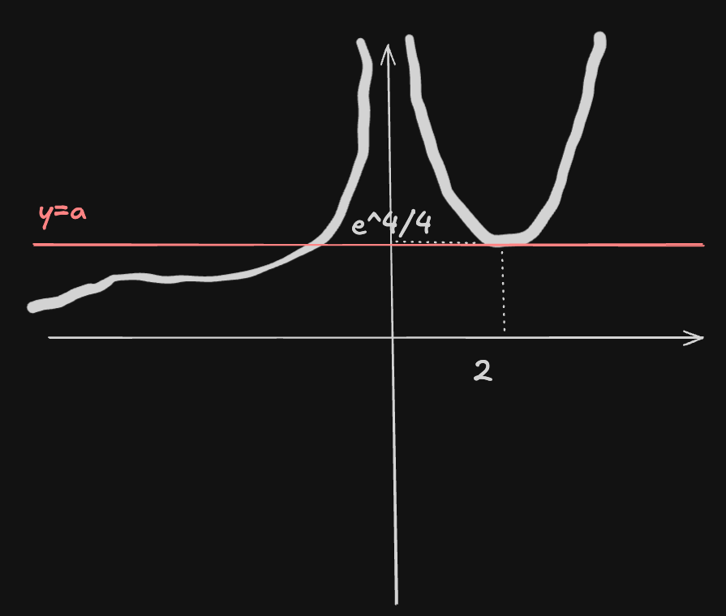
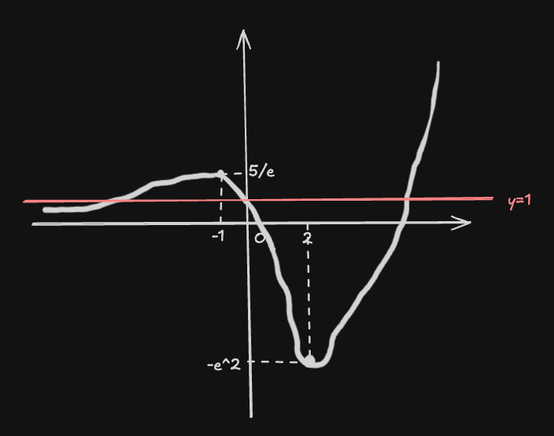
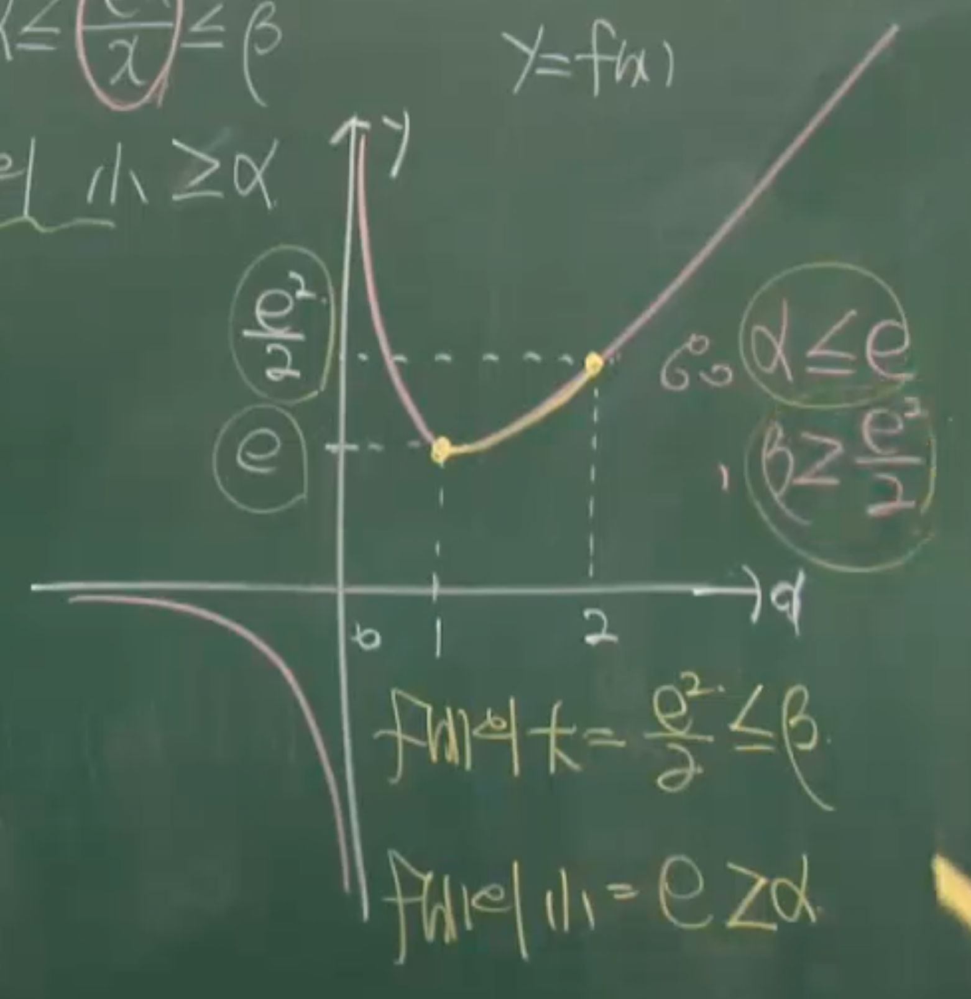
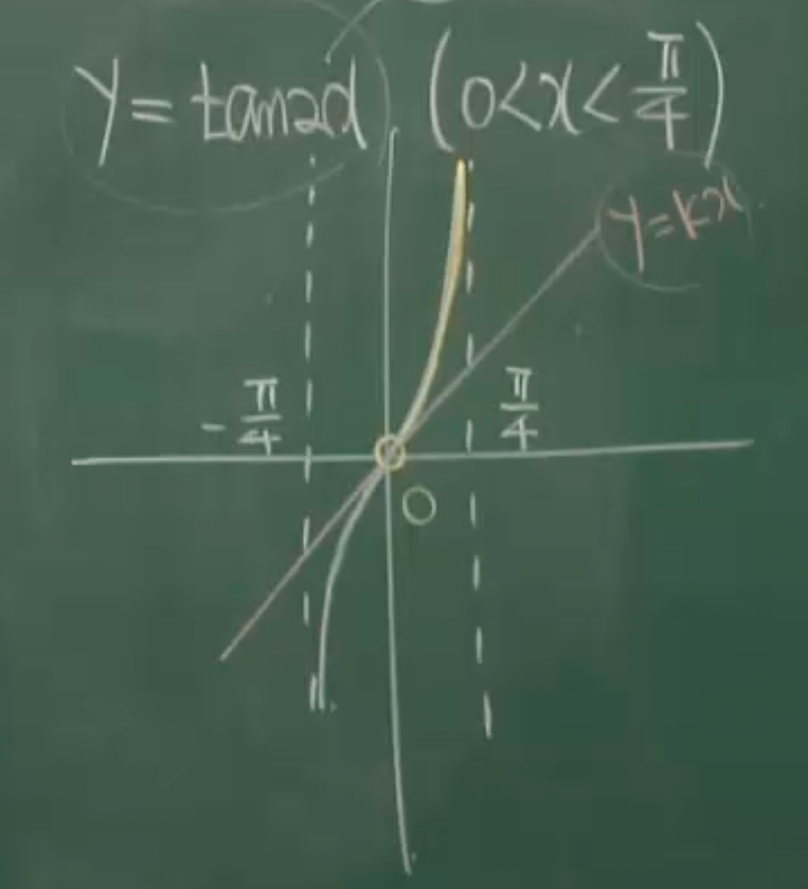

### 예제246

방정식 $ax^{2}=e^{x}$가 서로 다른 두 실근을 갖도록 하는 상수 a의 값을 구하여라

---

$$
a=\frac{e^{x}}{x^{2}}
$$

$f(x)=\frac{e^{x}}{x^{2}}$ 의 그래프그리기

$$
\text{put}\ f(x)=\frac{e^{x}}{x^{2}}\ (-\infty<x<0,0<x<\infty)
$$

$$
f(x)_{ex}\implies
f'(x)=\frac{e^{x}x^{2}-e^{x}2x}{x^{4}}=0
$$

$$
=x^{2}-2x=0
$$

$$
x=0,\ 2
$$

$$
\because x\neq 0,\ x=2
$$

$$
f(2)=\frac{e^{2}}{2^{2}}=\frac{e^{4}}{4}
$$

$$
\lim_{ x \to -\infty } \frac{e^{x}}{x^{2}}=0
$$

$$
\lim_{ x \to 0^{-} } \frac{e^{x}}{x^{2}}=\infty
$$

$$
\lim_{ x \to 0^{+} } \frac{e^{x}}{x^{2}}=\infty
$$

$$
\lim_{ x \to \infty } \frac{e^{x}}{x^{2}}
=\lim_{ x \to \infty } \frac{e^{x}}{2x}
=\lim_{ x \to \infty } \frac{e^{x}}{2}
=\infty
$$

f(x)의 극값과 경계값으로 그래프를 그리면

a가 $\frac{e^{4}}{4}$ 일떄 두 교점이 생기므로

$$
a=\frac{e^{4}}{4}
$$

### 예제247

방정식 $x^{2}-3x+1=\frac{1}{e^{x}}$ 의 실근의 개수를 구하여라

---

준식의 우변을 상수항으로 두고 실근을 구할수있다.

$$
(x^{2}-3x+1)e^{x}=1
$$

$$
\text{put}\ f(x)=(x^{2}-3x+1)e^{x}
$$

$$
x\in R
$$

$$
f(x)_{ex}\implies
f'(x)=(2x-3)e^{x}+(x^{2}-3x+1)e^{x}=0
$$

$$
x^{2}-x-2=0
$$

$$
x=2,\ -1
$$

극값 경계값

$$
f(2)=(4-6+1)e^{2}=-e^{2}
$$

$$
f(-1)=(1+3+1)e^{-1}=\frac{5}{e}
$$

$$
\lim_{ x \to \infty } (x^{2}-3x+1)e^{x}
=\infty
$$

$$
\lim_{ x \to -\infty } (x^{2}-3x+1)e^{x}=
\lim_{ x \to \infty } \frac{x^{2}+3x+1}{e^{x}}
$$

$$
=\lim_{ x \to \infty } \frac{2x+3}{e^{x}}
=\lim_{ x \to \infty } \frac{2}{e^{x}}
=0
$$

f(x)의 개형은 아래와 같다

그러므로 준식을 만족하는 실근의 갯수는 3개다

### 예제 248

두 함수 $f(x)=5x^3-10x^2+k$, $g(x)=5x^2+2$가 있다
$\{x \mid 0 < x < 3\}$에서 부등식 $f(x) \ge g(x)$가 성립하도록 하는
상수 $k$의 최솟값을 구하여라.

---

$$
given: f(x)-g(x)\geq 0
$$

$$
\text{put}\ h(x)=f(x)-g(x)\geq 0
$$

$$
h(x)=5x^{3}-15x^{2}+k-2
$$

$$
h(x)_{ex}\implies
h'(x)=15x^{2}-30x
=15x(x-2)
=0
$$

$$
x=0,\ 2\  \because x \in (0,3)\ x=2
$$

삼차함수h(x)의 3차항계수가 양이므로 x=0에서 극댓값 x=2에서
극솟값이 되고
문제의 정의역범위내에서 h(x)의 최소값은 극솟값이된다.

$$
h(2)=40-60+k-2\geq 0
$$

$$
k=22
$$

### 예제249

$x > 0$인 모든 실수 x에 대하여 부등식 $x\ln x-x \geq k$가 항상 성립할 때
k의 최댓값을 구하여라

---

$$
\text{put}\ f(x)=x\ln x-x-k \geq 0
$$

$$
f(x)_{ex}\implies
f'(x)=1\cdot \ln x+x \cdot \frac{1}{x}-1
=\ln x=0
$$

$$
x=1
$$

$$
f''(x)=\frac{1}{x}, f''(1) > 0
$$

$$
f(1)=-1-k
$$

그러므로 점(1, -1-k)는 f(x)의 극솟값이다

$$
k\leq -1
$$

### 예제250

$x \in [0,\infty]$에 대하여 부등식 $e^{x} \geq \frac{x^{2}}{2}+x+a$ 가 항상 성립하도록 하는
상수 a의 최댓값을 구하여라

---

$$
\text{put}\ f(x)= e^{x}-\frac{x^{2}}{2}-x-a\geq0\ ,(x\geq0)
$$

$$
f(x)_{ex}\implies
f'(x)=e^{x}-x-1=0,\ x=0
$$

$$
f(0)=1-0-0-a=1-a\geq0
$$

$$
a\leq1
$$

### 예제251

$1\leq x\leq 2$ 인 x에 대하여 부등식 $\alpha x\leq e^{x}\leq \beta x$ 가
성립하도록 상수 $\alpha,\beta$를 정하여라

---

$$
\alpha \leq \frac{e^{x}}{x}\leq \beta
$$

$$
\alpha\leq \frac{e^{1}}{1}=e\leq \beta
$$

$$
\alpha\leq \frac{e^{2}}{2}\leq \beta
$$

$$
\alpha=e,\ \beta=\frac{e^{2}}{2}
$$

---

강의 풀이: $f(x) = \frac{e^x}{x}$ 분석을 통한 $\alpha, \beta$ 결정

주어진 부등식 $\alpha x \le e^x \le \beta x$를 $1 \le x \le 2$ 범위에서 성립시키기 위해 $f(x) = \frac{e^x}{x}$로 식을 변형하여 분석합니다.

> 도함수와 극점 구하기

함수의 증감을 파악하기 위해 미분을 수행합니다.

$$f'(x) = \frac{e^x \cdot x - e^x \cdot 1}{x^2} = \frac{e^x(x-1)}{x^2}$$

- $f'(x) = 0$이 되는 지점은 $x = 1$입니다.
- $x=1$일 때 함숫값: $f(1) = \frac{e^1}{1} = e$

> 극한값 분석 (함수의 전체적 개형)

이미지 풀이에서 제시된 함수의 거동을 확인합니다.

- $\displaystyle \lim_{x \to -\infty} \frac{e^x}{x} = 0$
- $\displaystyle \lim_{x \to 0^-} \frac{e^x}{x} = -\infty$
- $\displaystyle \lim_{x \to 0^+} \frac{e^x}{x} = \infty$
- $\displaystyle \lim_{x \to \infty} \frac{e^x}{x} = \infty$

> 구간 $[1, 2]$에서의 경계값 분석

우리가 주목하는 구간은 $1 \le x \le 2$입니다.

- **$x=1$일 때:** $f(1) = e$ (이 구간의 시작점이자 극솟점)
- **$x=2$일 때:** $f(2) = \frac{e^2}{2}$
- $x > 1$일 때 $f'(x) > 0$이므로, 함수 $f(x)$는 해당 구간에서 **증가**합니다.

> 최종 결론

경계값과 극점으로 그래프를 그리면 아래와 같고

부등식 $\alpha \le f(x) \le \beta$가 구간 내 모든 $x$에 대해 성립해야 하므로:

- $\alpha$는 $f(x)$의 최솟값보다 작거나 같아야 함: $\alpha \le f(1) = e$
- $\beta$는 $f(x)$의 최댓값보다 크거나 같아야 함: $\beta \ge f(2) = \frac{e^2}{2}$

따라서 구하는 상수의 조건은 다음과 같습니다.

$$\alpha \le e, \quad \beta \ge \frac{e^2}{2}$$

### 예제252

$0 < x < \frac{\pi}{4}$인 모든 실수 $x$에 대하여 부등식 $\tan 2x > kx$가 성립하도록 상수 $k$를 구하여라.

---

$$
\tan 2x>kx
$$

$$
\text{put}\ f(x)=\tan 2x,\ g(x)=kx
$$

그래프는 아래와 같다

원점에서 f(x)의 기울기와 g(x)기울기가 같게 하는 k를 구해보자
$$
f'(x)=2\sec ^{2}2x
$$

$$
f'(0)=2
$$
$$
k\leq 2
$$