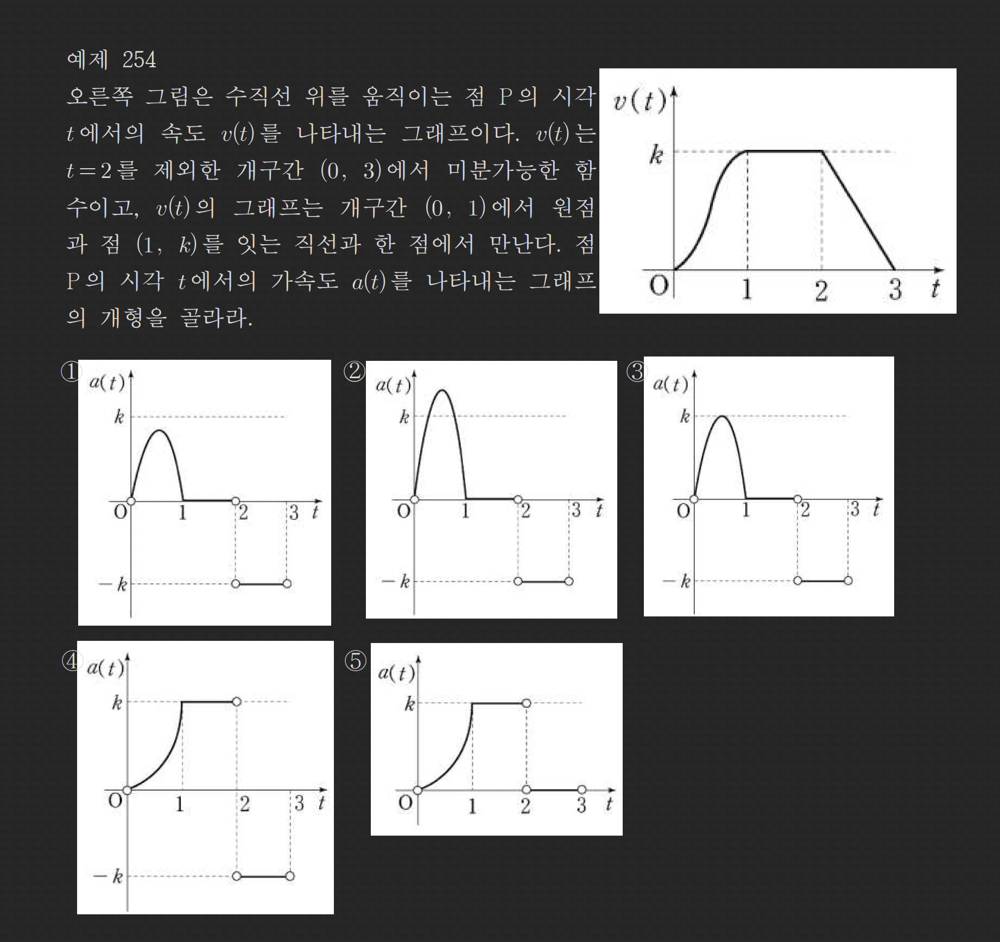
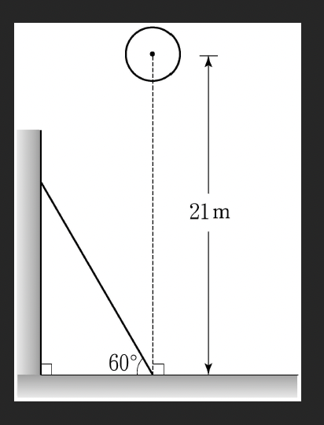
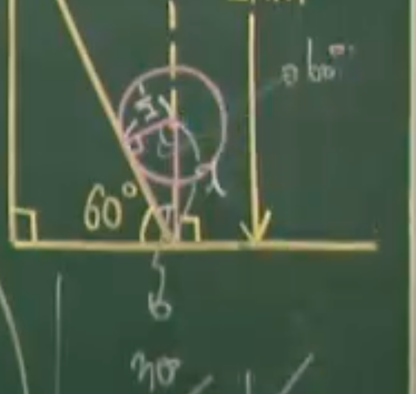
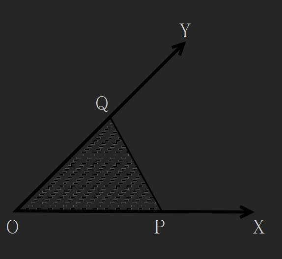

# 속도, 가속도와 미분(1)

## Thm 40: 속도와 가속도의 미분

### (1) 속도와 가속도

수직선 위를 움직이는 점 $P$가 있을 때 시각 $t$에 대해 점 $P$의 $x$좌표를 대응시키는 함수를 $x = f(t)$라 할 때:

#### 속도 (Velocity)

$x$의 $t$에 대한 변화율 $\lim_{\Delta t \to 0} \frac{\Delta x}{\Delta t} = \frac{dx}{dt} = f'(t)$를 시각 $t$에서의 점 $P$의 **속도**라 하고 이를 $v$로 나타낸다.

$$v(t) = f'(t) = \frac{dx}{dt}$$

#### 가속도 (Acceleration)

$v$의 $t$에 대한 변화율 $\lim_{\Delta t \to 0} \frac{\Delta v}{\Delta t} = \frac{dv}{dt} = v'$를 시각 $t$에서의 점 $P$의 **가속도**라 하고 이를 $a$로 나타낸다.

$$a(t) = v'(t) = f''(t) = \frac{dv}{dt} = \frac{d^2x}{dt^2}$$

### (2) 시각에 대한 여러 가지 변화율

① 시각 $t$에서 길이 $l$의 변화율 $\to \frac{dl}{dt}$

② 시각 $t$에서 넓이 $S$의 변화율 $\to \frac{dS}{dt}$

③ 시각 $t$에서 부피 $V$의 변화율 $\to \frac{dV}{dt}$

---

## 운동 분석의 기본 원리

### 감속운동, 등속운동, 가속운동

$x = f(t)$의 그래프에서 **속도는 접선의 기울기**로 파악한다.

```
   x                    x                    x
   |                    |                    |    x=f(t)
   |    x=f(t)          |    x=f(t)          |   /
   |   /                |   /──              |  /
   |  /                 |  /                 | /
   | /                  | /                  |/
   |/                   |/                   |
   +─────────> t        +─────────> t        +─────────> t
    감속운동              등속운동              가속운동
```

### 속도 $v = f'(t)$의 부호는 운동의 방향을 나타낸다

- $v > 0$이면 **양의 방향**
- $v = 0$이면 **운동방향이 바뀌거나 정지**
- $v < 0$이면 **음의 방향**

### 가속도 분석

$v(t)$ 그래프에서 가속도는 **접선의 기울기**로 파악한다.

```
예) v
    |    /\
    |   /  \___
    |  /       
    | /         
    |/___________> t
    0           40

    가속도가 0인 첫순간?
```

---

## 예제

### 예제 253

수직선 위를 움직이는 점 $P$의 시각 $t$에서의 위치가 $x = t^3 - 5t^2 + 3t$일 때

(1) $t = 2$일 때 속도와 가속도를 구하여라.

> [!summary]- 풀이
> **Step 1**: 속도 함수 구하기
> 
> $$v(t) = \frac{dx}{dt} = 3t^2 - 10t + 3$$
> 
> $t = 2$일 때 속도:
> 
> $$v(2) = 3(4) - 10(2) + 3 = 12 - 20 + 3 = -5$$
> 
> **Step 2**: 가속도 함수 구하기
> 
> $$a(t) = \frac{dv}{dt} = 6t - 10$$
> 
> $t = 2$일 때 가속도:
> 
> $$a(2) = 6(2) - 10 = 12 - 10 = 2$$
> 
> $$\therefore v(2) = -5, \quad a(2) = 2$$

(2) 운동방향이 바뀐 횟수를 구하여라.

> [!summary]- 풀이
> **Step 1**: 운동방향이 바뀌는 시각 찾기
> 
> 운동방향이 바뀔 때 $v(t) = 0$:
> 
> $$3t^2 - 10t + 3 = 0$$
> 
> $$3t^2 - 10t + 3 = (t - 3)(3t - 1) = 0$$
> 
> $$t = 3 \text{ 또는 } t = \frac{1}{3}$$
> 
> **Step 2**: 운동방향 변화 확인
> 
> - $t < \frac{1}{3}$: $v(t) > 0$ (양의 방향)
> - $\frac{1}{3} < t < 3$: $v(t) < 0$ (음의 방향)
> - $t > 3$: $v(t) > 0$ (양의 방향)
> 
> $$\therefore \text{운동방향이 바뀐 횟수: } 2\text{번}$$

---

### 예제 254

오른쪽 그림은 수직선 위를 움직이는 점 $P$의 시각 $t$에서의 속도 $v(t)$를 나타내는 그래프이다. $v(t)$는 $t = 2$를 제외한 개구간 $(0, 3)$에서 미분가능한 함수이고, $v(t)$의 그래프는 개구간 $(0, 1)$에서 원점과 점 $(1, k)$를 잇는 직선과 한 점에서 만난다. 점 $P$의 시각 $t$에서의 가속도 $a(t)$를 나타내는 그래프의 개형을 골라라.



> [!summary]- 풀이
> **Step 1**: $v(t)$ 그래프 분석
> 
> - $t \in (0, 1)$: $v(t)$가 증가 → $a(t) = v'(t) > 0$
> - $t = 1$: $v(t)$가 극댓값 → $a(1) = 0$
> - $t \in (1, 2)$: $v(t)$가 감소 → $a(t) < 0$
> - $t = 2$: 미분불가능 (꺾인점)
> - $t \in (2, 3)$: $v(t) = k$ (상수) → $a(t) = 0$
> 
> **Step 2**: $a(t)$ 그래프 개형 결정
> 
> - $(0, 1)$: 양수 영역
> - $t = 1$: 0을 지남
> - $(1, 2)$: 음수 영역
> - $(2, 3)$: 0 (수평선)
> 
> $$\therefore \text{답: ②번}$$

---

### 예제 255

두 자동차 $A, B$가 같은 지점에서 동시에 출발하여 직선 도로를 한 방향으로만 달리고 있다. $t$초 동안 $A, B$가 움직인 거리는 각각 미분가능한 함수 $f(t), g(t)$로 주어지고, 다음이 성립한다고 한다.

> (가) $f(20) = g(20)$
> (나) $10 \le t \le 30$에서 $f'(t) < g'(t)$

이로부터 $10 \le t \le 30$에서의 $A$와 $B$의 위치에 관한 다음 설명 중 옳은 것은?

① $B$가 항상 $A$의 앞에 있다.
② $A$가 항상 $B$의 앞에 있다.
③ $B$가 $A$를 한 번 추월한다.
④ $A$가 $B$를 한 번 추월한다.
⑤ $A$가 $B$를 추월한 후 $B$가 다시 $A$를 추월한다.

> [!summary]- 풀이
> **Step 1**: 주어진 조건 분석
> 
> - $f'(t)$: 자동차 $A$의 속도
> - $g'(t)$: 자동차 $B$의 속도
> - 조건 (나): $10 \le t \le 30$에서 $f'(t) < g'(t)$ → $B$가 $A$보다 빠름
> 
> **Step 2**: $t = 20$에서의 상황
> 
> - $f(20) = g(20)$ → 두 자동차의 위치가 같음
> 
> **Step 3**: 구간별 위치 관계
> 
> - $10 \le t < 20$:
>   - $g'(t) > f'(t)$ → $B$가 더 빠름
>   - 하지만 $t = 20$에서 같은 위치 → $t < 20$에서는 $A$가 앞에 있음
> 
> - $t = 20$: $f(20) = g(20)$ → $B$가 $A$를 추월
> 
> - $20 < t \le 30$:
>   - $g'(t) > f'(t)$ → $B$가 더 빠름
>   - $B$가 $A$보다 앞에 있음
> 
> $$\therefore \text{답: ③ } B\text{가 } A\text{를 한 번 추월한다.}$$

---

### 예제 256

원점 $O$를 동시에 출발하여 수직선 위를 움직이는 두 점 $P, Q$의 $t$분 후의 좌표를 각각 $x_1, x_2$라 하면 $x_1 = 2t^3 - 9t^2$, $x_2 = t^2 + 8t$이다. 선분 $PQ$의 중점을 $M$이라 할 때, 두 점 $P, Q$가 원점을 출발한 후 4분 동안 $P, Q, M$이 움직이는 방향을 바꾼 횟수를 각각 $a, b, c$라고 하자. 이때, $a + b + c$의 값을 구하여라.

> [!summary]- 풀이
> **Step 1**: 함수 정의
> 
> $$f(t) = 2t^3 - 9t^2, \quad g(t) = t^2 + 8t$$
> 
> 중점 $M$의 좌표:
> 
> $$h(t) = \frac{f(t) + g(t)}{2} = \frac{2t^3 - 9t^2 + t^2 + 8t}{2}$$
> 
> $$= \frac{2t^3 - 8t^2 + 8t}{2} = t^3 - 4t^2 + 4t$$
> 
> **Step 2**: 속도 함수 및 방향 변화 분석 ($t \in [0, 4]$)
> 
> **점 $P$의 속도**:
> 
> $$f'(t) = 6t^2 - 18t = 6t(t - 3)$$
> 
> $f'(t) = 0$에서 $t = 0, 3$
> 
> - $0 < t < 3$: $f'(t) < 0$ (음의 방향)
> - $t > 3$: $f'(t) > 0$ (양의 방향)
> 
> $t = 3$에서 방향 변화 → $a = 1$
> 
> **점 $Q$의 속도**:
> 
> $$g'(t) = 2t + 8$$
> 
> $g'(t) = 0$에서 $t = -4$ (구간 $[0, 4]$ 밖)
> 
> $g'(t) > 0$ (항상 양의 방향) → $b = 0$
> 
> **중점 $M$의 속도**:
> 
> $$h'(t) = 3t^2 - 8t + 4 = (3t - 2)(t - 2)$$
> 
> $h'(t) = 0$에서 $t = \frac{2}{3}, 2$
> 
> - $0 < t < \frac{2}{3}$: $h'(t) > 0$ (양의 방향)
> - $\frac{2}{3} < t < 2$: $h'(t) < 0$ (음의 방향)
> - $2 < t < 4$: $h'(t) > 0$ (양의 방향)
> 
> $t = \frac{2}{3}, 2$에서 방향 변화 → $c = 2$
> 
> **Step 3**: 결과
> 
> $$a + b + c = 1 + 0 + 2 = 3$$

---

### 예제 257

그림과 같이 편평한 바닥 $60°$로 기울어진 경사면과 반지름의 길이가 $0.5\text{m}$인 공이 있다. 이 공의 중심은 경사면과 바닥이 만나는 점에서 바닥에 수직으로 높이가 $21\text{m}$인 위치에 있다. 이 공을 자유낙하시킬 때, $t$초 후 공의 중심의 높이 $h(t)$는 $h(t) = 21 - 5t^2 \; (\text{m})$라고 한다. 공이 경사면과 처음으로 충돌하는 순간, 공의 속도를 구하여라. (단, 경사면의 두께와 공기의 저항은 무시한다.)



> [!summary]- 풀이
> **Step 1**: 공이 경사면과 충돌할 때의 높이
> 
> 공의 반지름: $0.5\text{m}$
> 
> 경사각: $60°$
> 
> 
> 
> 공의 중심이 경사면에 접할 때, 바닥으로부터의 높이:
> 
> $$\sin 30° = \frac{0.5}{x}$$
> 
> $$\frac{1}{2} = \frac{0.5}{x}$$
> 
> $$x = 1\text{m}$$
> 
> 충돌 시 높이: $h = 1\text{m}$
> 
> **Step 2**: 충돌 시각 구하기
> 
> $$h(t) = 21 - 5t^2 = 1$$
> 
> $$5t^2 = 20$$
> 
> $$t^2 = 4$$
> 
> $$t = 2\text{초}$$
> 
> **Step 3**: 속도 계산
> 
> $$v(t) = h'(t) = -10t$$
> 
> $$v(2) = -10 \cdot 2 = -20\text{m/s}$$
> 
> (음수는 아래 방향)
> 
> $$\therefore \text{속력: } 20\text{m/s}$$

---

### 예제 258

오른쪽 그림과 같이 각의 크기가 $45°$를 이루고 있는 두 반직선 $OX, OY$ 위에 각각 두 점 $P, Q$가 있다. 점 $P$는 점 $O$를 출발하여 매초 $3\text{cm}$의 속도로 $X$축의 양의 방향으로 움직이고, 점 $Q$는 점 $P$가 출발한 지 1초 후에 점 $O$를 출발하여 매초 $4\text{cm}$의 속도로 $Y$축의 양의 방향으로 움직일 때, 5초 후의 $\triangle OPQ$의 넓이의 변화율을 구하여라.



> [!summary]- 풀이
> **Step 1**: 변수 정의
> 
> - 시각 $t$에서 $\overline{OP} = 3t$
> - 시각 $t$에서 $\overline{OQ} = 4(t - 1)$ ($t \ge 1$)
> 
> **Step 2**: 삼각형 넓이 함수
> 
> $$S(t) = \frac{1}{2} \cdot \overline{OP} \cdot \overline{OQ} \cdot \sin 45°$$
> 
> $$= \frac{1}{2} \cdot 3t \cdot 4(t-1) \cdot \frac{\sqrt{2}}{2}$$
> 
> $$= \frac{\sqrt{2}}{4} \cdot 12t(t-1)$$
> 
> $$= 3\sqrt{2} \cdot t(t-1)$$
> 
> $$= 3\sqrt{2}(t^2 - t)$$
> 
> **Step 3**: 넓이의 변화율
> 
> $$\frac{dS}{dt} = 3\sqrt{2}(2t - 1)$$
> 
> $t = 5$일 때:
> 
> $$\frac{dS}{dt}\bigg|_{t=5} = 3\sqrt{2}(2 \cdot 5 - 1) = 3\sqrt{2} \cdot 9 = 27\sqrt{2}$$
> 
> $$\therefore 27\sqrt{2} \; \text{cm}^2/\text{초}$$

---

### 예제 259

공 모양의 눈덩어리를 따뜻한 곳에 옮겨놓으면, 눈덩어리의 표면만이 따뜻한 공기에 노출되므로, 녹는 양의 비율은 그 때의 겉넓이에 비례하고 항상 공 모양을 유지한다고 가정하자. 이 때, 눈덩어리의 반지름의 길이는 어떤 비율로 줄어들겠는가?

① 일정한 비율로 줄어든다.
② 점점 더 빠르게 줄어든다.
③ 점점 더 느리게 줄어든다.
④ 그 때의 겉넓이에 비례해서 줄어든다.
⑤ 그 때의 부피에 비례해서 줄어든다.

**Hint**: 구의 겉넓이 $S = 4\pi r^2$, 구의 부피 $V = \frac{4}{3}\pi r^3$

> [!summary]- 풀이
> **Step 1**: 가정 및 수식 세우기
> 
> 공 모양 눈덩어리의 반지름 $r$, 부피 $V$, 겉넓이 $S$:
> 
> - **부피**: $V = \frac{4}{3}\pi r^3$
> - **겉넓이**: $S = 4\pi r^2$
> 
> 녹는 양의 비율(부피의 변화율)은 겉넓이에 비례:
> 
> $$\frac{dV}{dt} = -kS \quad (k > 0)$$
> 
> (음수는 부피가 감소함을 의미)
> 
> **Step 2**: 반지름의 변화율 구하기
> 
> 부피를 시각 $t$에 대해 미분 (연쇄법칙):
> 
> $$\frac{dV}{dt} = \frac{dV}{dr} \cdot \frac{dr}{dt} = 4\pi r^2 \cdot \frac{dr}{dt}$$
> 
> 조건식에 $S = 4\pi r^2$ 대입:
> 
> $$4\pi r^2 \cdot \frac{dr}{dt} = -k(4\pi r^2)$$
> 
> 양변을 $4\pi r^2$로 나누면 ($r \neq 0$):
> 
> $$\frac{dr}{dt} = -k$$
> 
> **Step 3**: 결론
> 
> 반지름의 변화율 $\frac{dr}{dt}$가 상수 $-k$
> 
> → 반지름 $r$이 시간에 관계없이 항상 **일정한 비율**로 줄어듦
> 
> $$\therefore \text{답: ① 일정한 비율로 줄어든다.}$$

---

### 예제 260

바다 위에 정지해 있는 유조선에서 원유가 유출되어, 동심원을 그리며 모든 방향으로 반지름이 $10\text{m/분}$의 속도로 퍼져 나간다고 하자. 원유가 차지하는 원의 반지름의 길이가 $100\text{m}$일 때, 그 원의 넓이는 얼마의 속도로 커지는가?

> [!summary]- 풀이
> **Step 1**: 주어진 정보
> 
> $$\frac{dr}{dt} = 10\text{m/분}$$
> 
> 원의 넓이:
> 
> $$S = \pi r^2$$
> 
> **Step 2**: 넓이의 변화율 (연쇄법칙)
> 
> $$\frac{dS}{dt} = \frac{dS}{dr} \cdot \frac{dr}{dt}$$
> 
> $$= \frac{d(\pi r^2)}{dr} \cdot \frac{dr}{dt}$$
> 
> $$= 2\pi r \cdot \frac{dr}{dt}$$
> 
> **Step 3**: $r = 100\text{m}$일 때 계산
> 
> $$\frac{dS}{dt} = 2\pi \cdot 100 \cdot 10$$
> 
> $$= 2000\pi \; \text{m}^2/\text{분}$$
> 
> $$\therefore 2000\pi \; \text{m}^2/\text{분}$$

---

## 연습문제

각 예제를 통해 다음 내용을 복습하시오:

1. 위치함수로부터 속도와 가속도 계산
2. 운동방향이 바뀌는 시각 찾기
3. 속도 그래프로부터 가속도 그래프 추론
4. 두 물체의 상대적 위치 변화 분석
5. 중점의 운동 분석
6. 자유낙하와 충돌 시각 계산
7. 기하학적 변화율 (삼각형 넓이)
8. 관련 변화율 (구의 반지름과 부피)
9. 관련 변화율 (원의 반지름과 넓이)

---

## 관련 주제

- [[41-velocity-acceleration-2|속도, 가속도와 미분(2)]]
- [[28-mean-value-theorem|평균값의 정리]]
- [[22-transcendental-derivative-1|초월함수의 도함수(1)]]
- [[20-derivative-applications|도함수의 활용]]

---

**학습 포인트:**

1. **속도 = 위치의 도함수**, **가속도 = 속도의 도함수**
2. **운동방향 변화**: 속도가 0이 되는 시각 찾기
3. **그래프 분석**: 속도 그래프 → 접선 기울기 = 가속도
4. **관련 변화율**: 연쇄법칙 $\frac{dy}{dt} = \frac{dy}{dx} \cdot \frac{dx}{dt}$
5. **물리적 직관**: 속도와 가속도의 부호로 운동 상태 파악
6. **중점의 운동**: 두 점의 위치함수로부터 중점 위치 계산
