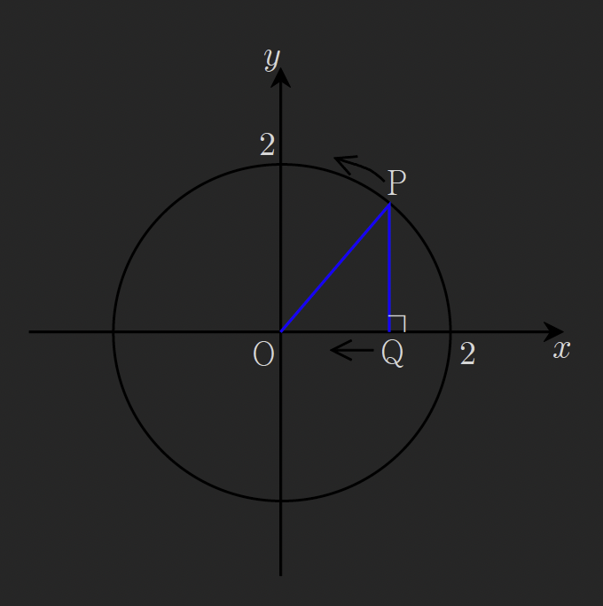

### Thm41 속도,가속도와 미분(평면운동)

$\vec{a} = (a_1, a_2), \vec{b} = (b_1, b_2)$ 일 때
① $|\vec{a}| = \sqrt{a_1^2 + a_2^2}, |\vec{b}| = \sqrt{b^2_{1} + b^2_{2}}$ 이다.
② $\vec{a} \cdot \vec{b} = a_1 b_1 + a_2 b_2$ 이다.
③ $\vec{a} \perp \vec{b}$ 이면 $\vec{a} \cdot \vec{b} = 0$ 이다.

### 예제 261

좌표평면 위의 점 $\mathrm{P}(x, y)$의 시각 $t$에서의 좌표가 $x = \sin t + \cos t, y = 2\cos t$로 주어질 때, 시각 $t = \frac{\pi}{3}$에서의 **속력**과 **가속도의 크기**를 각각 구하여라.

---

$$
\text{put}\ r(t)=(x,y)=(\sin t+\cos t,2\cos t)
$$

$$
\vec{V}=r'(t)=(\cos t-\sin t,-2\sin t)
$$

$$
\vec{V}_{t=\frac{\pi}{3}}=\left( \frac{1}{2}-\frac{\sqrt{ 3 }}{2}, -\sqrt{ 3 } \right)
=(\frac{1-\sqrt{ 3 }}{2},-\sqrt{ 3 })
$$

$$
|\vec{V}|=\sqrt{ \left( \frac{1-\sqrt{ 3 }}{2} \right)^{2}+3 }
=\sqrt{ \frac{4-2\sqrt{ 3 }}{4}+3 }
=\frac{\sqrt{ 16-2\sqrt{ 3 } }}{2}
$$

$$
\vec{a}=r''(t)=(-\sin t-\cos t,-2\cos t)
$$

$$
r''\left( \frac{\pi}{3} \right)=\left( -\frac{\sqrt{ 3 }}{2}-\frac{1}{2},-1 \right)
=(\frac{-1-\sqrt{ 3 }}{2},-1)
$$

$$
|\vec{a}|=\sqrt{ \left( \frac{-1-\sqrt{ 3 }}{2} \right)^{2}+1}
$$

### 예제 262

좌표평면 위를 움직이는 점 $\mathrm{P}$의 시각 $t$에서의 위치가 $\mathrm{P}(t - \sin t, 1 - \cos t)$일 때, 시각 $t = \frac{\pi}{6}$에서의 속도 $\vec{v}$와 가속도 $\vec{a}$의 **내적** $\vec{v} \cdot \vec{a}$를 구하시오.

(참고) $\vec{a} = (a_1, a_2), \vec{b} = (b_1, b_2)$일 때 $\vec{a} \cdot \vec{b} = a_1 b_1 + a_2 b_2$이다.

---

$$
\text{put}\ r(t)=(t-\sin t,-\cos t)
$$

$$
\vec{V}=r'(t)=(1-\cos t,\sin t)
$$

$$
\vec{V}_{t=\frac{\pi}{6}}=
r'\left( \frac{\pi}{6} \right)
=(1-\frac{\sqrt{ 3 }}{2}, \frac{1}{2})
$$

$$
\vec{a}=r''(t)
=(\sin t,\cos t)
$$

$$
r''\left( \frac{\pi}{6} \right)=\left( \frac{1}{2}, \frac{\sqrt{ 3 }}{2} \right)
$$

$$
\vec{V}\cdot \vec{a}=\frac{1}{2}-\frac{\sqrt{ 3 }}{4}+\frac{\sqrt{ 3 }}{4}
=\frac{1}{2}
$$

### 예제263

좌표평면 위를 움직이는 점 P의 위치가 $x=e^{-t}\cos \pi t,\ y=e^{-t}\sin \pi t$
로 주어질때 t=1에서 점P의 속력을 구하여라

---

$$
\text{put}\ r(t)=(e^{-t}\cos \pi t,e^{-t}\sin \pi t)
$$

$$
\vec{V}=r'(t)
=(-e^{-t}\cdot \cos \pi t+e^{-t}(-\pi \sin \pi t),
-e^{-t}\sin \pi t+e^{-t}\cdot(\pi \cos \pi t))
$$

$$
=(-e^{-t}(\cos \pi t+\pi\sin \pi t),-e^{-t}(\sin \pi t-\pi \cos \pi t))
$$

$$
r'(1)=(-e^{-1}\cdot(1+ 0),-e^{-1}\cdot (0+\pi))
=(-e^{-1},-e^{-1}\pi)
$$

$$
|\vec{a}|_{t=1}=\sqrt{ (-e^{-1})^{2}+(-e^{-1}\pi)^{2} }
$$

$$
=\sqrt{ e^{-2}+e^{-2}\pi^{2} }
=\sqrt{ e^{-2}(1+\pi^{2}) }
=\frac{\sqrt{ 1+\pi^{2} }}{e}
$$

### 예제 264

아래 그림과 같이 반지름의 길이가 $2$인 원 위를 움직이고 있는 점 $\mathrm{P}$가 있다. 점 $\mathrm{P}$를 $x$축 위로 정사영시킨 점 $\mathrm{Q}$는 $x$축 위를 매초 $1$의 일정한 속력으로 움직이고 있다. $\angle \mathrm{POQ} = \frac{\pi}{3}$일 때, 점 $\mathrm{P}$의 **속력**을 구하여라.

---
$$
given: \frac{dx}{dt}=-1
$$
$$
given:
P=\left( 2\cos \frac{\pi}{3},2\sin \frac{\pi}{3} \right)
=(1,\sqrt{ 3 })
$$
점P의 위치변화를 함수로 나타내면
$$
P(\theta)=(2\cos\theta,2\sin\theta)
$$
	
$$
\vec{V}_{\theta=\frac{\pi}{3}}
=\left( -1, \frac{dy}{dt} \right)
$$

$$
\frac{dy}{dt}_{\theta=\frac{\pi}{3}}
=\frac{dy}{dt} \cdot \frac{d\theta}{d\theta}
=\frac{d}{dt} 2\sin\theta \cdot \frac{d\theta}{d\theta}
=2\cos\theta \cdot \frac{d\theta}{dt}
=\frac{d\theta}{dt}
$$

$$
\frac{dx}{dt}_{\theta=\frac{\pi}{3}}
=\frac{d}{dt} 2\cos\theta \cdot \frac{d\theta}{d\theta}
=-2\sin\theta \cdot \frac{d\theta}{dt}
=-\sqrt{ 3 }\cdot \frac{d\theta}{dt}
=-1
$$
$$
\frac{d\theta}{dt}=\frac{\sqrt{ 3 }}{3}
$$

$$
\therefore \vec{V}=\left( -1, \frac{\sqrt{ 3 }}{3} \right)
$$
$$
|\vec{V}|
=\sqrt{ 1+\frac{3}{9} }
=\sqrt{ \frac{4}{3} }
=\frac{2\sqrt{ 3 }}{3}
$$

### 예제265
공간 위를 움직이는 점 P의 시각 t에서의 위치가 ($1+t^{3},t,\sin 2t$) 일때
시각 $t=\frac{\pi}{6}$ 에서의 속력을 구하여라

---

$$
\text{put}\ f(t)=1+t^{3},\ g(t)=t,\ h(t)=\sin 2t
$$
$$
\text{put}\ r(t)=(f(t),g(t),h(t))
$$
$$
\vec{V}=r'(t)=(f'(t),g'(t),h'(t))
=(3t^{2},1,2\cos 2t)
$$
$$
r'\left( \frac{\pi}{6} \right)=\left( \frac{\pi^{2}}{12},1,1 \right)
$$
$$
|\vec{V}|_{t=\frac{\pi}{6}}
=\sqrt{ \frac{\pi^{4}}{144}+1+1 }
=\sqrt{ \frac{\pi^{4}}{144}+2 }
$$

### 예제266
공간 위를 움직이는 점P의 시각  t에서의 위치가 ($3\cos t,\ 3\sin t,\ t^{2}$)일때
다음 물음에 답하여라 (단, $0\leq t\leq 4\pi$)

(1)속도와 가속도 벡터를 구하여라
(2)임의의 시각 t에서 점P의 속력을 구하여라
(3)점P의 가속도가 속도와 수직일때 시각 t를 구하여라

---

$$
\text{put}\ r(t)=(3\cos t,3\sin t,t^{2})
$$

(1)풀이
$$
\vec{V}=r'(t)=(-3\sin t,3\cos t,2t)
$$
$$
\vec{a}=r''(t)=(-3\cos t,-3\sin t,2)
$$

(2)
$$
|\vec{V}|=\sqrt{ 9\cos ^{2}t+9\sin ^{2}t+4t^{2} }
=\sqrt{ 9+4t^{2} }
$$

(3)
$$
\vec{V} \cdot \vec{a}
=9\sin t\cos t -9\sin t\cos t + 4t
=4t=0
$$
$$
t=0
$$