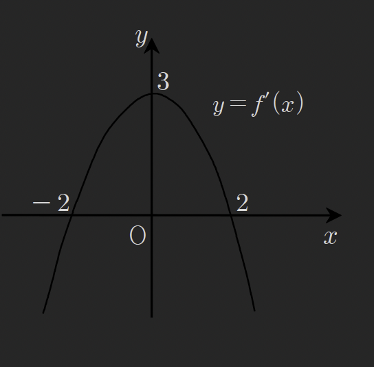

### Thm43 
4번식에 대한 증명
$$
\int(ax+b)^{n}dx=\frac{1}{a}\cdot \frac{1}{n+1}(ax+b)^{n+1}+C
$$
#### 증명1) 
$$
\int(ax+b)^{n}dx
=\int a^{n}\left( x+\frac{b}{a} \right)^{n}dx
=\frac{1}{a}\cdot a^{n+1}\int \left( x+\frac{b}{a} \right)^{n}dx
$$
$$
=\frac{1}{a}\cdot \frac{1}{n+1} \cdot a^{n+1}\left( x+\frac{b}{a} \right)^{n+1}+C
$$
$$
=\frac{1}{a}\cdot \frac{1}{n+1}(ax+b)^{n+1}+C
$$

증명2) 치환적분법을 이용한 증명
$(ax+b)^n$의 적분 공식이 $\frac{1}{a} \cdot \frac{1}{n+1}(ax+b)^{n+1} + C$임을 치환적분법으로 증명하면 다음과 같습니다.

치환 설정 $ax + b = t$ 로 놓습니다. ### 2. 양변 미분 양변을 $x$에 대하여 미분하면: 

$$
\frac{d}{dx}(ax + b) = \frac{dt}{dx}
$$ 
$$
a = \frac{dt}{dx} \implies dx = \frac{1}{a} dt
$$ 
적분식 대입 원래의 적분식에 $t$와 $dx$를 대입합니다: 
$$
\int(ax+b)^n dx 
=\int t^n \cdot \left( \frac{1}{a} \right) dt 
=\frac{1}{a} \int t^n dt
$$ 
 적분 수행 및 환원 $t$에 대해 적분한 후, 다시 $t = ax+b$를 대입하여 완성합니다: 
 
$$
= \frac{1}{a} \cdot \left( \frac{1}{n+1} t^{n+1} \right) + C 
= \frac{1}{a} \cdot \frac{1}{n+1} (ax+b)^{n+1} + C
$$

### 예제 276

함수 f(x)와 그의 부정적분 F(x)사이에
$F(x)=xf(x)+x^{3}-4x^{2}$을 만족할때, $f(4)-f(2)$의 값을 구하여라

---

$$
F'(x)=f(x)
$$

$$
F'(x)=f(x)+xf'(x)+3x^{2}-8x
$$

$$
xf'(x)+3x^{2}-8x=0
$$

$$
f'(x)=-3x+8
$$

$$
f(x)=-\frac{3}{2}x^{2}+8x+C
$$

$$
f(4)-f(2)=-24+32+C-(-6+16+C)
$$

$$
=8-10=-2
$$

### 예제277

$$
f(x)=\int(x^{3}-2x^{2}+x+1)dx
$$

일때

$$
\lim_{ h \to 0 } \frac{f(2+h)-f(2-h)}{h}
$$

의 값을 구하여라

---

$$
\lim_{ h \to 0 } \frac{f(2+h)-f(2-h)}{h}
=\lim_{ h \to 0 } \frac{f(2+h)-f(2-h)}{2h}\cdot 2=2f'(2)
$$

$$
f'(x)=x^{3}-2x^{2}+x+1
$$

$$
2f'(2)=2(8-8+2+1)=6
$$

### 예제 278

임의의 실수 x,y에 대하여 $f(x+y)=f(x)+f(y)+xy+1$를 만족시키는
함수 f(x)가 있다
$f'(0)=4$일때 f(8)의 값을 구하여라 (단, f(x)는 미분가능)

---

$$
f'(x+y)=f'(y)+x
$$

$$
f'(x+0)=f'(0)+x
$$

$$
f'(x)=x+4
$$

$$
f(x)=\int x+4\ dx=\frac{1}{2}x^{2}+4x+C
$$

$$
f(0+0)=f(0)+f(0)+1,\ f(0)=-1
$$

$$
\therefore C=-1
$$

$$
f(x)=\frac{1}{2}x^{2}+4x-1
$$

$$
f(8)=32+32-1=63
$$

### 예제279

삼차함수 $y=f(x)$는 x=1에서 극값을 갖고, 그 그래프가 원점에 대하여 대칭일떄
이 그래프와 x축과의 교점의 x좌표중에서 양수인 값을 구하여라

---

$$
given: f'(1)=0,\ f'(-x)=f'(x),\ f(0)=0
$$

$$
f'(x)=a(x+1)(x-1)=ax^{2}-a
$$

$$
f(x)=\frac{a}{3}x^{3}-ax+C
$$

$$
\because f(0)=0,\ \therefore C=0
$$

$$
f(x)=\frac{a}{3}x^{3}-ax
$$

$$
\frac{a}{3}x^{3}-ax=0
$$

$$
x^{3}-3x=0
$$

$$
x(x^{2}-3)=0
$$

$$
x=0,\ x=\pm \sqrt{ 3 }
$$

이 중 양수인 값은 $\sqrt{ 3 }$

### 예제280

삼차함수 y=f(x)의 도함수 $y=f'(x)$의 그래프는 아래와 같다
$f(0)=0$일때, x에 대한 방정식 $f(x)=kx$가 서로다른 세 실근을
갖기위한 실수 k의 값의 범위를 구하여라

---

$$
f'(x)=-\frac{3}{4}(x+2)(x-2)=-\frac{3}{4}(x^{2}-4)
$$
$$
f'(x)=-\frac{3}{4}x^{2}+3
$$
$$
f(x)=-\frac{1}{4}x^{3}+3x+C,\ C=0
$$
$$
-\frac{1}{4}x^{3}+3x=0
$$

아래식에서 x가 3실근을 갖게하는 k 범위를 구하자
$$
f(x)=-\frac{1}{4}x^{3}+3x=kx
$$
$$
=x^{3}-12x=-4kx
$$
$$
x(x^{2}-12+4k)=0
$$
x=0으로 실근하나, 2차항내에서 0이아닌 2개의 실근이 존재해야함
$$
0^{2}-12+4k\neq 0
$$
$$
-12+4k\neq 0
$$
$$
k\neq 3
$$

$$
\frac{D}{4}=12-4k>0
$$
$$
k<3
$$

### Thm44 초월함수의 적분공식

#### 추가내용
$$
\{\ln|f(x)|\}'=\frac{f'(x)}{f(x)}
$$
$$
\int \frac{f'(x)}{f(x)}\ dx=\ln|f(x)|+C
$$

#### 3번 공식 tan적분 유도과정
$$
\int \tan x \ dx
=\int \frac{\sin x}{\cos x}\ dx
=-\int \frac{-\sin x}{\cos x}\ dx 
$$
위의 추가내용으로부터 
$$
=-\ln|\cos x|+C
$$
임을 알수있다

#### sin^2 cos^2 적분방법
무엇을 미분했을떄 $\sin ^{2}과 \cos ^{2}$가 되는것은 없으므로
식변형이후 2번공식을 활용하여 적분하도록한다

#### 기타 중요한 적분 
1)
$$
\int \tan ^{2}x\ dx
=\int(\sec ^{2}x-1)\ dx
=\tan x-x+C
$$

2)
$$
\int \sec x\ dx
=\int \frac{\sec x(\sec x+\tan x)}{\sec x+\tan x}\ dx
$$
$$
\because (\sec x+\tan x)'
=\sec x \cdot \tan x +\sec ^{2}x
=\sec x(\sec x+\tan x)
$$
$$
\int \sec x\ dx = \ln|\sec x+\tan x|+C
$$

3)
$$
\int \cot x\ dx 
=\int \frac{\cos x}{\sin x}\ dx
=\ln|\sin x|+C
$$

4)
$$
\int \csc ^{2}x\ dx
=-\int-\csc ^{2}x\ dx
= -\cot x+C
$$

remind: $\cot x$를 미분하면 $-\csc ^{2}x$
$$
(\cot x)'=-\csc ^{2}x
$$

5)
$$
\int \cot ^{2}x\ dx
=\int \csc ^{2}x-1\ dx
= -\cot x-x+C
$$

remind: 삼각항등식
$$
1+\cot ^{2}x = \csc ^{2}x
\cot ^{2}x=\csc ^{2}x-1
$$

6)
$$
\int \csc x\ dx
=\int \frac{\csc x(\csc x+\cot x)}{\csc x+\cot x}\ dx
=-\int \frac{-\csc x(\csc x+\cot x)}{\csc x+\cot x}\ dx
=-\ln|\csc x+\cot x|+C
$$

remind:
$$
(\csc x+\cot x)'=-\csc x \cdot \cot x -\csc ^{2}x
$$

7)
$$
\int \sin ^{2}x\ dx
=\int \frac{1-\cos 2x}{2}\ dx 
=\frac{1}{2}x - \frac{1}{4}\sin 2x+C
$$

8)
$$
\int \cos ^{2}x\ dx 
= \int \frac{1+\cos 2x}{2}\ dx
=\frac{1}{2}x+\frac{1}{4}\sin 2x+C
$$

9)
방법1 - 3배각공식활용
$$
\int \sin ^{3}x\ dx
=\int \frac{3}{4}\sin x-\frac{1}{4}\sin 3x\ dx
=-\frac{3}{4}\cos x+\frac{1}{12}\cos 3x+C
$$

remind: 
$$
\sin 3x = 3\sin x-4\sin ^{3}x
$$
$$
4\sin ^{3}x=3\sin x-\sin 3x
$$
$$
\sin ^{3}x= \frac{3}{4}\sin x-\frac{1}{4}\sin 3x
$$

방법2 - 치환적분법을 활용
$$
\int \sin ^{3}x\ dx
= \int \sin x \cdot \sin ^{2}x\ dx
= \int \sin x(1-\cos ^{2}x)\ dx
$$

cos x 를 t로 치환하면
$$
\cos x=t
$$
$$
\frac{d}{dx}\cos x=\frac{d}{dx}t
$$
$$
-\sin x=\frac{dt}{dx}
$$
$$
\sin x \cdot dx=-dt
$$

$$
=\int(1-t^{2})(-dt)
=\int(t^{2}-1)dt
=\frac{1}{3}t^{3}-t+C
$$
$$
=\frac{1}{3}\cos ^{3}x-\cos x+C
$$

