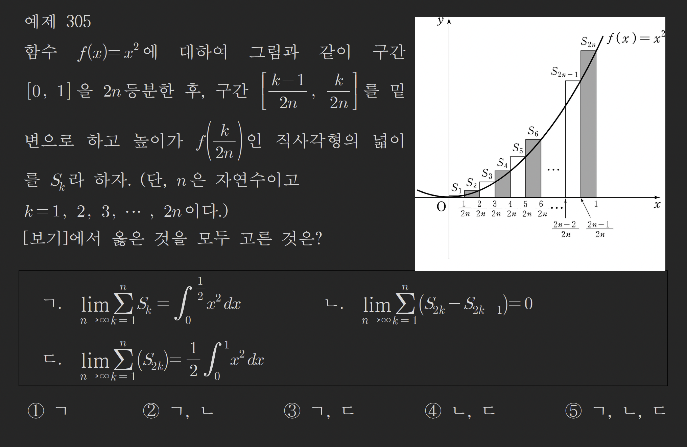
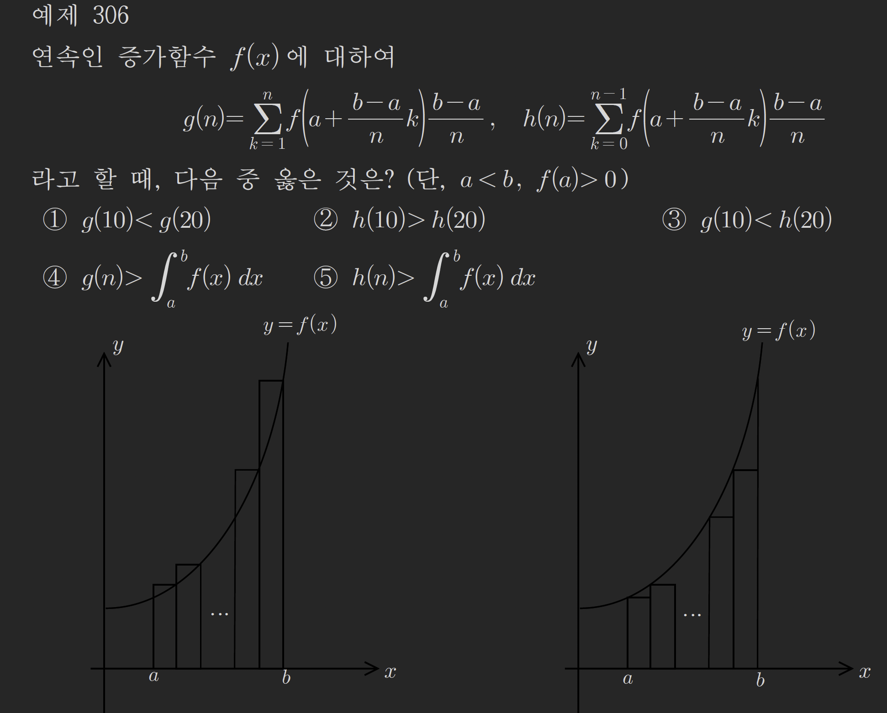
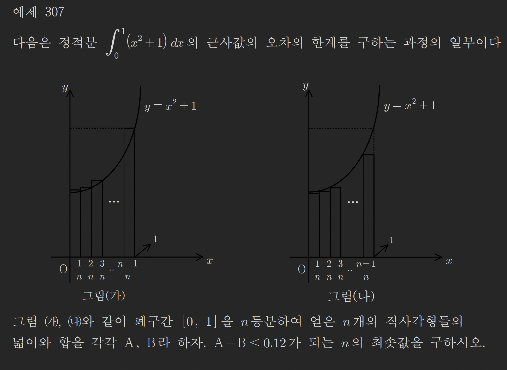
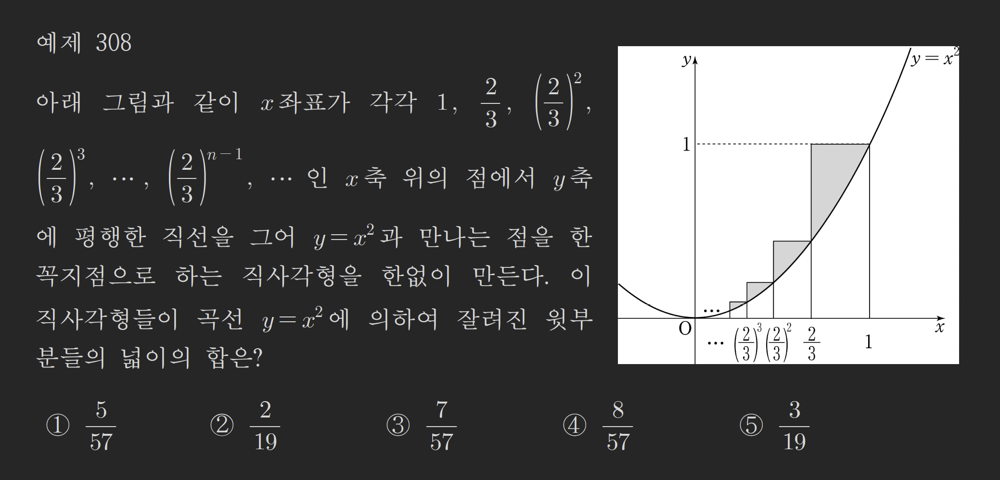
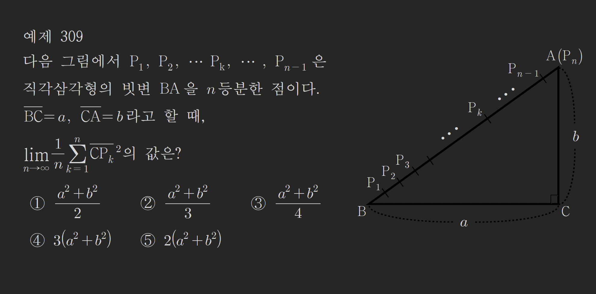

### 예제303

아래 보기중 다항함수 f(x)와 실수 a에 대하여

$$
\lim_{ n \to \infty } \frac{f\left( a+\frac{1}{n} \right)+f\left( a+\frac{2}{n} \right)+\dots f\left( a+\frac{n}{n} \right)}{an+1}
$$

과 같은것은?
(1) $\frac{1}{a}$

(2) $\int_{0}^{1}f(x)\ dx$

(3) $a\int_{0}^{1}f(x)\ dx$

(4)$\int_{a}^{a+1}f(x)\ dx$

(5)$\frac{1}{a} \int_{a}^{a+1}f(x)\ dx$

---

$$
GE=\lim_{ n \to \infty } \Sigma_{k=1}^{n} \frac{f\left( a+\frac{k}{n} \right)}{an+1}
$$

$$
=\lim_{ n \to \infty } \frac{n}{an+1}\int_{a}^{a+1}f(x)\ dx
$$

$$
=\frac{1}{a}\int_{a}^{a+1}f(x)\ dx
$$

### 예제304

함수 $f(x)=x^{3}+x$일때

$$
\lim_{ n \to \infty } \frac{1}{n}\Sigma_{k=1}^{n}f\left( 1+\frac{2k}{n} \right)
$$

의 값을 구하시오

---

$$
GE= \int_{1}^{3}f(x)\ dx \cdot \frac{1}{n} \cdot \frac{n}{2}
$$

$$
=\frac{1}{2}\int_{1}^{3}x^{3}+x\ dx
$$

$$
=\frac{1}{2}\cdot \left[\frac{1}{4}x^{4}+\frac{1}{2}x^{2}\right]_{1}^{3}
$$

$$
=\frac{1}{2}\left( \frac{81}{4}+\frac{9}{2}-\frac{1}{4}-\frac{1}{2} \right)
$$

$$
=\frac{1}{2} \cdot (20+4)= 12
$$

### 예제305

---

$$
given: S_{k}=\frac{1}{2n} \cdot f\left( \frac{k}{2n} \right)
$$

(ㄱ)

$$
GE=\lim_{ n \to \infty } \Sigma_{k=1}^{n}S_{k}
=\lim_{ n \to \infty } \Sigma_{k=1}^{n} \frac{1}{2n} \cdot f\left( \frac{k}{2n} \right)
$$

$$
=\int_{0}^{\frac{1}{2}} x^{2}\ dx
$$

ㄱ은 참이다
(ㄴ)

$$
GE=\lim_{ n \to \infty } \Sigma_{k=1}^{n} \frac{1}{2n}\cdot f\left( \frac{2k}{2n} \right)
-\lim_{ n \to \infty } \Sigma_{k=1}^{n} \frac{1}{2n}\cdot f\left(\frac{2k-1}{2n} \right)
$$

좌항 우항을 각각 정적분으로 바꾸면

$$
\lim_{ n \to \infty } \Sigma_{k=1}^{n}f\left( \frac{2k}{2n} \right) \frac{1}{2n}
=\frac{1}{2}\int_{0}^{1}x^{2}\ dx
$$

$$
\lim_{ n \to \infty } \Sigma_{k=1}^{n} f\left(\frac{2k-1}{2n} \right) \frac{1}{2n}
= \frac{1}{2}\int_{0}^{1}x^{2}\ dx
$$

좌항 우항이 같은 정적분임으로 ㄴ은 참이다

(ㄷ)

$$
GE=\lim_{ n \to \infty } \Sigma_{k=1}^{n} \frac{1}{2n} \cdot f\left( \frac{2k}{2n} \right)
$$

$$
dx=\frac{2}{2n}=\frac{1}{n}
$$

$$
GE=\lim_{ n \to \infty } \Sigma_{k=1}^{n}f\left( \frac{2k}{2n} \right) \cdot  \frac{1}{n} \cdot\frac{1}{2}
$$

$$
=\frac{1}{2}\int_{0}^{1}x^{2}\ dx
$$

ㄷ 은 참이다

---

#### 계산 안하고 푼 방법

우선 문제 그래프 구간의 넓이를 무한급수와 정적분으로 표현하면 아래와 같다.

$$
S=\lim_{ n \to \infty } \Sigma_{k=1}^{2n}f\left( \frac{k}{2n} \right) \frac{1}{2n}
=\int_{0}^{1}x^{2}\ dx=GE
$$

ㄱ 보기는 sigma범위가 1~2n에서 1~n으로 절반만큼 줄어들었으므로
GE에서 위끝이 절반만큼 감소하면 된다
ㄱ은 참이다

ㄴ 보기는 이미지그래프에서 $[0,1]$ 구간내에서 짝수번쨰 직각사각형의 합과 홀수번쨰 직각사각형의 합의 차가
0인지 묻고있다. (sigma범위는 그래프상의 $[0,0.5]$ 까지의 범위를 나타내지만 S에서 2k, 2k-1로 값을 받기에 적분구간은 0~1이 된다 )

둘 모두 GE의 절반만큼의 값인

$$
\frac{1}{2}\int_{0}^{1}x^{2}\ dx
$$

로 같다는 것을 알수있다.
ㄴ도 참이다

ㄷ 보기는 ㄴ보기의 결과로 참임을 알수있다

### 예제306

---

g와 n의 정의역 구간은 n이 급수기호 범위에 사용되므로 1~무한대범위의 정수라는 것을 알수있다.

우선 주어진 문제 조건에 따라 아래 식이 성립함을 알수있다

$$
g(n)\geq\lim_{ n \to \infty } g(n)=\int_{a}^{b}f(x)\ dx=\lim_{ n \to \infty } h(n) \geq h(n)
$$

그리고 g(n)에서 n의 값이 커질수록 $\int_{a}^{b}f(x)\ dx$ 값과 가까워지고 ( g(n)값은 n이 커질수록 작아진다 )
h(n)에서 n의 값이 커질수록 $\int_{a}^{b}f(x)\ dx$ 값과 가까줘지는 것을 알수있다 ( h(n)값은 n이 커질수록 커진다)

보기중 4번이 이 참임을 알 수 잇다

### 예제307

문제 그래프를 보면
가는 f(x)의 우합 A
나는 f(x)의 좌합 B 임을 알수있다

우합에서 좌합을 뺴면
우합의 마지막 직사각형과
좌합의 첫번쨰 직사각형만 남게된다.

$$
A-B=\frac{1}{n}(f(1)-f(0))
$$

$$
=\frac{1}{n}(2-1)
$$

$$
\frac{1}{n}\leq 0.12=\frac{12}{100}=\frac{3}{25}
$$

$$
n\geq \frac{25}{3}=8.3333
$$

n의 최솟값을 구해야하는데
n은 우합 좌합을 표현하기위해 sigma범위내에서 사용되어지므로
n은 자연수집합내의 원소중 하나임을 알 수 있다.

$$
\therefore n=9
$$

### 예제308

---

구하고자하는 넓이를 S
f(x)의 정적분을 $\int_{0}^{1}x^{2}\ dx$
그래프에 그려진 넓이를 RS라고 두면

$$
S=RS-\int_{0}^{1}x^{2}\ dx
$$

RS는 기존방식처럼 정적분형식으로는 변경할수가없다
각 직사각형 구간마다 분할된 길이가 일정하지 않으므로
각 분할된 밑변을 dx로 일반화 할수가 없기 떄문이다.
RS를 무한등비급수 형태로 표현하여 값을 구해보자

$$
RS=\left( \left(\frac{2}{3}\right)^{0}-\left(\frac{2}{3}\right)^{1} \right) \cdot \left(\left( \frac{2}{3} \right)^{0}\right)^{2}
+\left( \left(\frac{2}{3}\right)^{1}-\left(\frac{2}{3}\right)^{2} \right)\cdot \left(\left( \frac{2}{3} \right)^{1}\right)^{2}\dots
$$

$$
=\sum_{n=1}^{\infty} \left(\left(\frac{2}{3} \right)^{n-1}- \left( \frac{2}{3} \right)^{n}\right)\cdot \left( \frac{2}{3} \right)^{(n-1)\cdot 2}
$$

$$
=\sum_{n=1}^{\infty}\left( 1-\frac{2}{3} \right)\cdot \left( \frac{2}{3} \right)^{n-1}\cdot \left( \frac{2}{3} \right)^{(n-1)\cdot 2}
$$

$$
=\sum_{n=1}^{\infty} \frac{1}{3}\cdot \left( \frac{2}{3} \right)^{n-1} \cdot \left( \frac{4}{9} \right)^{n-1}
$$

$$
=\sum_{n=1}^{\infty} \frac{1}{3} \cdot \left( \frac{8}{27} \right)^{n-1}
$$

$$
=\frac{\frac{1}{3}}{1-\frac{8}{27}}
=\frac{\frac{1}{3}}{\frac{19}{27}}
=\frac{9}{19}
$$

$$
RS=\frac{9}{19}
$$

$$
S=\frac{9}{19}-\int_{0}^{1}x^{2}\ dx
$$

$$
=\frac{9}{19}-\left[ \frac{1}{3}x^{3} \right]_{0}^{1}
$$

$$
=\frac{9}{19}-\frac{1}{3}
=\frac{27-19}{57}
=\frac{8}{57}
$$

### 예제309

---
$$
\overline{AB}=\sqrt{ a^{2}+b^{2} }
$$
$$
\overline{BP_{k}}=\frac{\sqrt{ a^{2}+b^{2} }}{n}k
$$
$$
\overline{CP_{k}}^{2}
=\overline{BP_{k}}^{2}+a^{2}-2\cdot a \cdot \overline{BP_{k}} \cdot \cos \angle B
$$
$$
=\left(\frac{\sqrt{ a^{2}+b^{2} }}{n}k\right)^{2}+a^{2}-2\cdot a \cdot \frac{\sqrt{ a^{2}+b^{2} }}{n}k \cdot \frac{a}{\sqrt{ a^{2}+b^{2} }}
$$
$$
(a^{2}+b^{2}) \left(\frac{k}{n}\right)^{2}+a^{2}-2 a^{2}\frac{k}{n}
$$

$$
GE=\lim_{ n \to \infty } \frac{1}{n} \sum_{k=1}^{n} (a^{2}+b^{2}) \left(\frac{k}{n}\right)^{2} +a^{2} -2 a^{2} \frac{k}{n}
$$
$$
=\int_{0}^{1} (a^{2}+b^{2})x^{2}-2a^{2}x+a^{2}\ dx
$$
$$
=\left[ \frac{a^{2}+b^{2}}{3}x^{3}-a^{2}x^{2}+a^{2}x \right]_{0}^{1}
$$
$$
=\frac{a^{2}+b^{2}}{3}-a^{2}+a^{2}
$$
$$
=\frac{a^{2}+b^{2}}{3}
$$
