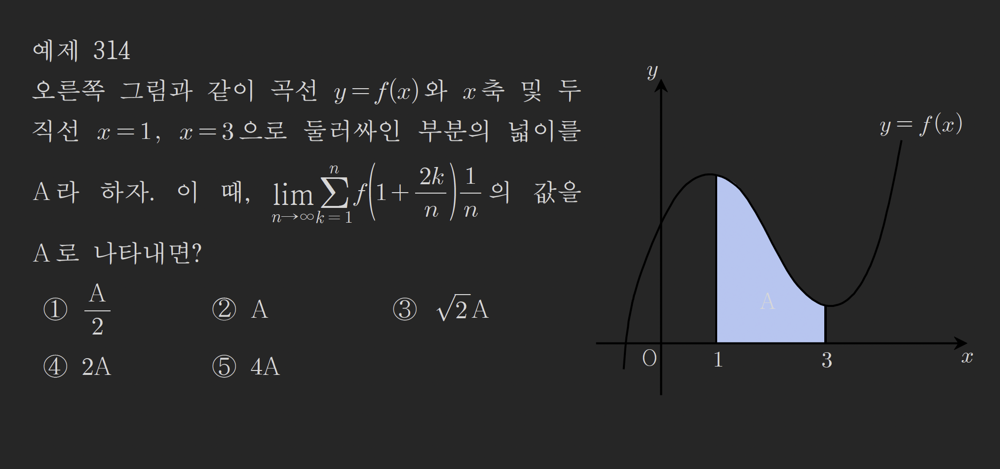
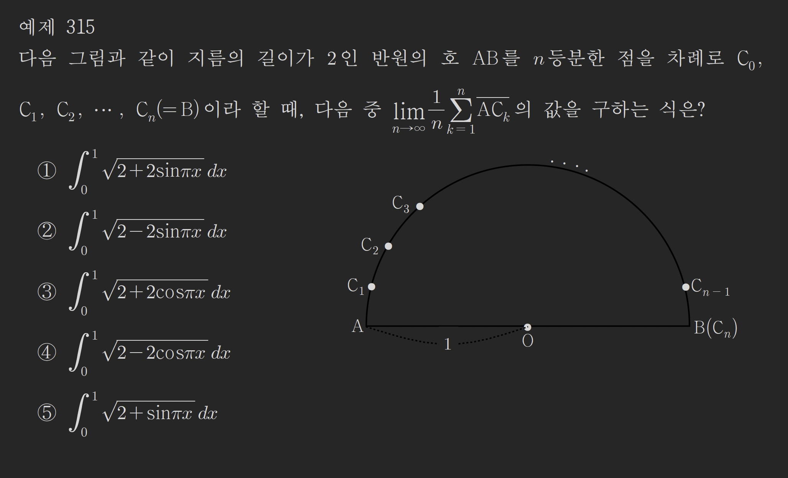
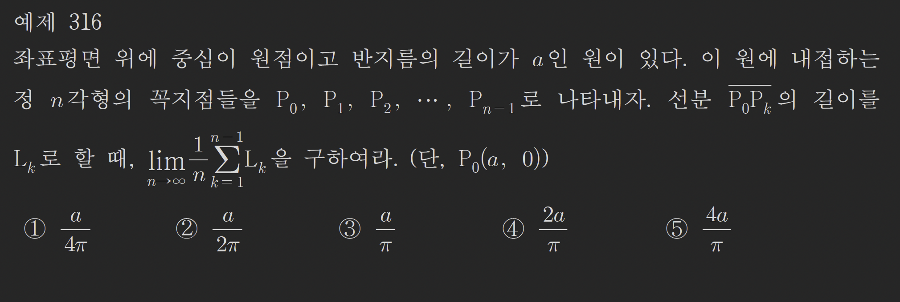
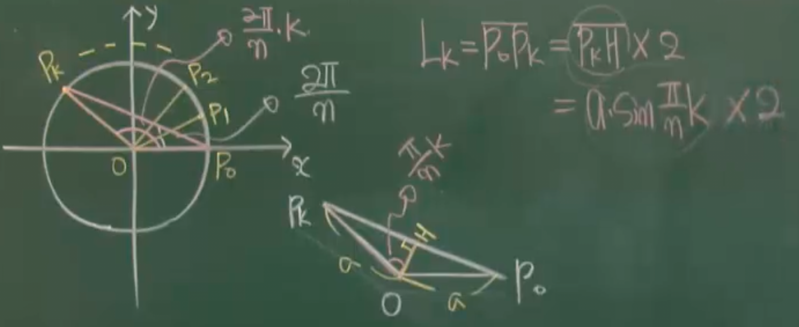
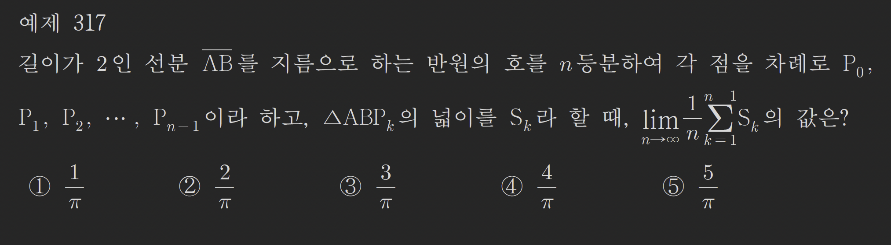
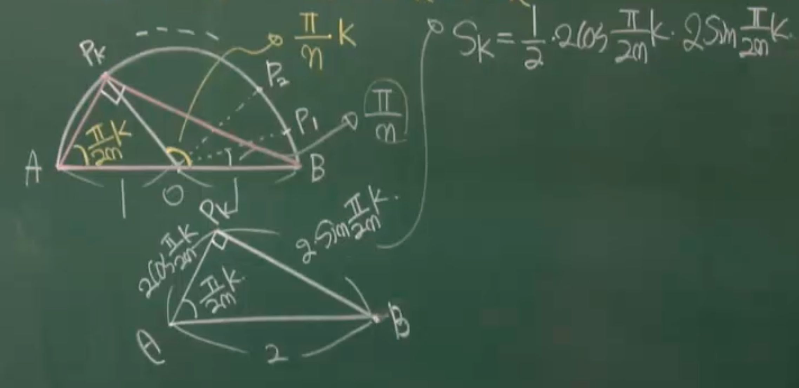

### 예제310

$$
\lim_{ n \to \infty } \frac{1}{n} \left( \sqrt{ \frac{1}{n} }+\sqrt{ \frac{2}{n} } + \sqrt{ \frac{3}{n} }+\dots+\sqrt{ \frac{n}{n} }\right)
$$

의 값을 구하여라

---

$$
GE=\lim_{ n \to \infty } \frac{1}{n} \sum_{k=1}^{n}\sqrt{ \frac{k}{n} }
$$

$$
=\int_{0}^{1}\sqrt{ x }\ dx
=\int_{0}^{1}x^{\frac{1}{2}}\ dx
=\left[ \frac{2}{3}x^{\frac{3}{2}} \right]_{0}^{1}
$$

$$
=\frac{2}{3}-0
= \frac{2}{3}
$$

### 예제311

$$
\lim_{ n \to \infty } \frac{1}{n}\left( \sin \frac{\pi}{n}+ \sin \frac{2\pi}{n}+\sin \frac{3\pi}{n} + \dots + \sin \frac{n\pi}{n} \right)
$$

의 값을 구하여라

---

$$
GE=\lim_{ n \to \infty } \frac{1}{n} \sum_{k=1}^{n} \sin \frac{k\pi}{n}
$$

$$
=\frac{1}{\pi}\int_{0}^{\pi}\sin x\ dx
$$

$$
=\frac{1}{\pi}[-\cos x]_{0}^{\pi}
$$

$$
=\frac{1}{\pi}(1-(-1))
=\frac{2}{\pi}
$$

### 예제312

$$
\lim_{ n \to \infty } \frac{\pi}{n}\left\{\sin\left( \pi+\frac{\pi}{n} \right)+\sin\left( \pi+\frac{2\pi}{n} \right)+\sin\left( \pi+\frac{3\pi}{n} \right)+\dots+\sin\left( \pi+\frac{n\pi}{n} \right)\right\}
$$

의 값을 구하여라

---

$$
GE= \lim_{ n \to \infty } \frac{\pi}{n} \sum_{k=1}^{n} \sin\left( \pi+\frac{k\pi}{n} \right)
$$

$$
=\int_{\pi}^{2\pi}\sin(x)\ dx
=[-\cos x]_{\pi}^{2\pi}
$$

$$
=-1+1 = 0
$$

### 예제313

$$
\lim_{ n \to \infty } \left( \ln \sqrt[n]{ \frac{n+1}{n} }+\ln \sqrt[n]{ \frac{n+2}{n} }+\ln \sqrt[n]{ \frac{n+3}{n} }+\dots+\ln \sqrt[n]{ \frac{n+n}{n} } \right)
$$

의 값을 구하여라

---

$$
\lim_{ n \to \infty } \ln \sqrt[n]{ \frac{n+1}{n} }
=\lim_{ n \to \infty } \frac{1}{n} \frac{n+1}{n}
=\lim_{ n \to \infty } \frac{1}{n} \left(1+\frac{1}{n}\right)
$$

$$
GE= \lim_{ n \to \infty } \frac{1}{n} \cdot \sum_{k=1}^{n} \ln\left( 1+\frac{k}{n} \right)
$$

$$
=\int_{1}^{2}\ln x\ dx
=[x\ln x-x]_{1}^{2}
$$

$$
=2\ln 2-2-(0-1)
$$

$$
=2\ln 2 -1
$$

### 예제314

---

$$
\lim_{ n \to \infty } \sum_{k=1}^{n}f\left( 1+\frac{2k}{n} \right) \frac{1}{n}
=\frac{1}{2} \int_{1}^{3}f(x)\ dx
$$

$$
=\frac{A}{2}
$$

### 예제315

$C_{k}$는 위 반원에서 1시방향 어딘가에 존재한다.

---

$$
\overline{AC_{k}}^{2}=1^{2}+1^{2}-2 \cdot 1 \cdot 1 \cos \frac{\pi}{n}k
$$

$$
\overline{AC_{k}}= \sqrt{ 2-2\cos \frac{\pi}{n}k }
$$

$$
GE= \lim_{ n \to \infty } \frac{1}{n} \sum_{k=1}^{n} \sqrt{ 2-2\cos \frac{\pi}{n}k }
$$

$$
=\int_{0}^{1} \sqrt{ 2-2\cos \pi x }\ dx
$$

### 에제316

---

$$
GE=\lim_{ n \to \infty } \frac{1}{n} \sum_{k=1}^{n-1} 2a\sin \frac{\pi}{n}k
$$

$$
=\frac{1}{\pi}\int_{0}^{\pi}2a\sin x\ dx
$$

$$
=\frac{2a}{\pi}[-\cos x]_{0}^{\pi}
=\frac{2a}{\pi}(1-(-1))
=\frac{4a}{\pi}
$$

### 예제317

---

문제조건상의 반원의 호는 위 그림처럼 표현될수있고
중심각 $\angle{P_{k}OB}= \frac{\pi}{n}k$
원주각 $\angle{A}=\frac{\pi}{2n}k$
$\angle{P_{k}}=\frac{\pi}{2}$

$\overline{AP_{k}}=2\cos \frac{\pi}{2n}k$
$\overline{BP_{k}}=2\sin \frac{\pi}{2n}k$

$$
\therefore S_{k}=\frac{1}{2} \cdot 2\cos \frac{\pi}{2n}k \cdot 2\sin \frac{\pi}{2n}k
$$
$$
=2\sin \frac{\pi}{2n}k \cdot \cos \frac{\pi}{2n}k
$$
sin2배각 공식적용하면 $2\sin\theta \cos\theta= \sin 2\theta$
$$
= \sin \frac{\pi}{n}k
$$

$$
GE=\lim_{ n \to \infty } \frac{1}{n} \sum_{k=1}^{n-1}\sin \frac{\pi}{n}k
$$
$$
=\frac{1}{\pi}\int_{0}^{\pi}\sin x\ dx
=\frac{1}{\pi}[-\cos x]_{0}^{\pi}
$$
$$
=\frac{1}{\pi}(1-(-1))=\frac{2}{\pi}
$$

###  예제318
$$
\lim_{ n \to \infty } \sum_{k=1}^{n} \frac{\pi}{n}\sin ^{2} \frac{k\pi}{2n}
$$
의 값을 구하여라

---

$$
GE=2\int_{0}^{\frac{\pi}{2}}\sin ^{2}x\ dx
$$
$$
=2\int_{0}^{\frac{\pi}{2}} \frac{1-\cos 2x}{2}\ dx
$$
$$
=\int_{0}^{\frac{\pi}{2}}1-\cos 2x\ dx
$$
$$
=\left[ x-\frac{1}{2}\sin 2x \right]_{0}^{\frac{\pi}{2}}
$$
$$
=\frac{\pi}{2}
$$

### 예제319
$$
\lim_{ n \to \infty } \sum_{k=1}^{n} \frac{k^{2}}{n^{3}+k^{3}}
$$
의 값을 구하여라 

---
분모분자에 $\frac{1}{n^{3}}$ 만큼 곱하면
$$
GE=\lim_{ n \to \infty } \frac{1}{n} \sum_{k=1}^{n} \frac{\left( \frac{k}{n} \right)^{2}}{1+\left( \frac{k}{n} \right)^{3}}
$$
$$
=\int_{0}^{1} \frac{x^{2}}{1+x^{3}}\ dx
$$
$$
=\frac{1}{3}\int_{0}^{1} \frac{3x^{2}}{1+x^{3}}\ dx
$$
$$
=\frac{1}{3} [\ln|1+x^{3}|]_{0}^{1}
$$
$$
=\frac{1}{3} \cdot \ln 2
$$

### 예제320
$$
f(x)=e^{3x},\ \lim_{ n \to \infty } \frac{1}{n} \sum_{k=1}^{n}f\left( \frac{2k}{n} \right)=?
$$
---
$$
GE=\frac{1}{2}\int_{0}^{2}f(x)\ dx
$$
$$
=\frac{1}{2}\left[ \frac{1}{3}e^{3x} \right]_{0}^{2}
$$
$$
=\frac{1}{2}\left( \frac{1}{3}e^{6}-\frac{1}{3} \right)
$$
$$
=\frac{1}{6}(e^{6}-1)
$$
