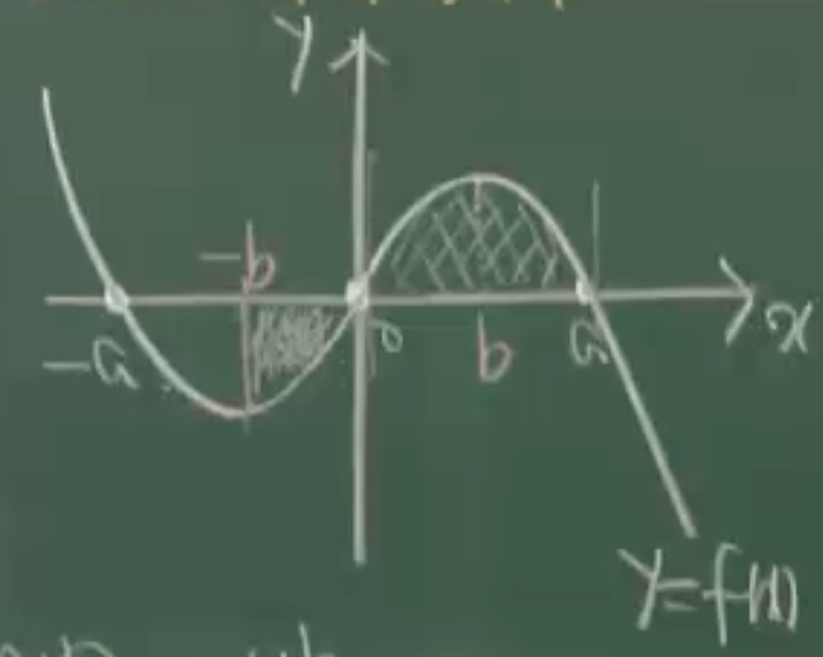

# 정적분의 계산기법(2)

> [[50-integral-techniques-1|정적분의 계산기법(1)]]에서 배운 4가지 기법(평행이동, 우·기함수, 주기함수, 대칭이동)을 예제에 적용한다.

---

## 예제 321

함수 $f(x) = x^3$의 그래프를 $x$축 방향으로 $a$만큼, $y$축 방향으로 $b$만큼 평행이동시켰더니 함수 $y = g(x)$의 그래프가 되었다.
$g(0) = 0$, $\displaystyle\int_{a}^{3a} g(x)\,dx - \int_{0}^{2a} f(x)\,dx = 32$일 때, $a^4$의 값을 구하여라.

> [!summary]- 풀이
>
> 평행이동에 의해 $g(x) = f(x-a) + b = (x-a)^3 + b$.
>
> **평행이동 공식 활용:**
>
> $$\int_{a}^{3a} g(x)\,dx = \int_{a}^{3a} f(x-a)+b\,dx = \int_{0}^{2a} f(x)+b\,dx$$
>
> 따라서:
>
> $$\int_{a}^{3a} g(x)\,dx - \int_{0}^{2a} f(x)\,dx = \int_{0}^{2a} \{f(x)+b - f(x)\}\,dx = \int_{0}^{2a} b\,dx = 2ab = 32$$
>
> 조건 $g(0) = 0$으로부터:
>
> $$g(0) = (0-a)^3 + b = -a^3 + b = 0 \implies b = a^3$$
>
> 대입하면:
>
> $$2ab = 2a \cdot a^3 = 2a^4 = 32$$
>
> $$\boxed{a^4 = 16}$$

---

## 예제 322

양수 $a$에 대하여 삼차함수 $f(x) = -x(x+a)(x-a)$의 극댓점의 $x$좌표를 $b$라 하자.
$\displaystyle\int_{-b}^{a} f(x)\,dx = A$, $\displaystyle\int_{b}^{a+b} f(x-b)\,dx = B$일 때,
$\displaystyle\int_{-b}^{a} |f(x)|\,dx$의 값을 $A$와 $B$로 나타내어라.

> [!summary]- 풀이
>
> 
>
> $f(x) = -x(x+a)(x-a)$는 기함수($f(-x) = -f(x)$)이므로 $x=0$에서 원점 대칭.
> $x = -a,\,0,\,a$에서 영점을 가지며, $x = b > 0$에서 극댓값, $x = -b$에서 극솟값.
>
> **$B$를 분석:** 평행이동 공식에 의해
>
> $$B = \int_{b}^{a+b} f(x-b)\,dx = \int_{0}^{a} f(x)\,dx$$
>
> **$A$를 분석:** $f$가 기함수이므로 $\int_{-b}^{b} f(x)\,dx = 0$.
>
> $$A = \int_{-b}^{a} f(x)\,dx = \int_{-b}^{0} f(x)\,dx + \int_{0}^{a} f(x)\,dx = \int_{-b}^{0} f(x)\,dx + B$$
>
> 기함수 성질에 의해 $\int_{-b}^{0} f(x)\,dx = -\int_{0}^{b} f(x)\,dx$.
> 그래프에서 $[0,b]$ 구간은 $[0,a]$ 구간의 절반이므로: $\int_{0}^{b} f(x)\,dx = \frac{B}{2}$.
>
> 따라서 $A = -\frac{B}{2} + B = \frac{B}{2}$, 즉 $B = 2A$.
>
> **$\int_{-b}^{a}|f(x)|\,dx$ 계산:** $[-b, 0]$에서 $f(x) < 0$, $[0, a]$에서 $f(x) > 0$이므로:
>
> $$\int_{-b}^{a}|f(x)|\,dx = -\int_{-b}^{0} f(x)\,dx + \int_{0}^{a} f(x)\,dx = -(A - B) + B = 2B - A$$
>
> $$\boxed{2B - A}$$

---

## 예제 323

$\displaystyle\int_{0}^{1} f(x)\,dx = a$일 때, 정적분 $\displaystyle\int_{2}^{3} \{f(x-2) + 4x - a\}\,dx$의 값을 구하여라.

> [!summary]- 풀이
>
> 적분을 분리한 뒤 평행이동 공식 적용:
>
> $$\int_{2}^{3} f(x-2)\,dx + \int_{2}^{3} 4x\,dx + \int_{2}^{3} (-a)\,dx$$
>
> 첫 번째 항: 평행이동 $x \to x+2$로 구간 $[0,1]$로 변환:
>
> $$\int_{2}^{3} f(x-2)\,dx = \int_{0}^{1} f(x)\,dx = a$$
>
> 두 번째 항:
>
> $$\int_{2}^{3} 4x\,dx = \left[2x^2\right]_{2}^{3} = 18 - 8 = 10$$
>
> 세 번째 항:
>
> $$\int_{2}^{3} (-a)\,dx = [-ax]_{2}^{3} = -3a + 2a = -a$$
>
> 합산:
>
> $$a + 10 + (-a) = \boxed{10}$$

---

## 예제 324

$$\int_{-1}^{1} \{\sin(x^3 + x) + x\sin^2 x + x + 1\}\,dx$$
의 값을 구하여라.

> [!summary]- 풀이
>
> 각 항의 우함수/기함수 여부를 판별한다.
>
> **① $\sin(x^3 + x)$:** $h(x) = x^3 + x$는 기함수이므로 $\sin(h(-x)) = \sin(-h(x)) = -\sin(h(x))$ → **기함수**
>
> **② $x\sin^2 x$:** $f(-x) = (-x)\sin^2(-x) = -x\sin^2 x = -f(x)$ → **기함수**
>
> **③ $x$:** 기함수
>
> **④ $1$:** 우함수
>
> 기함수의 대칭구간 적분은 0이므로:
>
> $$= 0 + 0 + 0 + \int_{-1}^{1} 1\,dx = 2\int_{0}^{1} 1\,dx = 2[x]_{0}^{1} = \boxed{2}$$

---

## 예제 325

연속함수 $f(x)$가 모든 실수 $x$에 대하여 $f(x) = f(-x)$, $f(2-x) = f(x)$를 만족하고
$\displaystyle\int_{0}^{1} f(x)\,dx = 2$일 때, $\displaystyle\int_{0}^{6} \{x^2 + f(x)\}\,dx$의 값을 구하여라.

> [!summary]- 풀이
>
> **$f$의 성질 분석:**
>
> - $f(x) = f(-x)$: 우함수 (y축 대칭)
> - $f(2-x) = f(x)$: $x=1$에 대해 대칭
> - 두 조건을 결합하면 $f(x) = f(x+2)$: **주기 2의 주기함수**
>
> **한 주기 $[0,2]$의 적분값:**
>
> 우함수이므로 $\int_{-1}^{0} f(x)\,dx = \int_{0}^{1} f(x)\,dx = 2$.
> 주기성으로 $\int_{0}^{2} f(x)\,dx = \int_{-1}^{1} f(x)\,dx = 2\int_{0}^{1} f(x)\,dx = 4$.
>
> **$\int_{0}^{6} f(x)\,dx$:** 주기 2, 구간 $[0,6]$은 3주기:
>
> $$\int_{0}^{6} f(x)\,dx = 3 \times 4 = 12$$
>
> **$\int_{0}^{6} x^2\,dx$:**
>
> $$\int_{0}^{6} x^2\,dx = \left[\frac{1}{3}x^3\right]_{0}^{6} = \frac{216}{3} = 72$$
>
> **최종 답:**
>
> $$72 + 12 = \boxed{84}$$

---

## 예제 326

$f(x)$가 우함수이고 $g(x)$가 기함수일 때, $F(x) = f(x) + f(-x)$, $G(x) = g(x) - g(-x)$라 놓는다.
이 때, $\displaystyle\int_{-a}^{a} F(x)\,dx - \int_{-a}^{a} G(x)\,dx$를 간단히 한 것은?

> [!summary]- 풀이
>
> **$F(x)$ 분석:** $f(x)$가 우함수이므로 $f(-x) = f(x)$:
>
> $$F(x) = f(x) + f(-x) = f(x) + f(x) = 2f(x)$$
>
> $F(x) = 2f(x)$도 우함수이므로:
>
> $$\int_{-a}^{a} F(x)\,dx = 2\int_{0}^{a} 2f(x)\,dx = 4\int_{0}^{a} f(x)\,dx$$
>
> **$G(x)$ 분석:** $g(x)$가 기함수이므로 $g(-x) = -g(x)$:
>
> $$G(x) = g(x) - g(-x) = g(x) - (-g(x)) = 2g(x)$$
>
> $G(x) = 2g(x)$도 기함수이므로:
>
> $$\int_{-a}^{a} G(x)\,dx = 0$$
>
> **결론:**
>
> $$4\int_{0}^{a} f(x)\,dx - 0 = \boxed{4\int_{0}^{a} f(x)\,dx}$$
>
> **정답**: ④

---

## 예제 327

연속함수 $f(x)$는 임의의 실수 $x$에 대하여 다음을 만족시킨다.

$$\text{(가)}\ f(-x) = f(x) \qquad \text{(나)}\ f(x) = f(x+4)$$

$\displaystyle\int_{0}^{2} f(x)\,dx = 16$일 때, $\displaystyle\int_{-4}^{8} f(x)\,dx$의 값을 구하여라.

> [!summary]- 풀이
>
> 조건 (가): 우함수, 조건 (나): 주기 4.
>
> **한 주기 $[0,4]$의 적분값:**
>
> 우함수이므로 $\int_{-2}^{0} f(x)\,dx = \int_{0}^{2} f(x)\,dx = 16$.
>
> 따라서 $\int_{0}^{4} f(x)\,dx = \int_{0}^{2} f(x)\,dx + \int_{2}^{4} f(x)\,dx$.
> 주기성에 의해 $\int_{2}^{4} f(x)\,dx = \int_{-2}^{0} f(x)\,dx = 16$.
> → 한 주기의 적분값: $16 + 16 = 32$
>
> **$\int_{-4}^{8} f(x)\,dx$:** 구간 길이 12 = 주기 4 × 3주기:
>
> $$\int_{-4}^{8} f(x)\,dx = 3 \times 32 = \boxed{96}$$

---

## 예제 328

함수 $f(x)$는 다음 두 조건을 만족한다.

$$\text{(가)}\ {-2 \le x \le 2}\ \text{일 때},\ f(x) = x^3 - 4x \qquad \text{(나)}\ \text{임의의 실수 }x\text{에 대하여 }f(x) = f(x+4)$$

정적분 $\displaystyle\int_{1}^{2} f(x)\,dx$와 같은 것은?

> [!summary]- 풀이
>
> 주기 4인 함수이므로 구간 $[1, 2]$을 $[1+4n, 2+4n]$으로 이동해도 값이 같다.
>
> $n = 501$로 놓으면: $[1 + 4 \times 501,\; 2 + 4 \times 501] = [2005, 2006]$
>
> $$\int_{1}^{2} f(x)\,dx = \int_{2005}^{2006} f(x)\,dx$$
>
> **정답**: ③ $\displaystyle\int_{2005}^{2006} f(x)\,dx$

---

## 예제 329

$$\int_{5\pi}^{10\pi} \sin(2x + 2005)\,dx$$
의 값을 구하여라.

> [!summary]- 풀이
>
> $f(x) = \sin(2x + 2005)$는 주기 $\pi$인 함수.
>
> 구간 $[5\pi, 10\pi]$의 길이는 $5\pi = 5 \times \pi$이므로 정확히 5주기.
>
> **평행이동으로 간소화:** $x \to x - \frac{2005}{2}$로 이동하면:
>
> $$\sin\!\left(2\!\left(x - \frac{2005}{2}\right) + 2005\right) = \sin(2x)$$
>
> $$\int_{5\pi}^{10\pi} \sin 2x\,dx = 5\int_{0}^{\pi} \sin 2x\,dx$$
>
> $$= 5\left[-\frac{1}{2}\cos 2x\right]_{0}^{\pi} = -\frac{5}{2}(\cos 2\pi - \cos 0) = -\frac{5}{2}(1 - 1) = \boxed{0}$$

---

## 예제 330

$f(1-x) = x^2 - x + 1 - f(x)$일 때, $\displaystyle\int_{0}^{1} f(x)\,dx$의 값을 구하여라.

> [!summary]- 풀이
>
> 주어진 조건을 정리하면:
>
> $$f(x) + f(1-x) = x^2 - x + 1$$
>
> $f(1-x)$는 $f(x)$와 $x = \frac{1}{2}$에 대해 대칭이므로, **대칭이동 공식** 적용:
>
> $$\int_{0}^{1} f(x)\,dx = \int_{0}^{\frac{1}{2}} \{f(x) + f(1-x)\}\,dx = \int_{0}^{\frac{1}{2}} (x^2 - x + 1)\,dx$$
>
> $$= \left[\frac{1}{3}x^3 - \frac{1}{2}x^2 + x\right]_{0}^{\frac{1}{2}}$$
>
> $$= \frac{1}{24} - \frac{1}{8} + \frac{1}{2} = \frac{1}{24} - \frac{3}{24} + \frac{12}{24} = \frac{10}{24} = \boxed{\frac{5}{12}}$$

---

## 예제 331

$f(4-x) = 3x^2 - 12x + 1 - f(x)$일 때, $\displaystyle\int_{1}^{3} f(x)\,dx$의 값을 구하여라.

> [!summary]- 풀이
>
> 주어진 조건을 정리하면:
>
> $$f(x) + f(4-x) = 3x^2 - 12x + 1$$
>
> $f(4-x)$는 $f(x)$와 $x = 2$에 대해 대칭. 구간 $[1,3]$의 중점이 $x=2$이므로 **대칭이동 공식** 적용:
>
> $$\int_{1}^{3} f(x)\,dx = \int_{1}^{2} \{f(x) + f(4-x)\}\,dx = \int_{1}^{2} (3x^2 - 12x + 1)\,dx$$
>
> $$= \left[x^3 - 6x^2 + x\right]_{1}^{2}$$
>
> $$= (8 - 24 + 2) - (1 - 6 + 1) = -14 - (-4) = \boxed{-10}$$

---

## 예제 332

$x > 0$에서 $f(x) > 0$인 함수 $f(x)$가

$$\frac{f(2+x) + f(2-x)}{2} = f(2) = 3$$

일 때, $\displaystyle\int_{1}^{3} f(x)\,dx$의 값을 구하여라.

> [!summary]- 풀이
>
> 조건을 정리하면:
>
> $$f(2+x) + f(2-x) = 6$$
>
> $t = x - 2$로 치환하면 ($x \to t+2$):
>
> $$f(t+2+2) + f(2-(t+2-2)) = f(t+2) + f(4-t+2)$$
>
> → 위 식은 $f(x)$가 $x = 2$에 대해 대칭임을 의미한다: $f(x) + f(4-x) = 6$.
>
> 구간 $[1, 3]$의 중점이 $x = 2$이므로 **대칭이동 공식** 적용:
>
> $$\int_{1}^{3} f(x)\,dx = \int_{1}^{2} \{f(x) + f(4-x)\}\,dx = \int_{1}^{2} 6\,dx = [6x]_{1}^{2} = 12 - 6 = \boxed{6}$$

---

## 유형별 풀이 전략 정리

| 유형         | 판별 조건            | 핵심 변환                                                |
| ------------ | -------------------- | -------------------------------------------------------- |
| **평행이동** | $g(x) = f(x-a)+b$ 꼴 | 구간을 함께 $-a$만큼 이동                                |
| **우함수**   | $f(-x) = f(x)$       | $\int_{-a}^{a} = 2\int_{0}^{a}$                          |
| **기함수**   | $f(-x) = -f(x)$      | $\int_{-a}^{a} = 0$                                      |
| **주기함수** | $f(x+p) = f(x)$      | 구간 길이를 주기로 나누어 계산                           |
| **대칭이동** | $f(x)+f(a-x) = c$    | $\int_{0}^{a} = \int_{0}^{\frac{a}{2}}\{f(x)+f(a-x)\}dx$ |

---

## 관련 주제

- [[50-integral-techniques-1|정적분의 계산기법(1)]]
- [[52-integral-inverse-function|정적분의 계산기법(3), 역함수와 정적분]]
- [[47-fundamental-theorem|정적분과 부정적분의 관계]]

---

**학습 포인트:**

1. 평행이동 시 구간과 함수를 **동시에** 이동하면 적분값이 보존된다.
2. 우·기함수 판별 후 대칭 구간 $[-a, a]$의 적분을 즉시 단순화한다.
3. 주기함수는 구간 길이 ÷ 주기 = 반복 횟수로 계산한다.
4. $f(x) + f(a-x) = c$ 꼴이 보이면 대칭이동 공식으로 $[0, a] \to [0, \frac{a}{2}]$로 축소한다.
