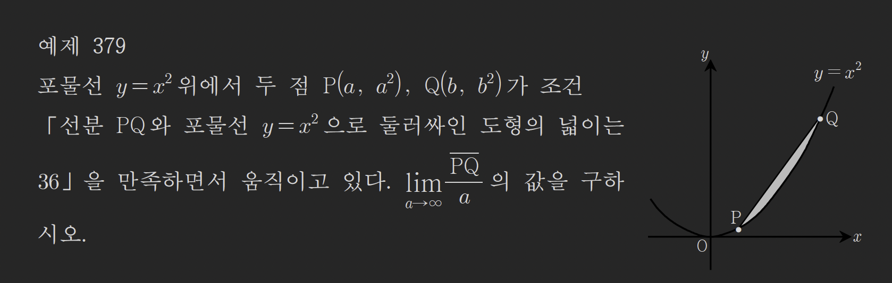
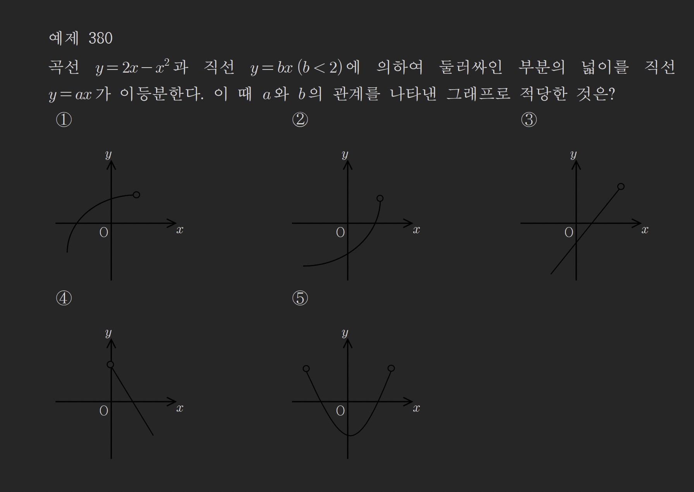
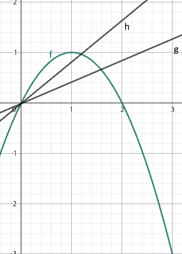

# 56강. 넓이와 적분(2)

## 1. 넓이와 적분 — Thm (54)

### (1) 좌표축과 곡선 사이의 넓이

① 곡선 $y = f(x)$ $(a \le x \le b)$와 $x$축 사이의 넓이 $S_x$는

$$S_x = \int_{a}^{b} |f(x)|\,dx = \int_{a}^{p} f(x)\,dx + \int_{p}^{b}\{-f(x)\}\,dx$$

② 곡선 $x = g(y)$ $(c \le y \le d)$와 $y$축 사이의 넓이 $S_y$는

$$S_y = \int_{c}^{d} |g(y)|\,dy = \int_{c}^{p} g(y)\,dy + \int_{p}^{d}\{-g(y)\}\,dy$$

### (2) 두 곡선 사이의 넓이

① 두 곡선 $y=f(x)$, $y=g(x)$와 두 직선 $x=a$, $x=b$로 둘러싸인 부분의 넓이 $S$는

$$S = \int_{a}^{b} |f(x) - g(x)|\,dx$$

② 구간 $[a, b]$에서 두 곡선 $y=f(x)$, $y=g(x)$로 둘러싸인 두 부분의 넓이가 같다.

$$\Rightarrow \int_{a}^{b}\{f(x)-g(x)\}\,dx = 0$$

---

## 2. 특수한 꼴의 넓이 공식

### 이차함수 $y = ax^2 + bx + c$ 와 $x$축 사이

| 형태 | 공식 |
|------|------|
| $x$축과 두 교점 $\alpha$, $\beta$ 사이 | $S = \dfrac{\|a\|}{6}(\beta - \alpha)^3$ |
| $x$축과 한 교점 + 직선으로 막힌 꼴 | $S = \dfrac{\|a\|}{6}(\beta - \alpha)^3$ |
| 두 이차함수 $f(x) = ax^2+\cdots$, $g(x)=a'x^2+\cdots$ 사이 | $S = \dfrac{\|a-a'\|}{6}(\beta - \alpha)^3$ |

### 사차함수 $y = ax^4 + \cdots$ 와 $x$축 사이

$$S = \frac{|a|}{30}(\beta - \alpha)^5$$

### 삼차함수 $f(x)$의 극대·극소의 차

삼차함수 $f(x) = ax^3 + \cdots$의 도함수 $f'(x) = 0$의 두 근이 $\alpha$, $\beta$이면

$$|f(\alpha) - f(\beta)| = \frac{|a|}{6}(\beta - \alpha)^3$$

> [!note] $\triangle ABD$ 와 꼭짓점 공식
> 포물선 $y = ax^2 + \cdots$ 위의 두 점을 연결하는 선분과 포물선으로 둘러싸인 삼각형 $\triangle ABD$의 넓이:
> $$S_{\triangle ABD} = \frac{3}{4} \times S_{\text{포물선과 선분}} = \frac{3}{4} \cdot \frac{|a|}{6}(\beta-\alpha)^3 = \frac{|a|(\beta-\alpha)^3}{8}$$

---

## 3. 예제

### 예제 377

$$\int_{0}^{2}|x^{2}(x-1)|\,dx \text{의 값을 구하여라.}$$

> [!summary]- 풀이
> $f(x) = x^2(x-1)$은 $x=0$에서 극점을 가지고 오른쪽 꼬리가 위로 향하는 개형.
>
> $x \in [0,1]$에서 $f(x) \le 0$, $x \in [1,2]$에서 $f(x) \ge 0$ 이므로
>
> $$\int_{0}^{2}|x^{2}(x-1)|\,dx = -\int_{0}^{1}x^{2}(x-1)\,dx + \int_{1}^{2}x^{2}(x-1)\,dx$$
>
> 첫 번째 항: 특수 공식 적용 ($a=1$, $\alpha=0$, $\beta=1$)
>
> $$-\int_{0}^{1}x^{2}(x-1)\,dx = \frac{1}{12}(1-0)^{4} = \frac{1}{12}$$
>
> 두 번째 항:
>
> $$\int_{1}^{2}(x^{3}-x^{2})\,dx = \left[\frac{1}{4}x^{4}-\frac{1}{3}x^{3}\right]_{1}^{2}$$
>
> $$= \frac{1}{4}(16-1) - \frac{1}{3}(8-1) = \frac{15}{4} - \frac{7}{3}$$
>
> 합산:
>
> $$= \frac{1}{12} + \frac{15}{4} - \frac{7}{3} = \frac{1 + 45 - 28}{12} = \frac{18}{12} = \boxed{\frac{3}{2}}$$

---

### 예제 378

자연수 $n$에 대하여, 두 곡선

$$y = x^{2}-2, \quad y = -x^{2}+\frac{2}{n^{2}}$$

로 둘러싸인 도형의 넓이를 $S_n$이라 할 때, $\displaystyle\lim_{n \to \infty}S_n$의 값은?

① $\dfrac{16}{3}$ ② $\dfrac{14}{3}$ ③ $4$ ④ $\dfrac{10}{3}$ ⑤ $\dfrac{8}{3}$

> [!summary]- 풀이
> $n \to \infty$이면 $\dfrac{2}{n^2} \to 0$이므로
>
> $$y = -x^2 + \frac{2}{n^2} \longrightarrow y = -x^2$$
>
> 따라서 $S_n$의 극한은 두 곡선 $y = x^2 - 2$, $y = -x^2$으로 둘러싸인 넓이와 같다.
>
> **교점 구하기:**
>
> $$x^2 - 2 = -x^2 \implies 2x^2 = 2 \implies x = \pm 1$$
>
> **특수 공식 적용** ($a=1$, $a'=-1$, $\alpha=-1$, $\beta=1$):
>
> $$S_n = \frac{|1-(-1)|}{6}(1-(-1))^3 = \frac{2}{6} \cdot 8 = \frac{1}{3} \cdot 8 = \boxed{\frac{8}{3}} \quad \text{⑤}$$

---

### 예제 379

포물선 $y=x^2$ 위에서 두 점 $\mathrm{P}(a,\,a^2)$, $\mathrm{Q}(b,\,b^2)$가 조건 「선분 $\overline{\mathrm{PQ}}$와 포물선 $y=x^2$으로 둘러싸인 도형의 넓이는 $36$」을 만족하면서 움직이고 있다. $\displaystyle\lim_{a \to \infty}\frac{\overline{PQ}}{a}$의 값을 구하시오.

> [!summary]- 풀이
> 포물선 $y = x^2$ 위의 두 점 사이의 넓이 공식:
>
> $$S = \frac{1}{6}(b-a)^3 = 36$$
>
> $$b - a = 6 \implies b = a + 6$$
>
> 선분 $\overline{PQ}$의 길이:
>
> $$\overline{PQ} = \sqrt{(b-a)^2 + (b^2-a^2)^2}$$
>
> $$= \sqrt{36 + (b+a)^2(b-a)^2}$$
>
> $b - a = 6$, $b + a = 2a + 6$ 이므로
>
> $$= \sqrt{36 + (2a+6)^2 \cdot 36} = \sqrt{36 + (12a+36)^2}$$
>
> 극한 계산:
>
> $$\lim_{a \to \infty}\frac{\overline{PQ}}{a} = \lim_{a \to \infty}\frac{\sqrt{36+(12a+36)^2}}{a}$$
>
> 분자에서 최고차항 추출: $\sqrt{(12a+36)^2} \sim 12a$
>
> $$= \lim_{a \to \infty}\frac{12a + 36}{a} = \boxed{12}$$

---

### 예제 380

곡선 $y=2x-x^2$과 직선 $y=bx$ $(b<2)$에 의하여 둘러싸인 부분의 넓이를 직선 $y=ax$가 이등분한다. 이 때 $a$와 $b$의 관계를 나타낸 그래프로 적당한 것은?

> [!summary]- 풀이
> $f(x) = -x^2+2x$, $g(x) = bx$, $h(x) = ax$ 로 놓는다.
>
> 
>
> **교점 계산:**
>
> $h(x) = f(x)$: $ax = -x^2+2x \implies x(x - 2 + a) = 0 \implies x = 0,\ 2-a$
>
> $g(x) = f(x)$: $bx = -x^2+2x \implies x(x - 2 + b) = 0 \implies x = 0,\ 2-b$
>
> **각 영역의 넓이** (특수 공식):
>
> $$S_A = \frac{1}{6}(2-a)^3, \quad S_B = \frac{1}{6}(2-b)^3$$
>
> **이등분 조건** $S_B = 2S_A$:
>
> $$\frac{1}{6}(2-b)^3 = 2 \cdot \frac{1}{6}(2-a)^3$$
>
> $$(2-b)^3 = 2(2-a)^3$$
>
> $$2-b = \sqrt[3]{2}\,(2-a)$$
>
> $$b = 2 - \sqrt[3]{2}\,(2-a)= a\sqrt[3]{2} + 2 - 2\sqrt[3]{2}$$
>
> 이 관계식을 만족하는 $a$, $b$ 관계 그래프는 **③번**.

---

### 예제 381

오른쪽 그림과 같이 곡선 $y=x^2$과 직선 $l$이 두 점 A, B에서 만나고 선분 $\overline{AB}$의 중점을 C, 점 C를 지나고 $y$축에 평행한 직선이 이 곡선과 만나는 점을 D라 한다. 두 점 A, B의 $x$좌표가 각각 $a$, $b$일 때 $\triangle ABD$의 넓이는? (단, $a < b$)

① $\dfrac{(b-a)^3}{2}$ ② $\dfrac{(b-a)^3}{8}$ ③ $\dfrac{b^2-a^2}{6}$ ④ $\dfrac{b^3-a^3}{6}$ ⑤ $\dfrac{b^3-a^3}{8}$

![[exer381.png]]

> [!summary]- 풀이
> 포물선 $y = x^2$ 위의 두 점 A$(a, a^2)$, B$(b, b^2)$에서 직선 $l$과 포물선으로 둘러싸인 넓이:
>
> $$S_{\text{포물선}} = \frac{1}{6}(b-a)^3$$
>
> $\triangle ABD$는 그 넓이의 $\dfrac{3}{4}$ (꼭짓점 공식):
>
> $$S_{\triangle ABD} = \frac{3}{4} \cdot \frac{1}{6}(b-a)^3 = \frac{(b-a)^3}{8} \quad \text{②}$$

---

### 예제 382

자연수 $n$에 대하여 $f(x)=x^2$의 그래프를 $x$축의 방향으로 $\dfrac{1}{n}$만큼 평행이동한 그래프를 $y=f_n(x)$라 하자. 곡선 $y=f_n(x)$와 $x$축, $y$축으로 둘러싸인 부분의 넓이를 $S_n$이라 할 때, $\displaystyle\lim_{n \to \infty}n^3 S_n$의 값은?

① $1$ ② $\dfrac{1}{2}$ ③ $\dfrac{1}{3}$ ④ $\dfrac{1}{4}$ ⑤ $\dfrac{1}{5}$

![[exer382.png]]

> [!summary]- 풀이
> $f_n(x) = \left(x - \dfrac{1}{n}\right)^2$이므로 꼭짓점이 $\left(\dfrac{1}{n}, 0\right)$.
>
> ![[exer382-1.png]]
>
> $y$축과 $x$축, $y = f_n(x)$로 둘러싸인 넓이는 $x \in \left[0, \dfrac{1}{n}\right]$ 구간:
>
> $$S_n = \int_{0}^{\frac{1}{n}}\left(x - \frac{1}{n}\right)^2 dx$$
>
> $u = x - \dfrac{1}{n}$으로 치환하면 $x: 0 \to \dfrac{1}{n}$일 때 $u: -\dfrac{1}{n} \to 0$
>
> $$S_n = \int_{-\frac{1}{n}}^{0} u^2\,du = \left[\frac{1}{3}u^3\right]_{-\frac{1}{n}}^{0} = 0 - \left(\frac{1}{3} \cdot \left(-\frac{1}{n^3}\right)\right) = \frac{1}{3n^3}$$
>
> 따라서
>
> $$\lim_{n \to \infty}n^3 S_n = \lim_{n \to \infty}n^3 \cdot \frac{1}{3n^3} = \boxed{\frac{1}{3}} \quad \text{③}$$

---

### 예제 383

곡선 $y=x^2$과 직선 $y=b$로 둘러싸인 영역을 직선 $y=a$가 이등분할 때 $a$와 $b$ 사이의 관계를 그래프로 나타내면?

![[exer383.png]]

> [!summary]- 풀이
> ![[exer383-1.png]]
>
> 곡선 $y = x^2$과 직선 $y = b$로 둘러싸인 영역을 $y$축을 기준으로 생각한다.
>
> $y = x^2$과 $y = b$의 교점: $x = \pm\sqrt{b}$
>
> $y = x^2$과 $y = a$의 교점: $x = \pm\sqrt{a}$
>
> 이등분 조건: 위쪽 영역($B$) = 아래쪽 영역($A$)의 2배 (넓이 기준)
>
> $$B = 2A$$
>
> 특수 공식으로 각 넓이 계산 (두 포물선 형태, $x$축 대칭):
>
> $$\frac{1}{6}(2\sqrt{b})^3 = 2 \cdot \frac{1}{6}(2\sqrt{a})^3$$
>
> $$(2\sqrt{b})^3 = 2\,(2\sqrt{a})^3$$
>
> $$8b\sqrt{b} = 2 \cdot 8a\sqrt{a}$$
>
> $$b^{3/2} = 2\,a^{3/2}$$
>
> $$b = \sqrt[3]{4}\,a$$
>
> 이 관계식은 $b$가 $a$의 $\sqrt[3]{4}$배인 선형 관계 → **①번**.

---

## 관련 주제

- [[55-area-integral-1|55강. 정적분과 함수의 결정, 넓이와 적분(1)]]
- [[57-area-integral-3|57강. 넓이와 적분(3)]]

---

**학습 포인트:**

1. 이차함수와 $x$축(또는 두 이차함수) 사이 넓이: $S = \dfrac{|a|}{6}(\beta - \alpha)^3$ 공식을 암기한다.
2. 사차함수 넓이: $S = \dfrac{|a|}{30}(\beta-\alpha)^5$
3. $\triangle ABD$ 넓이는 포물선-현 넓이의 $\dfrac{3}{4}$배: $S = \dfrac{|a|(\beta-\alpha)^3}{8}$
4. 이등분 문제는 두 영역 넓이 비를 방정식으로 세운 뒤 관계식을 유도한다.
5. 극한 $\lim n^k S_n$ 유형은 $S_n$을 $n$의 식으로 정확히 계산한 후 극한을 취한다.
